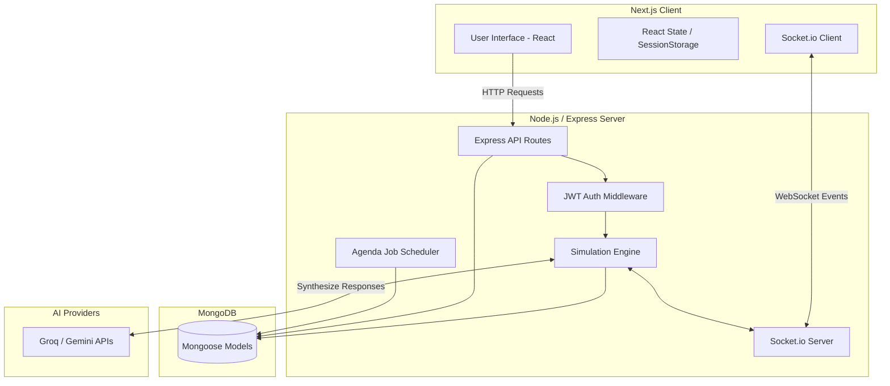

# 2. Architecture

## System Architecture

The Skillomentum Global Bank (SGB) simulator follows a client-server architecture with a heavy emphasis on real-time event-driven processing for the simulation engine.

### High-Level Flowchart

## Frontend Architecture
The frontend is built using **Next.js 16 (App Router)**.
- **Routing**: Handled natively by Next.js app directory structure (`src/app/`).
- **State Management**: React hooks (`useState`, `useEffect`) and browser `sessionStorage` for persisting JWT tokens and user context.
- **Styling**: Tailwind CSS for utility-first styling.
- **Real-time**: `socket.io-client` connects to the backend to receive live updates (e.g., trade status changes, new messages).

## Backend Architecture
The backend is a **Node.js / Express** application heavily focused on business logic (`src/engine/`).
- **HTTP Server**: Serves RESTful APIs (`/api/*`).
- **WebSockets**: `Socket.io` runs on the same HTTP server, providing bi-directional communication to broadcast events to specific user rooms (e.g., `user_${userId}`).
- **Engine Loop**: Instead of just waiting for HTTP requests, `server.js` runs multiple `setInterval` loops to process communication replies, FO replies, and cache updates continuously.
- **Scheduled Jobs**: Uses `Agenda` for handling time-based transitions (e.g., moving a trade from `CONFIRMATION_PENDING` to `SETTLEMENT_PENDING` at a specific simulated time).

## AI / Engine Integration
The simulator utilizes LLMs to act as counterparties.
- When a user sends a message via the UI, it hits the API, saves to the DB, and triggers the `communicationEngine`.
- The engine formats a prompt with trade details and sends it to `cptyAI` (Counterparty) or `foAI` (Front Office).
- The LLM processes the natural language and returns a structured response (e.g., agreeing to amend a trade or providing a missing SSI).
- The system updates the DB and pushes the new state via WebSockets back to the user.
