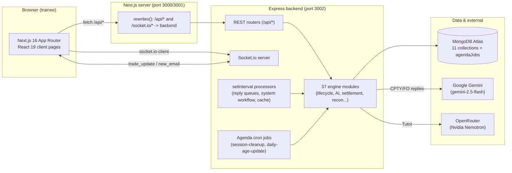
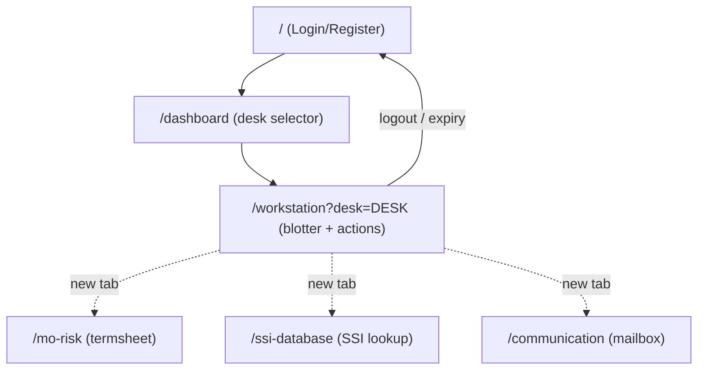
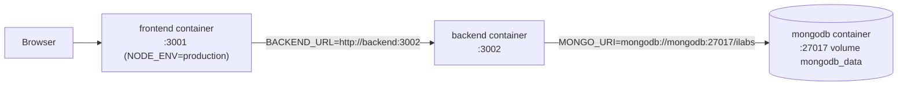

# 02 · Architecture

[← 01 Overview](01_Project_Overview.md) | [INDEX](INDEX.md) | Next: [03 Folder Structure →](03_Folder_Structure.md)

---

## 2.1 System architecture (high level)

Two independently-deployed applications talk over HTTP + WebSocket:



> **Note on the proxy:** the frontend calls **relative** `/api/*` URLs, which Next.js rewrites to the backend (`next.config.mjs`). **Exception:** the Workstation page's Socket.io connection and the TutorialPanel's `/api/chat/tutor` call use the **absolute** backend URL (`NEXT_PUBLIC_BACKEND_URL || http://localhost:3002`), bypassing the proxy. See [13](13_Event_And_Socket_Flow.md) §"Socket base URL differs by page".

## 2.2 Backend architecture (layers)

The backend is **not** a classic controller→service→repository stack. It is a **router + engine** architecture:

```
HTTP request
  │
  ▼
Express router  (src/routes/*.js)   ← "controller" logic lives inline in route handlers
  │  authenticateToken middleware (src/middleware/auth.js)
  ▼
Engine modules  (src/engine/*.js)   ← business logic, state machine, AI, workflows
  │
  ▼
Mongoose models (src/models/*.js)   ← MongoDB persistence
  │
  ▼
MongoDB Atlas
```

Key architectural facts:

- **Controllers = route handlers.** Each `src/routes/*.js` file both declares routes and contains the handler logic. There is no separate controllers directory.
- **Engines are singletons or function modules.** Some export a class instance (`new QueueComposer()`, `new SimulationClock()`), some export a class with static methods (`LifecycleEngine`), some export plain functions.
- **The lifecycle state machine is the spine.** [transitions.js](../src/engine/transitions.js) declares the legal graph; [lifecycle.js](../src/engine/lifecycle.js) enforces it; almost every route/engine that changes `currentStatus` goes through `LifecycleEngine.transition()`.
- **Asynchronous "reply queues".** Counterparty/FO replies are not synchronous. A user email schedules a `PendingReply` row with a future `sendAt`; background `setInterval` processors drain it seconds later, invoking the AI and posting the reply. This models real-world latency. See [13](13_Event_And_Socket_Flow.md).
- **Two isolated internal workflows** use their own delayed-job tables: `PendingReply` (CPTY/FO comms) and `SystemJob` (settlement amend/verify bot).

### Backend runtime processes (started in [server.js](../server.js))

| Process | Interval | Function | Purpose |
|---|---|---|---|
| CPTY reply processor | 3000 ms | `communicationEngine.processReplies` | Drain CPTY email replies |
| FO reply processor | 3000 ms | `communicationEngine.processFOReplies` | Drain FO email replies |
| FO internal processor | 3000 ms | `foInternalChannel.processFOInternalReplies` | Drain FO internal-channel replies |
| System workflow processor | 3000 ms | `systemWorkflowEngine.processJobs` | Drain settlement amend/verify jobs |
| Trade cache refresh | 2000 ms | inline `Trade.find({assignedTo:{$ne:null}})` | Rebuild `communicationEngine._cachedTrades` |
| Simulation clock tick | 1000 ms | `SimulationClock.start()` interval | Advance sim time, emit `clock_tick` (starts on first queue generation, **not** at boot) |
| Agenda `session-cleanup` | 1 min | `queueComposer.cleanupExpiredSessions` | Expire 3h-old sessions, unassign trades |
| Agenda `daily-age-update` | 1 min | `dailyScheduler.runDailyCycle` | Recompute `Trade.age` for all trades |

> ⚠️ Despite the name, `daily-age-update` runs **every minute**, not daily.

## 2.3 Frontend architecture

- **Next.js App Router**, but **every page is a client component** (`'use client'`). There are **no server components with data logic, no `middleware.js`, no Next API routes** — the Next server is essentially a static/SSR shell + API proxy.
- **Auth gating is client-side only** — each page checks `sessionStorage` in a `useEffect` and `router.push('/')` if unauthenticated. There is no server-enforced protection.
- **Session state = `sessionStorage`** (`auth_token`, `userId`, `fullName`), managed by [frontend/src/lib/auth.js](../frontend/src/lib/auth.js). (An HttpOnly `auth_token` cookie is also set by the backend but the frontend does not read it; it exists so Socket.io and API can authenticate via cookie fallback.)
- **Real-time via socket.io-client** on the Workstation and Communication pages; a **polling fallback** (15s / 5s) keeps the UI fresh if the socket drops.
- **Multi-tab UX:** reference screens (Termsheet, SSI database, Mailbox) open in **new browser tabs** via `window.open(..., '_blank')`, inheriting `sessionStorage` from the opener.



## 2.4 Data architecture

**Primary store: MongoDB** (Mongoose). 11 domain collections + Agenda's `agendaJobs` collection. See [11 Database Schema](11_Database_Schema.md) for full field-level detail.

| Collection | Model file | Holds |
|---|---|---|
| `trades` | [Trade.js](../src/models/Trade.js) | The central trade entity (economics, truths, booking, settlement, amendments, escalation) |
| `users` | [User.js](../src/models/User.js) | Registered users (email, bcrypt password, fullName) |
| `queues` | [Queue.js](../src/models/Queue.js) | Per-user 3h session + assigned tradeRefs |
| `conversations` | [Conversation.js](../src/models/Conversation.js) | CPTY/FO email threads |
| `focommunications` | [FOCommunication.js](../src/models/FOCommunication.js) | FO internal-channel threads |
| `pendingreplies` | [PendingReply.js](../src/models/PendingReply.js) | Scheduled (delayed) AI replies |
| `systemjobs` | [SystemJob.js](../src/models/SystemJob.js) | Settlement amend/verify delayed jobs |
| `systemmails` | [SystemMail.js](../src/models/SystemMail.js) | System-notification mailbox |
| `auditlogs` | [AuditLog.js](../src/models/AuditLog.js) | Event audit trail (+ XML for system events) |
| `userscores` | [UserScore.js](../src/models/UserScore.js) | Points/penalties/history per user |
| `systemconfigs` | [SystemConfig.js](../src/models/SystemConfig.js) | Key/value config (e.g. `SETTLEMENT_INITIAL_STATE`) |

**In-memory stores** (not persisted, reset on restart):
- `communicationEngine._cachedTrades` — a `tradeRef → trade` map refreshed every 2s.
- `conversationEngine.cache` — per-tradeRef conversation cache.
- `reconciliation.js` `ledger[] / statements[] / matches[]` — the recon module's whole state is in-memory.
- `truthEngine.scenarioStore` — legacy scenario store.
- `scoringEngine.userScores{}` — fallback when DB is down.
- `SimulationClock.simulatedTime` — the sim clock.

> **Graceful degradation:** [src/db.js](../src/db.js) logs a warning and runs "memory-only" if `MONGO_URI` is absent. Many engines have `getIsConnected()` guards and in-memory fallbacks — but the queue/trade flow effectively requires MongoDB.

## 2.5 External integrations

| Integration | Used by | Model / endpoint | Fallback |
|---|---|---|---|
| **Google Gemini** | CPTY & FO email personas | `gemini-2.5-flash`, JSON mode, temp 0.7, 4s client throttle, 3-retry backoff | Deterministic offline template engine ([offlineResponseEngine.js](../src/engine/offlineResponseEngine.js)) |
| **OpenRouter → Nvidia Nemotron** | AI Tutor only | `POST https://openrouter.ai/api/v1/chat/completions`, `nvidia/nemotron-3-ultra-550b-a55b:free` | **None** — tutor throws on failure |

The tutor also reads Simulator Knowledge Base markdown from `docs/skb/*.md` (`simulator_workflow_guide.md`, `screen_and_feature_guide.md`, `troubleshooting_and_faqs.md`) and injects them into the system prompt. Those files are referenced by the code but were **deleted from the current checkout** (see git status / [18](18_Unused_And_Dead_Code.md)).

## 2.6 Deployment topology (`docker-compose.yml`)



- **backend** image: `node:22-alpine`, `npm install --omit=dev`, `CMD node server.js`, exposes 3002.
- **frontend** image: built from `frontend/Dockerfile`, `PORT=3001`.
- **mongodb**: `mongo:latest`, persistent named volume.
- ⚠️ `docker-compose.yml` hardcodes `JWT_SECRET=YOUR_SUPER_SECRET_JWT_KEY_CHANGE_ME` — see [20 Security](20_Security_Analysis.md).

See [04 Entry Point](04_Entry_Point_And_Startup.md) for the exact boot sequence and environment loading.

---
[← 01 Overview](01_Project_Overview.md) | [INDEX](INDEX.md) | Next: [03 Folder Structure →](03_Folder_Structure.md)
