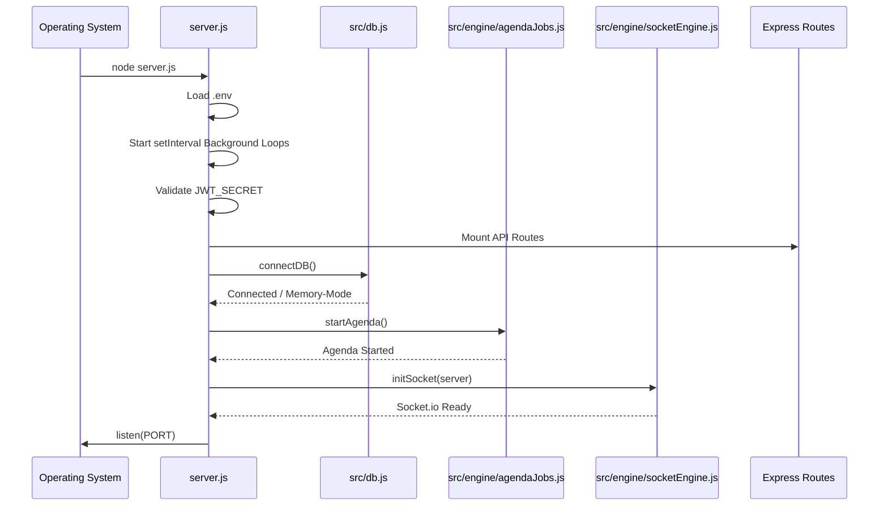

# 3. Entry Point & Initialization

This document covers the execution flow when the application starts, detailing the backend startup process.

## Backend Startup (`server.js`)

The application starts by executing `node server.js`.

### 1. Imports and Config Loading
- `require("dotenv").config()` is called immediately to load environment variables from the `.env` file into `process.env`.
- Core modules (`express`, `http`) are imported.
- Internal modules are imported: Database (`src/db.js`), Models (`src/models/Trade`), and various Engine components (`queueComposer`, `dailyScheduler`, `communicationEngine`, etc.).

### 2. Background Processes Initialization
Before setting up routes, `server.js` initializes several continuous memory-backed polling loops using `setInterval`. These loops drive the simulation forward:
- **Communication Reply Processor** (every 3s): Checks for counterparty (CPTY) replies and updates trade states.
- **FO Reply Processor** (every 3s): Checks for Front Office replies.
- **FO Internal Channel Processor** (every 3s): Checks for escalations.
- **Cache Refresh** (every 2s): Loads all assigned trades into a local memory cache (`communicationEngine._cachedTrades`) for fast access by the other processors.

### 3. Startup Validation
- The server checks if `process.env.JWT_SECRET` is set. If not, it logs a fatal error and exits (`process.exit(1)`). This ensures secure authentication.

### 4. Express Configuration & Routing
- `app.use(express.json())` enables JSON body parsing.
- API Routes are mounted to specific prefixes:
  - `/api/auth` -> `src/routes/authRoutes`
  - `/api/session` -> `src/routes/sessionRoutes`
  - `/api/clock` -> `src/routes/clockRoutes`
  - `/api/queue` -> `src/routes/queueRoutes`
  - `/api/trade` -> `src/routes/tradeRoutes`
  - `/api/conversation` -> `src/routes/conversationRoutes`
  - `/api/fo-channel` -> `src/routes/foChannelRoutes`
  - `/api/audit` -> `src/routes/auditRoutes`

### 5. Server Initialization Function (`startServer`)
The `startServer()` function orchestrates the final boot sequence:
1. **Database Connection**: `await connectDB()` establishes a connection to MongoDB using Mongoose (`MONGO_URI`). If it fails, the app warns and runs in memory-only mode.
2. **Job Scheduler**: `await startAgenda()` starts the Agenda scheduler for time-based background tasks.
3. **HTTP Server**: `http.createServer(app)` wraps the Express app.
4. **WebSocket Server**: `initSocket(server)` attaches Socket.io to the HTTP server, configuring CORS and JWT authentication middleware for socket connections.
5. **Listen**: `server.listen(PORT)` starts accepting connections on port 3002 (default).

### Sequence Diagram: Application Startup

## Frontend Startup

The frontend is a Next.js application started via `npm run dev` or `next start`.

### 1. `src/app/layout.js` (Root Layout)
- Loads global fonts (Geist).
- Loads global CSS (`globals.css`).
- Wraps the entire application, injecting `<Toaster position="top-center" />` for global notifications.

### 2. `src/app/page.js` (Root Page)
- Renders the Login page as the default entry point when a user visits `/`.
- If the user authenticates, they are pushed to `/dashboard` via `useRouter().push()`.
