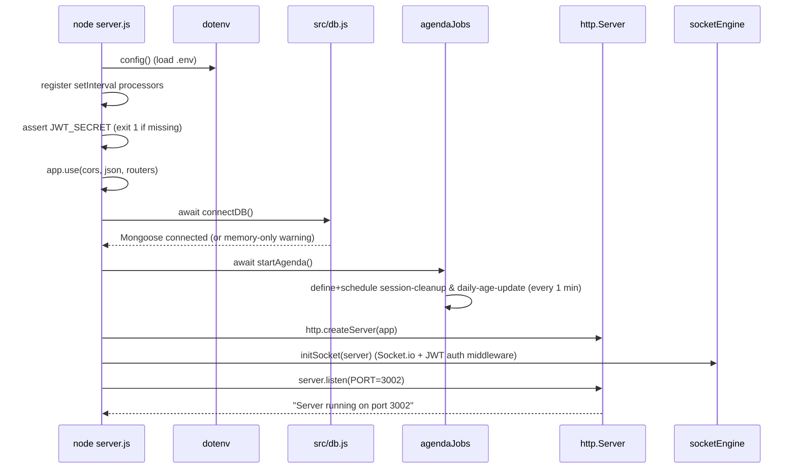

# 04 · Entry Point & Startup Sequence

[← 03 Folder Structure](03_Folder_Structure.md) | [INDEX](INDEX.md) | Next: [05 Authentication →](05_Authentication_And_Login_Flow.md)

---

## 4.1 The first file that runs

**Backend entry point: [server.js](../server.js)** (invoked by `npm start` → `node server.js`, or `npm run dev` → `nodemon server.js`).

**Frontend entry point:** Next.js boots `frontend/src/app/layout.js` (root layout) then the matched `page.js`. `npm run dev` in `frontend/` → `next dev --webpack` (port 3000).

The two processes are independent; the frontend proxies API/socket calls to the backend.

## 4.2 Backend startup — exact execution order

Reading [server.js](../server.js) top to bottom:

### Step 1 — Module load & imports (lines 1–15)
```js
const express = require("express");
const http = require("http");
const cors = require("cors");
require("dotenv").config();          // ① load .env into process.env

const { connectDB, getIsConnected } = require("./src/db");
const Trade = require("./src/models/Trade");
const queueComposer = require("./src/engine/queueComposer");
const dailyScheduler = require("./src/engine/dailyScheduler");
const communicationEngine = require("./src/engine/communicationEngine");
const conversationEngine = require("./src/engine/conversationEngine");
const foInternalChannel = require("./src/engine/foInternalChannel");
const systemWorkflowEngine = require("./src/engine/systemWorkflowEngine");
const { startAgenda } = require("./src/engine/agendaJobs");
const { initSocket } = require("./src/engine/socketEngine");
```
- **`dotenv.config()` runs first** — every downstream module reads `process.env.*` (JWT_SECRET, MONGO_URI, GEMINI_API_KEY, OPENROUTER_API_KEY, PORT, ALLOWED_ORIGINS).
- Requiring the engine modules runs their top-level code (each `mongoose.model(...)` registers a schema; singletons like `new QueueComposer()`, `new SimulationClock()` are instantiated here — but the clock does **not** start ticking yet).

### Step 2 — Register background interval processors (lines 26–96)
These `setInterval`s are **registered immediately at module load** (before the server even listens). They will start firing on their timers, but do nothing meaningful until MongoDB is connected and trades exist.

| Lines | Interval | Job |
|---|---|---|
| 26–41 | 3000 ms | `communicationEngine.processReplies(...)` — drains CPTY email replies; persists `cptyResponseReceived`, `pendingAmendments`. |
| 44–60 | 3000 ms | `communicationEngine.processFOReplies(...)` — drains FO email replies; persists `foResponseReceived`, `currentStatus`, `pendingAmendments`. |
| 63–75 | 3000 ms | `foInternalChannel.processFOInternalReplies(...)` — drains FO internal-channel replies; persists `foEscalation`, `currentStatus`. |
| 78–80 | 3000 ms | `systemWorkflowEngine.processJobs()` — drains settlement amend/verify jobs. |
| 83–96 | 2000 ms | Cache refresh — `Trade.find({ assignedTo: { $ne: null } })` into `communicationEngine._cachedTrades` (a `tradeRef → trade` map used by the reply processors' `getTradeByRef` callback). |

> The three reply processors receive a `getTradeByRef(ref)` closure that reads `communicationEngine._cachedTrades[ref]`, and a `saveTrade(trade)` closure that writes selected fields back via `Trade.updateOne`. This is how background AI replies mutate persisted trades.

### Step 3 — Startup validation (lines 101–105)
```js
if (!process.env.JWT_SECRET) {
  console.error("FATAL: JWT_SECRET environment variable is not set. Server cannot start.");
  process.exit(1);
}
```
- **Hard fail-fast.** No `JWT_SECRET` → the process exits with code 1. There is intentionally **no fallback secret** (see [src/middleware/auth.js](../src/middleware/auth.js)).

### Step 4 — Express config & route mounting (lines 110–125)
```js
app.use(cors());              // wide-open CORS, no options
app.use(express.json());      // JSON body parsing for all routes

app.use("/api/auth",           require("./src/routes/authRoutes"));
app.use("/api/session",        require("./src/routes/sessionRoutes"));
app.use("/api/clock",          require("./src/routes/clockRoutes"));
app.use("/api/queue",          require("./src/routes/queueRoutes"));
app.use("/api/trade",          require("./src/routes/tradeRoutes"));
app.use("/api/conversation",   require("./src/routes/conversationRoutes"));
app.use("/api/conversations",  require("./src/routes/conversationRoutes"));  // same router, 2nd prefix
app.use("/api/fo-channel",     require("./src/routes/foChannelRoutes"));
app.use("/api/audit",          require("./src/routes/auditRoutes"));
app.use("/api/settlement",     require("./src/routes/settlementRoutes"));
app.use("/api/system-mailbox", require("./src/routes/systemMailboxRoutes"));
app.use("/api/ssi",            require("./src/routes/ssiRoutes"));
app.use("/api/chat",           require("./src/routes/chatRoutes"));
```
- Routers are `require`d lazily here (their top-level code runs at mount time).
- `conversationRoutes` is deliberately **mounted twice** — every endpoint is reachable under both `/api/conversation/*` and `/api/conversations/*` (the frontend uses both spellings).

### Step 5 — Async server bootstrap (lines 130–145)
```js
async function startServer() {
  await connectDB();                 // ① connect Mongoose to MONGO_URI
  await startAgenda();               // ② start Agenda cron (needs live Mongoose connection)

  const server = http.createServer(app);   // ③ wrap Express in an http.Server
  initSocket(server);                      // ④ attach Socket.io to the same server

  server.listen(PORT, () => {              // ⑤ start listening (PORT env or 3002)
    console.log(`Server running on port ${PORT}`);
    console.log("Simulation Clock Ready (starts on queue generation)");
  });
}

if (process.env.NODE_ENV !== "test") {
  startServer();                     // not called under NODE_ENV=test (so supertest imports app only)
}

module.exports = app;                // exported for supertest
```

Ordered bootstrap:



## 4.3 Configuration & environment loading

**File: `.env`** (loaded by `dotenv` at the very top of `server.js`). Documented template in [.env.example](../.env.example):

| Var | Required? | Used by | Purpose |
|---|---|---|---|
| `MONGO_URI` | Yes (else memory-only) | [src/db.js](../src/db.js), [agendaJobs](../src/engine/agendaJobs.js) | MongoDB Atlas connection string |
| `JWT_SECRET` | **Yes (fatal if missing)** | [middleware/auth](../src/middleware/auth.js), [authRoutes](../src/routes/authRoutes.js), [socketEngine](../src/engine/socketEngine.js) | JWT signing/verification |
| `GEMINI_API_KEY` | For AI (else offline fallback) | [llmService](../src/engine/llmService.js) | Gemini API |
| `OPENROUTER_API_KEY` | For tutor (else throws) | [tutorAI](../src/engine/tutorAI.js) | OpenRouter/Nemotron |
| `CEREBRAS_API_KEY` | No | — | Declared; **unused** |
| `GROQ_API_KEY` | No | — | Declared (commented); **unused** |
| `PORT` | No (default 3002) | server.js | Backend port |
| `ALLOWED_ORIGINS` | No (default localhost) | [socketEngine](../src/engine/socketEngine.js) | Socket.io CORS allowlist (comma-separated) |
| `NEXT_PUBLIC_BACKEND_URL` | Frontend | frontend pages, next.config | Backend base URL for direct socket/tutor calls & proxy target |
| `NODE_ENV` | No | server.js, authRoutes | `test` suppresses `startServer()`; `production` adds `Secure` cookie flag |
| `SYSTEM_AMENDMENT_DELAY_MS` / `SYSTEM_VERIFICATION_DELAY_MS` | No (default 8000) | [systemWorkflowEngine](../src/engine/systemWorkflowEngine.js) | Bot job delays |

## 4.4 Database connection ([src/db.js](../src/db.js))

```js
async function connectDB() {
  const uri = process.env.MONGO_URI;
  if (!uri) { /* warn: memory-only mode */ return; }
  try {
    await mongoose.connect(uri, { serverSelectionTimeoutMS: 10000, socketTimeoutMS: 45000 });
    isConnected = true;   // "✅ MongoDB connected successfully"
  } catch (err) {
    isConnected = false;  // "⚠️ Running in memory-only mode"
  }
}
```
- **Never throws** — a failed connection degrades to memory-only rather than crashing. `getIsConnected()` is checked by `auditEngine` and `scoringEngine` before writing.

## 4.5 Server & socket creation

- Express is wrapped in a raw `http.Server` so **Socket.io can share the same port** (3002). See [socketEngine.js](../src/engine/socketEngine.js): `initSocket(server)` creates the `Server`, installs a JWT handshake-auth middleware, and joins each socket to a `user_<userId>` room. Details in [13 Event Flow](13_Event_And_Socket_Flow.md).

## 4.6 The simulation clock does NOT start at boot

The console prints `"Simulation Clock Ready (starts on queue generation)"`. The `SimulationClock` singleton ([clock.js](../src/engine/clock.js)) only begins ticking when a user first hits **`POST /api/queue/generate`**, which calls:
```js
simulationClock.reset();
simulationClock.start();      // begins the 1s tick emitting clock_tick
```
So the sim day (09:00→18:00) is anchored to the moment the first queue is generated.

## 4.7 Frontend bootstrap

1. `frontend/src/app/layout.js` (root, server component) loads Geist fonts and mounts `<Toaster/>` (react-hot-toast) once. It wraps all pages.
2. The matched route's `page.js` (all `'use client'`) mounts and runs its `useEffect`:
   - Reads `sessionStorage` via [lib/auth.js](../frontend/src/lib/auth.js).
   - If unauthenticated → `router.push('/')`.
   - Otherwise fetches its initial data (e.g. Workstation → `GET /api/queue/my`).
3. `next.config.mjs` `rewrites()` proxy all `/api/*` and `/socket.io/*` to `NEXT_PUBLIC_BACKEND_URL || BACKEND_URL || http://localhost:3002`.

See [05 Login Flow](05_Authentication_And_Login_Flow.md) for the first real user journey.

## 4.8 Shutdown

[agendaJobs.js](../src/engine/agendaJobs.js) registers `SIGTERM`/`SIGINT` handlers that call `agenda.stop()` then `process.exit(0)`. Nothing else has explicit teardown (Mongoose/sockets close with the process).

---
[← 03 Folder Structure](03_Folder_Structure.md) | [INDEX](INDEX.md) | Next: [05 Authentication →](05_Authentication_And_Login_Flow.md)
