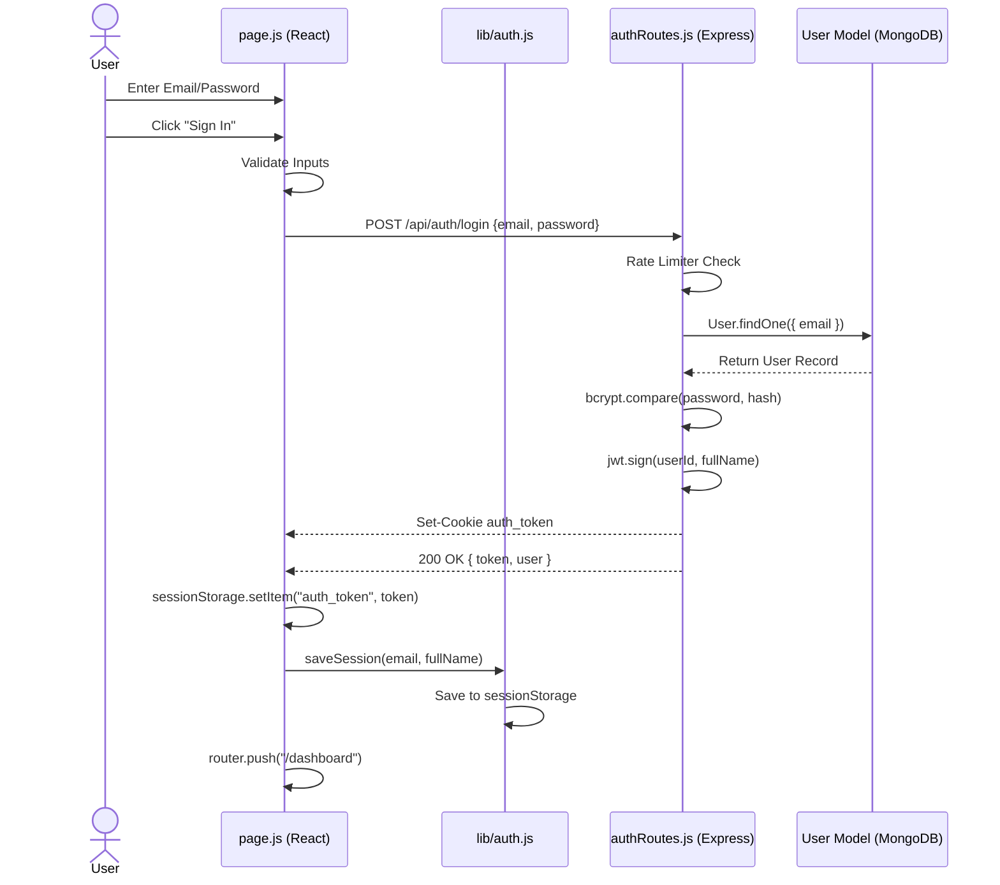

# 4. Login Flow

This document details the complete end-to-step execution path when a user logs into the SGB Operations Simulator.

## Execution Order

The login flow is heavily client-side driven with a secure backend API that validates credentials and provides a JWT token.

### 1. User Opens Login Page
**File:** [frontend/src/app/page.js](file:///e:/Ilabs_Main/ilabs1/frontend/src/app/page.js)
- **Component:** `<LoginPage>` (Default export)
- **Purpose:** Renders the authentication interface. Next.js loads this file as the root `/` route.
- **Hooks:** Uses `useState` to manage `email`, `password`, `fullName`, `isLoginMode`, `errorMsg`, and `isLoading`. Uses `useRouter` for navigation.

### 2. User Input & Validation
- **Action:** User types their credentials.
- **State Change:** The `onChange` handlers update `email` and `password` states.
- **Action:** User clicks "Sign In".
- **Function Called:** `handleSubmit(e)` is triggered.
- **Validation:** Checks if `!email` or `!password`. If missing, sets `errorMsg`.

### 3. API Call
- **Action:** `fetch()` is executed inside `handleSubmit`.
- **Endpoint:** `POST /api/auth/login`
- **Payload:** `{ email, password }`
- **State Change:** `isLoading` is set to `true` to disable the submit button.

### 4. Backend Routing
**File:** [server.js](file:///e:/Ilabs_Main/ilabs1/server.js)
- The request hits the Express server.
- Express matches `/api/auth` and forwards it to `authRoutes`.

### 5. Controller & Middleware
**File:** [src/routes/authRoutes.js](file:///e:/Ilabs_Main/ilabs1/src/routes/authRoutes.js)
- **Middleware:** Request passes through `authLimiter` (Express Rate Limiter: max 15 requests / 15 minutes).
- **Controller Logic:** The route handler for `router.post("/login", ...)` executes.
- **Validation:** Server verifies `email` and `password` exist in the payload. Converts email to lowercase.

### 6. Database Lookup
**File:** [src/models/User.js](file:///e:/Ilabs_Main/ilabs1/src/models/User.js)
- **Database Query:** `User.findOne({ email: emailLower })` is called using Mongoose.
- If no user is found, returns `400 Bad Request` with "Invalid email or password".

### 7. Password Verification
- **Action:** `bcrypt.compare(password, userRecord.password)` is called.
- If passwords do not match, returns `400 Bad Request`.

### 8. Token Generation & Session Setup
- **Action:** `jwt.sign()` generates a JSON Web Token.
- **Payload:** `{ userId: userRecord.email, fullName: userRecord.fullName }`
- **Secret:** `JWT_SECRET` (from `src/middleware/auth.js` / `.env`).
- **Expiry:** 3 hours (`3h`).
- **Cookies:** Sets an `HttpOnly` cookie named `auth_token` in the response header (`Set-Cookie`) for security.

### 9. API Response
- Returns `200 OK` with JSON:
  ```json
  {
    "success": true,
    "token": "eyJhbGci...",
    "user": {
      "email": "user@example.com",
      "fullName": "User Name"
    }
  }
  ```

### 10. Frontend Receives Response
**File:** [frontend/src/app/page.js](file:///e:/Ilabs_Main/ilabs1/frontend/src/app/page.js)
- `handleSubmit` parses the JSON response.
- **State Updates:** 
  - `sessionStorage.setItem("auth_token", data.token)`
  - `sessionStorage.setItem("justLoggedIn", "true")`
- **Function Called:** `saveSession(data.user.email, data.user.fullName)`
  **File:** [frontend/src/lib/auth.js](file:///e:/Ilabs_Main/ilabs1/frontend/src/lib/auth.js)
  - This function saves `userId` and `fullName` to `sessionStorage` (avoiding passing PII in URL parameters).

### 11. Navigation to Dashboard
- **Action:** `router.push("/dashboard")`
- The user is redirected to the `/dashboard` route.

---

## Sequence Diagram: Login Flow


