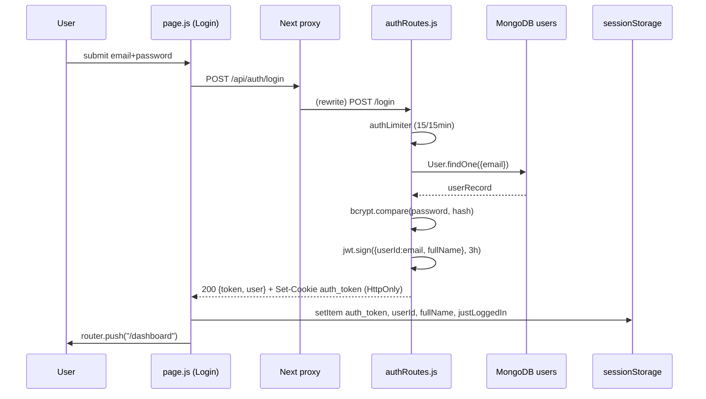

# 05 · Authentication & Login Flow

[← 04 Entry Point](04_Entry_Point_And_Startup.md) | [INDEX](INDEX.md) | Next: [06 User Flows →](06_User_Flows.md)

---

## 5.1 Auth model at a glance

| Aspect | Implementation |
|---|---|
| Token | **JWT** signed with `process.env.JWT_SECRET`, `expiresIn: "3h"`, payload `{ userId: <email>, fullName }` |
| Password storage | **bcryptjs** hash (cost 10) |
| Token delivery | Response JSON `token` **and** a `Set-Cookie: auth_token=...; HttpOnly; SameSite=Lax` |
| Frontend storage | **`sessionStorage`** (`auth_token`, `userId`, `fullName`) — the HttpOnly cookie is *not* read by JS |
| API auth | `Authorization: Bearer <token>` header (primary) **or** `auth_token` cookie (fallback) |
| Socket auth | JWT via `socket.handshake.auth.token` or `auth_token` cookie |
| Rate limiting | 15 requests / 15 min / IP on `/api/auth/*` only |
| Roles / RBAC | **None** — every authenticated user is equal; "desk" is a session choice, not an identity |

> ⚠️ **`userId` is the user's email**, not a Mongo `_id`. Everywhere you see `userId` / `assignedTo` / `req.user.userId`, it is an email string. This is set at login: `jwt.sign({ userId: userRecord.email, ... })`.

## 5.2 Files involved in auth

| File | Role |
|---|---|
| [frontend/src/app/page.js](../frontend/src/app/page.js) | Login/Register UI + submit handler |
| [frontend/src/lib/auth.js](../frontend/src/lib/auth.js) | `getToken/saveSession/authHeaders/clearSession/hasSession` |
| [src/routes/authRoutes.js](../src/routes/authRoutes.js) | `POST /api/auth/register`, `POST /api/auth/login` |
| [src/routes/sessionRoutes.js](../src/routes/sessionRoutes.js) | `GET /api/session/info`, `POST /api/session/logout` |
| [src/middleware/auth.js](../src/middleware/auth.js) | `authenticateToken` guard + `JWT_SECRET` |
| [src/models/User.js](../src/models/User.js) | `User` schema (email/fullName/password) |
| [src/engine/socketEngine.js](../src/engine/socketEngine.js) | Socket handshake JWT auth |

## 5.3 Registration flow (step-by-step)

**User action:** on `/`, toggles to "Register", fills fullName/email/password, submits.

```
page.js handleSubmit (register mode)
  → POST /api/auth/register  { fullName, email, password }
      authRoutes.js:
        authLimiter (rate limit 15/15min)
        validate all 3 present → 400 "All fields are required"
        emailLower = email.toLowerCase()
        hashedPassword = bcrypt.hash(password, 10)
        User.findOne({ email: emailLower })
          exists → 400 "Email is already registered"
        new User({ fullName, email: emailLower, password: hashedPassword }).save()
      → 200 { success:true, message:"Registration successful" }
  → toast.success("Registration successful! Please login.")
  → flip to login mode
```

Files & order: `page.js` → `POST /api/auth/register` → `authRoutes.js` handler → `bcryptjs` → `User` model → MongoDB `users`.

> ⚠️ The password is hashed **before** the duplicate-email check (minor wasted CPU; no security impact).

## 5.4 Login flow — full end-to-end (VERY IMPORTANT)

### 5.4.1 Chronological execution

**User action:** on `/` (login mode), enters email + password, clicks "Login".

| # | File · function | What happens |
|---|---|---|
| 1 | [frontend/src/app/page.js](../frontend/src/app/page.js) · `handleSubmit` | Form `onSubmit`. Guards `email && password`. Sets `isLoading`. |
| 2 | `page.js` | `fetch("/api/auth/login", { method:"POST", headers:{Content-Type}, body: JSON({email,password}) })` |
| 3 | Next.js `next.config.mjs` rewrite | `/api/*` proxied to backend `:3002` |
| 4 | [src/routes/authRoutes.js](../src/routes/authRoutes.js) · `authLimiter` | express-rate-limit: 15/15min/IP; over-limit → `429` |
| 5 | `authRoutes.js` · `POST /login` handler | Validates presence → `400` if missing. `emailLower = email.toLowerCase()`. |
| 6 | `User.findOne({ email: emailLower })` | MongoDB `users` lookup. Not found → `400 "Invalid email or password"`. |
| 7 | `bcrypt.compare(password, userRecord.password)` | Mismatch → `400 "Invalid email or password"` (same generic message). |
| 8 | `jwt.sign({ userId: userRecord.email, fullName: userRecord.fullName }, JWT_SECRET, {expiresIn:"3h"})` | Create 3-hour JWT. |
| 9 | `res.setHeader("Set-Cookie", "auth_token=<jwt>; Path=/; Max-Age=10800; SameSite=Lax; HttpOnly" + (prod? "; Secure":""))` | Set HttpOnly cookie. |
| 10 | `res.json({ success:true, token, user:{ email, fullName } })` | Return token + user. |
| 11 | `page.js` (back in browser) | On `res.ok && data.success`: `sessionStorage.setItem("auth_token", data.token)`, `sessionStorage.setItem("justLoggedIn","true")`, `saveSession(data.user.email, data.user.fullName)`. |
| 12 | `router.push("/dashboard")` | Client navigation to desk selector. |
| 13 | [frontend/src/app/dashboard/page.js](../frontend/src/app/dashboard/page.js) · `useEffect` | Reads `loadUserId()`; `hasSession()` check; renders 5 desk buttons. |

### 5.4.2 Sequence diagram



### 5.4.3 Response state updates (frontend)

`page.js` `useState`: `isLoginMode, email, password, fullName, errorMsg, isLoading`.
On success only `sessionStorage` is written and navigation occurs (no persistent React state). On failure: `setErrorMsg(data.error || "Login failed")`.

> ⚠️ **Known bug:** if email/password are empty, `handleSubmit` sets the error and returns **without** `setIsLoading(false)`, so the button can stick on "Processing…". See [18](18_Unused_And_Dead_Code.md).

## 5.5 The `authenticateToken` middleware ([src/middleware/auth.js](../src/middleware/auth.js))

Applied to every protected route (all except `POST /api/auth/*` and `GET /api/clock`).

```js
function authenticateToken(req, res, next) {
  // 1) Authorization header: "Bearer <token>" → take split(" ")[1]
  let token = req.headers["authorization"]?.split(" ")[1];
  // 2) Fallback: parse auth_token from the Cookie header
  if (!token && req.headers.cookie) token = parseCookies()["auth_token"];
  if (!token) return res.status(401).json({ error: "Authentication required" });
  try {
    req.user = jwt.verify(token, JWT_SECRET);   // { userId, fullName, iat, exp }
    next();
  } catch {
    return res.status(403).json({ error: "Invalid or expired token" });
  }
}
```

- **`req.user.userId` = email.** All ownership filters (`assignedTo: req.user.userId`) key on it.
- No scheme validation — it just takes the 2nd whitespace token of the Authorization header.
- Two failure codes: `401` (no token) vs `403` (invalid/expired token).

## 5.6 Session lifecycle

| Concept | Value | Where |
|---|---|---|
| JWT expiry | 3 hours | `authRoutes.js` `expiresIn:"3h"` |
| Cookie Max-Age | 3 hours (10800s) | `authRoutes.js` Set-Cookie |
| Queue session | 3 hours (`SESSION_DURATION_MS`) | [queueComposer.js](../src/engine/queueComposer.js) |
| Frontend timer | Counts down to `sessionExpiry`; auto-logout at 0 | [workstation/page.js](../frontend/src/app/workstation/page.js) session-timer effect |

**`GET /api/session/info`** (sessionRoutes) — returns `{ hasActiveSession, userId, fullName, desk?, queueSize?, sessionStart?, sessionExpiry? }`. Used by `mo-risk` / `ssi-database` pages to recover identity when opened in a new tab without `userId` in storage.

**Logout** — Workstation `logout()` → `POST /api/session/logout`:
```
sessionRoutes.js:
  queueComposer.endSession(userId)   // does NOT unassign trades; 3h timer keeps running
  Set-Cookie: auth_token=; Max-Age=0 (clear; note: no HttpOnly on the clear)
  → 200 { success:true }
page.js: clearSession() → router.push("/")
```

> Note: `endSession` intentionally leaves trades assigned so the background AI reply timers keep running; the Agenda `session-cleanup` job or a new login expires them later.

## 5.7 Socket authentication ([socketEngine.js](../src/engine/socketEngine.js))

```js
io.use((socket, next) => {
  let token = socket.handshake.auth?.token
           || cookie.parse(socket.handshake.headers.cookie || "")["auth_token"];
  if (!token) return next(new Error("Authentication error: No token provided"));
  try {
    socket.user = jwt.verify(token, JWT_SECRET);   // { userId, fullName }
    next();
  } catch { next(new Error("Authentication error: Invalid token")); }
});
```
On connect, the socket joins room `user_<userId>`. Frontend passes `{ auth: { token: getToken() } }`. See [13 Event Flow](13_Event_And_Socket_Flow.md).

## 5.8 Client-side auth-gating pattern (per page)

Each page self-guards in `useEffect`:

| Page | Guard | Redirect |
|---|---|---|
| `/` (login) | none (entry) | — |
| `/dashboard` | `!uid || !hasSession()` | toast + `push('/')` |
| `/workstation` | `!desk` → `/dashboard`; `!uid || !getToken()` → `/` | — |
| `/mo-risk`, `/ssi-database` | `!getToken()` → `/`; if `uid` missing, recover via `GET /api/session/info` | — |
| `/communication` | `!uid` → `/` | — |

> ⚠️ There is **no server-side route protection** on the frontend (no `middleware.js`). Tokens live in JS-readable `sessionStorage`. See [20 Security](20_Security_Analysis.md).

## 5.9 Complete auth call graph

```
LoginPage (page.js) handleSubmit
  → fetch POST /api/auth/login
    → authRoutes.js authLimiter → login handler
      → User.findOne (MongoDB)
      → bcrypt.compare
      → jwt.sign (JWT_SECRET from middleware/auth.js)
      → Set-Cookie + res.json
  → sessionStorage + saveSession (lib/auth.js)
  → router.push('/dashboard')
    → dashboard/page.js useEffect → hasSession() → render desks
      → goDesk(DESK) → router.push('/workstation?desk=DESK')
        → every subsequent API call: authHeaders() = Bearer <token>
        → authenticateToken verifies on each protected route
        → socket: io(url, { auth:{ token } }) → socketEngine io.use JWT
```

---
[← 04 Entry Point](04_Entry_Point_And_Startup.md) | [INDEX](INDEX.md) | Next: [06 User Flows →](06_User_Flows.md)
