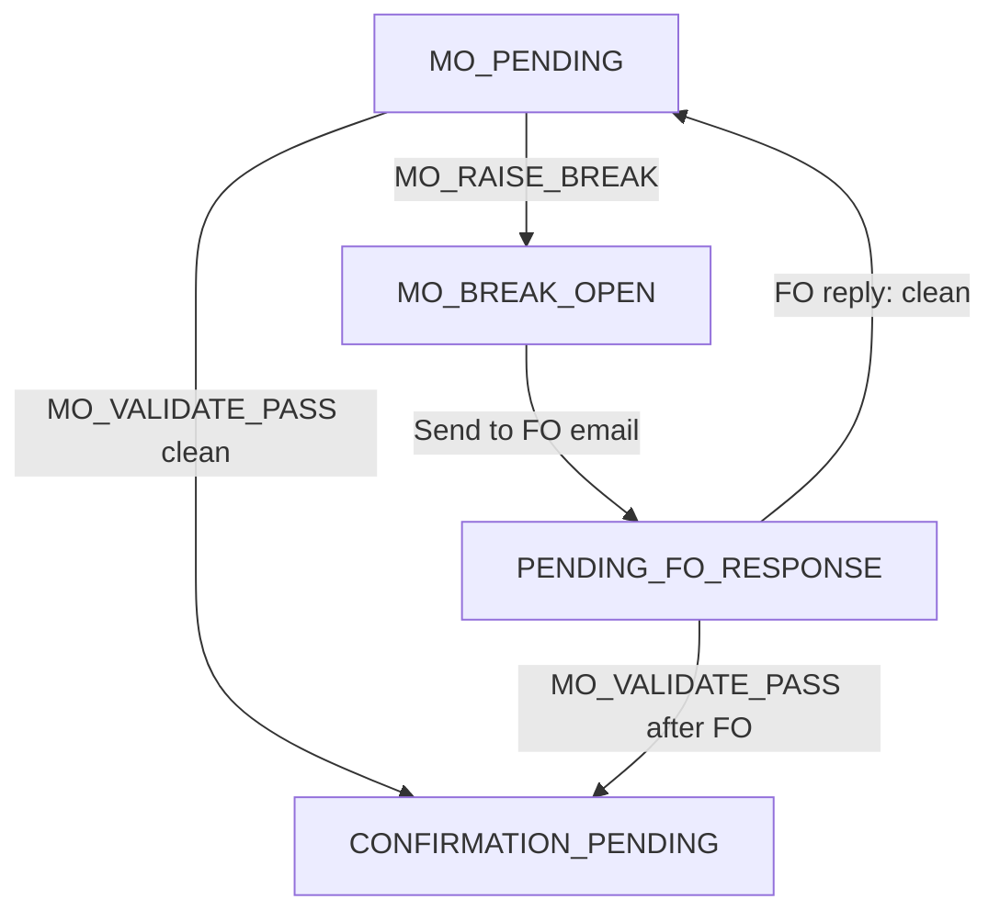
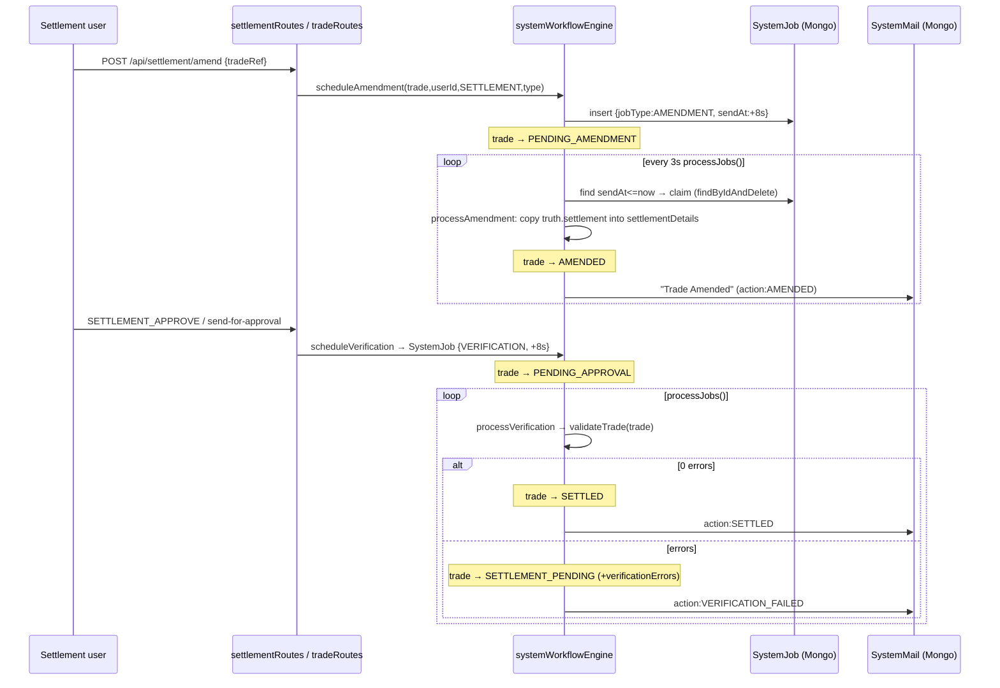
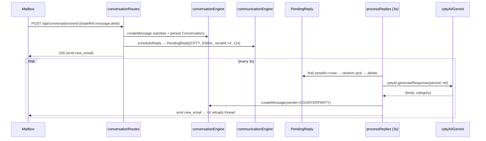

# 06 · Every User Flow

[← 05 Authentication](05_Authentication_And_Login_Flow.md) | [INDEX](INDEX.md) | Next: [07 Navigation & Routing →](07_Navigation_And_Routing.md)

---

This document traces **every user-facing feature** from UI action → frontend state → API → engine → model → DB → response → UI update, in execution order. For the login flow see [05](05_Authentication_And_Login_Flow.md). For endpoint details see [09 API Reference](09_API_Reference.md). For the state machine see [17 Flowcharts](17_Flowcharts.md).

## 6.0 The lifecycle state machine (context for all flows)

Every trade carries `currentStatus`. Legal transitions are declared in [transitions.js](../src/engine/transitions.js) and enforced by `LifecycleEngine.transition()` ([lifecycle.js](../src/engine/lifecycle.js)). Full status list:

`NEW → MO_PENDING → {MO_BREAK_OPEN | CONFIRMATION_PENDING}`, `MO_BREAK_OPEN → {MO_PENDING | PENDING_FO_RESPONSE}`, `CONFIRMATION_PENDING → {SETTLEMENT_PENDING | CONFIRMATION_BREAK | LIASING_WITH_CPTY | LIASING_WITH_FO}`, `CONFIRMATION_BREAK → {LIASING_WITH_CPTY | LIASING_WITH_FO | CONFIRMATION_PENDING}`, `SETTLEMENT_PENDING → {SETTLEMENT_BREAK | LIASING_WITH_CPTY}`, `SETTLEMENT_BREAK → {LIASING_WITH_CPTY | SETTLEMENT_PENDING | PENDING_AMENDMENT}`, `PENDING_AMENDMENT → AMENDED → PENDING_APPROVAL → {SETTLED | SETTLEMENT_PENDING}`, `REJECTED_REVERIFY → {PENDING_AMENDMENT | SETTLEMENT_PENDING}`, `SETTLED → RECON_PENDING → {RECON_CLEARED | UNMATCHED_BY_USER}`, `RECON_CLEARED → CLOSED`. (`APPROVED → SETTLED` retained for backward compat.)

> `"LIASING"` is the exact spelling used in the code (sic).

---

## 6.1 Flow: Generate a work queue (start a session)

**Where:** Workstation, "Generate Queue" button.

| # | Layer | Detail |
|---|---|---|
| 1 | UI | `generateQueue()` in [workstation/page.js](../frontend/src/app/workstation/page.js); sets `isGeneratingQueue` |
| 2 | API | `POST /api/queue/generate` `{ desk }`, `authHeaders()` |
| 3 | Route | [queueRoutes.js](../src/routes/queueRoutes.js): validates `desk ∈ {MO,CONFIRMATION,SETTLEMENT}` → 400 otherwise |
| 4 | Clock | `simulationClock.reset(); simulationClock.start()` — sim day begins (09:00) and `clock_tick` starts emitting |
| 5 | Engine | `queueComposer.buildQueue(desk, userId)` |
| 5a | | Guard: existing active `Queue`? expired → `expireSession`; else throw `"Complete your current queue first"` (route returns **200** `{success:false}`) |
| 5b | | Count unassigned DB pool for desk (`Trade.countDocuments({assignedTo:null, nextDesk:desk, currentStatus:{$in:[...]}})`) |
| 5c | | `calculateDbAllocation(pool)` — exponential: full pool → ~all 20 from DB; <50 → generate all fresh |
| 5d | | Pull from DB (recompute age, filter `age<=1`, split clean/break via `isBreakTrade`) |
| 5e | | Generate remainder via `tradeGenerator.generateTrades(clean,break,desk,settlementInitialState)` + `saveGeneratedTrades` |
| 5f | | Assemble exactly **20** (target 12 clean + 8 break), shuffle, recompute age |
| 5g | | Assign: `Trade.updateOne({tradeRef},{assignedTo:userId, age})` for each |
| 5h | | Create `Queue{userId, desk, trades:[refs], sessionStart, sessionExpiry: now+3h, isActive:true}` (upsert) |
| 6 | Response | `200 { success:true, desk, queueSize, trades, sessionStart, sessionExpiry }` |
| 7 | UI | `setQueue(trades)`, `setSessionExpiry/Start`; session timer starts counting down |

```mermaid
sequenceDiagram
    participant W as Workstation
    participant QR as queueRoutes
    participant CK as SimulationClock
    participant QC as queueComposer
    participant TG as tradeGenerator
    participant DB as Mongo (Trade/Queue)
    W->>QR: POST /api/queue/generate {desk}
    QR->>CK: reset(); start()
    QR->>QC: buildQueue(desk, userId)
    QC->>DB: countDocuments(unassigned pool)
    QC->>TG: generateTrades(clean, break, desk)
    TG->>DB: insertMany(Trade) + insertMany(AuditLog)
    QC->>DB: updateOne assignedTo=userId (x20)
    QC->>DB: upsert Queue (3h session)
    QC-->>QR: {trades, sessionExpiry}
    QR-->>W: 200 {trades, sessionStart, sessionExpiry}
```

**Refresh queue** (`refreshQueue()` / silent) → `GET /api/queue/my?desk=` → `queueComposer.getActiveQueue(userId)` (auto-expires if past 3h) → `setQueue`.

---

## 6.2 Flow: MO desk — validate / raise break / escalate to FO

The MO analyst compares `booking` vs `truths.mo`. All actions POST to `POST /api/trade/action` in [tradeRoutes.js](../src/routes/tradeRoutes.js) (the **core state-machine endpoint**), body `{ trade, action, comment }` (comment mandatory). The handler re-fetches the trade by `{tradeRef, assignedTo:userId}` (client trade not trusted), checks `allowedActions[action]` includes `currentStatus`, runs the action, transitions via `LifecycleEngine`, saves, emits `trade_update`, and fire-and-forget audits via `auditEngine.recordEvent`.

| User action | Button | `action` | From status → to status | Side effects |
|---|---|---|---|---|
| Validate (clean) | MO Validate | `MO_VALIDATE_PASS` | `MO_PENDING`/`PENDING_FO_RESPONSE` → `CONFIRMATION_PENDING` (desk CONFIRMATION) | Applies accepted `pendingAmendments`; requires `conversation.status==="RESOLVED"` if amendments pending; if `PENDING_FO_RESPONSE` requires `foResponseReceived` |
| Raise a break | MO Raise Break | `MO_RAISE_BREAK` | `MO_PENDING` → `MO_BREAK_OPEN` | — |
| Send to FO | Send to FO | `MO_SEND_TO_FO` | `MO_BREAK_OPEN` → `PENDING_FO_RESPONSE` | sets `foResponseReceived=false` |

**Escalate-to-FO email path** (the actual investigation): from the Workstation the "Send to FO" button opens the **Mailbox** (`/communication?...&composeTo=FO`) in a new tab. Sending there hits `POST /api/conversation/send` with `desk=MO`, which:
1. `conversationEngine.createMessage(...)` (persists to `Conversation`, sanitized).
2. If `MO_BREAK_OPEN` → transition to `PENDING_FO_RESPONSE`, `foResponseReceived=false`.
3. `communicationEngine.scheduleFOReply(tradeRef, trade, message)` → inserts a `PendingReply{replyType:"FO_EMAIL", sendAt: now+profileDelay}`.
4. Emits `new_email`.

Seconds later the **FO reply processor** (`processFOReplies`, every 3s) drains it: calls `foAI.generateFOResponse` (Gemini→offline), classifies the reply category, and — if the trade is clean — sets `foResponseReceived=true` and moves `PENDING_FO_RESPONSE → MO_PENDING`; if the FO confirms a break, it may attach amendments. The trainee then returns and validates.



---

## 6.3 Flow: Confirmation desk

The Confirmation analyst compares trade economics vs `truths.confirmation` (counterparty's expectation). Proactively, `tradeGenerator` seeds up to 3 CPTY confirmation-request emails per queue.

| User action | `action` | From → to | Notes |
|---|---|---|---|
| Send to CPTY | `CONFIRM_SEND_TO_CPTY` | `CONFIRMATION_PENDING`/`CONFIRMATION_BREAK`/`LIASING_WITH_FO`/`LIASING_WITH_CPTY` → `LIASING_WITH_CPTY` | `cptyContactCount++`; schedules CPTY reply |
| Confirm trade (clean) | `CONFIRM_TRADE` | `LIASING_WITH_CPTY` → `SETTLEMENT_PENDING` | Advances to settlement desk |
| Raise confirmation break | `CONFIRM_RAISE_BREAK` | `LIASING_WITH_CPTY` → `CONFIRMATION_BREAK` | Only if `cptyContactCount===1 && foContactCount===0` (first contact only) |
| Reject CPTY claim | `CONFIRM_REJECT_CLAIM` | `CONFIRMATION_BREAK` → `CONFIRMATION_PENDING` | If FO supports us & no universal mismatch, CPTY concedes (overwrites `truths.confirmation`) |
| Request evidence | `CONFIRM_REQUEST_EVIDENCE` | `CONFIRMATION_BREAK` → `CONFIRMATION_BREAK` | Pushes evidence item; emails CPTY |
| Escalate to FO | `CONFIRM_ESCALATE_TO_FO` | `CONFIRMATION_BREAK` → `LIASING_WITH_FO` | Opens FO internal channel; `foContactCount++` |
| Raise amendment | `CONFIRM_RAISE_AMENDMENT` | `CONFIRMATION_BREAK` → `CONFIRMATION_BREAK` | Stays in break |
| Approve amendment | `CONFIRM_APPROVE_AMENDMENT` | `CONFIRMATION_BREAK` → `CONFIRMATION_PENDING` | Marks all `pendingAmendments` ACCEPTED then `amendmentEngine.applyAllAccepted` |
| Resend confirmation | `CONFIRM_RESEND` | `CONFIRMATION_PENDING` → `LIASING_WITH_CPTY` | Re-emails amended confirmation |

**Round-based CPTY behavior:** the CPTY AI checks `cptyContactCount`. Round 1 uses `truths.confirmation`; round 2+ uses `truths.universal` — so a wrong CPTY "stays firm" first, then "admits mistake" on the second contact (or vice-versa). See [communicationEngine.js](../src/engine/communicationEngine.js) / [cptyAI.js](../src/engine/cptyAI.js).

**FO internal channel:** escalation opens a `FOCommunication` thread. `processFOInternalReplies` (every 3s) decides FO's position (`FO_SUPPORTS_US` / `FO_ADMITS_MISTAKE`) using round-based truth; if FO admits a mistake it auto-creates & applies amendments and moves the trade back to `CONFIRMATION_PENDING`. See [foInternalChannel.js](../src/engine/foInternalChannel.js).

---

## 6.4 Flow: Settlement desk (SSI + amend + approve + settle)

The Settlement analyst compares `settlementDetails` (SSI) vs `truths.settlement`. Trades arrive as `SETTLEMENT_PENDING` (or `SETTLEMENT_BREAK` if a break was injected).

### 6.4.1 SSI lookup
- Workstation row "View SSI" → `"ssi"` modal shows `settlementDetails`.
- "SSI Database" button opens `/ssi-database` (new tab). The trainee enters the **Alert Code** + **Acronym Code** the counterparty provided → `GET /api/ssi/search-codes?alertCode=&acronymCode=` → returns the canonical SSI from `CPTY_SSIS`/`ENTITY_SSIS` (in-memory reference data in [tradeGenerator.js](../src/engine/tradeGenerator.js)). The trainee compares codes vs booking.

### 6.4.2 Settlement actions
| User action | `action` / endpoint | From → to |
|---|---|---|
| Mail CPTY (SSI inquiry) | `SETTLEMENT_MAIL_CPTY` (trade/action) | `SETTLEMENT_PENDING` → `LIASING_WITH_CPTY` |
| Raise settlement break | `SETTLEMENT_RAISE_BREAK` (trade/action) | `LIASING_WITH_CPTY` → `SETTLEMENT_BREAK` |
| Send for system amendment | `POST /api/settlement/amend` | `SETTLEMENT_BREAK`/`REJECTED_REVERIFY` → `PENDING_AMENDMENT` |
| Approve settlement | `SETTLEMENT_APPROVE` (trade/action) | `LIASING_WITH_CPTY`/`AMENDED` → `PENDING_APPROVAL` (schedules verification) |
| Settle (final) | `POST /api/settlement/settle` | `APPROVED` → `SETTLED` |

### 6.4.3 The System Verification Bot workflow ([systemWorkflowEngine.js](../src/engine/systemWorkflowEngine.js))

This is an **automated backend workflow** using `SystemJob` (delayed jobs) + `SystemMail` (notifications), polled by `processJobs()` every 3s.



`validateTrade` (the bot rulebook) checks: economics present (`amount>0`, currency, valueDate, counterparty), counterparty vs `truths.settlement.counterparty`, `MANDATORY_FIELDS` present, and every `SSI_FIELDS` value equals the settlement truth. Any failure → rejection back to `SETTLEMENT_PENDING`. If the user's session is gone, the trade is unassigned (`assignedTo=null`).

The Workstation "Send to System for Amendment" button (in the SSI modal, when status is `SETTLEMENT_BREAK`/`REJECTED_REVERIFY`) calls `handleSendToSystemAmendment()` → `POST /api/settlement/amend`.

---

## 6.5 Flow: Communication / Mailbox (email client)

**Screen:** [communication/page.js](../frontend/src/app/communication/page.js) — an Outlook-style 3-pane client opened in a new tab. Three modes via `?channel=`:

| Mode | `channel` | Inbox source | Reply endpoint |
|---|---|---|---|
| OpsMail (CPTY) | (none) | `GET /api/conversations/personal` + `/shared` | `POST /api/conversation/send` |
| FO Chat | `FO` | `GET /api/fo-channel/list` | `POST /api/fo-channel/send` |
| System Mailbox | `SYSTEM` | `GET /api/system-mailbox/list` | read-only |

### 6.5.1 Read a thread
`InboxList` row click → `loadConversation(tradeRef, channel)` → `GET /api/conversation/<ref>` (or `/api/fo-channel/<ref>` for FO; SYSTEM uses already-loaded messages) → `setCurrentMessages` → `MessageThread` renders each message (bodies via `dangerouslySetInnerHTML`).

### 6.5.2 Compose / reply
- **Reply:** `ReplyModal` → `sendReply()` → `POST /api/conversation/send` (or `/api/fo-channel/send`) `{ tradeRef, sender:userId, message, desk }`.
- **Compose:** opened from Workstation with `?composeFor&composeTo&composeAction`. `sendCompose()` → if `composeAction` present, `POST /api/trade/action` (e.g. `CONFIRM_SEND_TO_CPTY`); else `POST /api/conversation/send` or `/api/fo-channel/send`.

### 6.5.3 Resolve a conversation
`getResolveState()` computes button state from desk/channel + `foResponseReceived`/`cptyResponseReceived`. "Resolve & Return to MO" → `POST /api/conversation/resolve` `{ tradeRef, userId }`:
- Guard `foResponseReceived` else `400 "awaiting FO response"`.
- Sets `conversation.status="RESOLVED"`, applies accepted `pendingAmendments`, transitions trade `→ MO_PENDING`. Audits `BREAK_RESOLVED`.

### 6.5.4 Real-time & polling
Socket `new_email` / `new_system_mail` → refresh folder + reload selected thread. Polling fallback every 5s.



---

## 6.6 Flow: MO-Risk termsheet viewer

**Screen:** [mo-risk/page.js](../frontend/src/app/mo-risk/page.js), opened in a new tab from MO Workstation ("View Termsheet"). Loads `GET /api/trade/all` (all trades), left list is client-side filtered by `searchQuery`; clicking a trade shows a read-only **Termsheet** built from `truths.mo` (the FO reference truth the MO compares booking against). No mutations, no sockets.

---

## 6.7 Flow: Reconciliation (post-settlement)

> **Status: engine-only, not wired to any route or UI in this checkout.** [reconciliation.js](../src/engine/reconciliation.js) + [reconBreakEngine.js](../src/engine/reconBreakEngine.js) implement ledger/statement generation, weighted break injection (`PERFECT_MATCH`/`REFERENCE_MISMATCH`/`AMOUNT_MISMATCH`/`MISSING_STATEMENT`/`DUPLICATE_LEDGER`/`TIMING_DIFFERENCE`), auto-match, and manual/force match. The lifecycle has `RECON_PENDING → RECON_CLEARED → CLOSED`, but no Express route currently exposes these functions. Documented here as designed behavior; see [18 Unused Code](18_Unused_And_Dead_Code.md).

---

## 6.8 Flow: AI Tutor

**Component:** [TutorialPanel.js](../frontend/src/components/TutorialPanel.js) (floating 🤖 chatbot on Workstation). Seeded with desk instructions from [instructionsData.js](../frontend/src/components/instructionsData.js).

```
handleSend()
  → POST {BACKEND_URL}/api/chat/tutor  (absolute URL — bypasses Next proxy)
     Authorization: Bearer <token>
     body { message, desk, tradeContext: selectedTrade, history: messages.slice(-5) }
  → chatRoutes.js → tutorAI.generateTutorResponse
     - requires OPENROUTER_API_KEY (throws otherwise)
     - injects docs/skb/*.md into system prompt (currently missing → best-effort)
     - fetch OpenRouter (nvidia/nemotron-3-ultra-550b-a55b:free), temp 0.5
     - Socratic: never gives the direct answer
  → 200 { reply }
  → append data.reply (rendered via ReactMarkdown)
```
> ⚠️ Workstation passes only `desk` to `TutorialPanel`, so `selectedTrade`/`tradeContext` is `undefined`.

---

## 6.9 Flow: Audit trail

Workstation "Audit" button → `openAudit()` → `GET /api/audit/<tradeRef>` → `auditEngine.getAuditTrail` (manual `AuditLog` entries) + `trade.auditXml` (system-generated XML). Renders XML in `<pre>` + cards (system cards flagged when `isAutomated`). "View Truth" is client-only — stringifies `selectedTrade.truths`.

---

## 6.10 Flow: Download queue as CSV

Workstation "Download Excel" → `downloadCSV()` (pure client) builds a CSV from `queue` (extra SSI columns for SETTLEMENT desk) and triggers a Blob download `trade_queue.csv`. No API.

---

## 6.11 Flow: Logout / session expiry / market close

| Trigger | Path |
|---|---|
| Logoff button | `logout()` → `POST /api/session/logout` → `clearSession()` → `/` |
| Session timer hits 0 | toast "Session expired (3 hours)" → `logout()` |
| Sim clock reaches 18:00 | `handleAlerts` toast "Market Closed" → `logout()` |
| Any page, missing token | toast "Session expired" → `router.push('/')` |

---
[← 05 Authentication](05_Authentication_And_Login_Flow.md) | [INDEX](INDEX.md) | Next: [07 Navigation & Routing →](07_Navigation_And_Routing.md)
