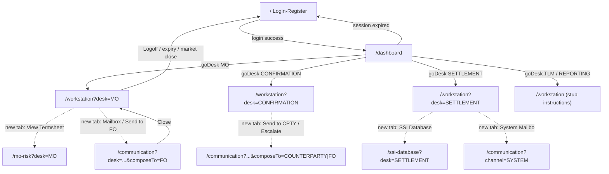

# 07 · Navigation & Routing

[← 06 User Flows](06_User_Flows.md) | [INDEX](INDEX.md) | Next: [08 Frontend Components →](08_Frontend_Components.md)

---

## 7.1 Frontend routes (Next.js App Router)

Folder = route. **Every page is a client component** (`'use client'`). No `middleware.js`, no dynamic segments, no route groups, no Next API routes.

| Route | File | Purpose | Protected? | How reached |
|---|---|---|---|---|
| `/` | [app/page.js](../frontend/src/app/page.js) | Login / Register | No (entry) | Direct / redirect on auth failure |
| `/dashboard` | [app/dashboard/page.js](../frontend/src/app/dashboard/page.js) | Desk selector (5 buttons) | Yes (client guard) | `router.push` after login |
| `/workstation?desk=DESK` | [app/workstation/page.js](../frontend/src/app/workstation/page.js) | Trade blotter + actions (core) | Yes | `goDesk(DESK)` from dashboard |
| `/mo-risk?desk=DESK` | [app/mo-risk/page.js](../frontend/src/app/mo-risk/page.js) | Termsheet viewer | Yes | `window.open` (new tab) from MO Workstation |
| `/ssi-database?desk=DESK` | [app/ssi-database/page.js](../frontend/src/app/ssi-database/page.js) | SSI code lookup | Yes | `window.open` from SETTLEMENT Workstation |
| `/communication?desk=&channel=&tradeRef=&composeFor=&composeTo=&composeAction=` | [app/communication/page.js](../frontend/src/app/communication/page.js) | Mailbox (3-pane email) | Yes | `window.open` from Workstation |

**Query params carry all context** (there is no global store): `desk` is threaded everywhere; communication additionally uses `channel` (`FO`/`SYSTEM`/none), `tradeRef`, `composeFor`, `composeTo`, `composeAction`.

**Suspense:** dashboard, workstation, mo-risk, ssi-database, communication wrap their inner component in `<Suspense>` (required because they use `useSearchParams`). Login does not.

**Lazy loading:** Next.js code-splits per route automatically; there is no manual `React.lazy`.

## 7.2 Navigation map



### Navigation mechanisms
- **Same-tab:** `useRouter().push()` — login→dashboard→workstation, and all auth-failure redirects to `/`.
- **New tab:** `window.open(url, "_blank")` — Termsheet, SSI DB, Mailbox. New tabs inherit `sessionStorage` (same-origin) so they stay authenticated.
- **Close:** communication `closeMailbox()` → `window.close()` (fallback `router.push('/workstation')`).

### Where each navigation is triggered (Workstation buttons)
| Button | Function | Target |
|---|---|---|
| MO "View Termsheet" | `openTermsheet()` | `/mo-risk?desk=` (new tab) |
| "📧 Mailbox" | `openMailboxGeneral()` | `/communication?...` (new tab) |
| MO "Send to FO" | `sendToFO()` | `/communication?...&composeTo=FO` |
| CONFIRM "Send to CPTY" | `startCptyFlow()` | `/communication?...&composeTo=COUNTERPARTY&composeAction=CONFIRM_SEND_TO_CPTY` |
| CONFIRM "Escalate to FO" | inline | `/communication?...&channel=FO&composeTo=FO` |
| SETTLE "SSI Database" | inline | `/ssi-database?desk=` |
| SETTLE "System Mailbox" | inline | `/communication?channel=SYSTEM&desk=SETTLEMENT` |
| "Logoff" | `logout()` | `/` |

## 7.3 Backend routing (Express)

### Mount table ([server.js](../server.js))
| Prefix | Router | Auth | Endpoints |
|---|---|---|---|
| `/api/auth` | authRoutes | rate-limited, no JWT | `POST /register`, `POST /login` |
| `/api/session` | sessionRoutes | JWT | `GET /info`, `POST /logout` |
| `/api/clock` | clockRoutes | **none (public)** | `GET /` |
| `/api/queue` | queueRoutes | JWT | `POST /generate`, `GET /my` |
| `/api/trade` | tradeRoutes | JWT | `GET /all`, `POST /action` |
| `/api/conversation` + `/api/conversations` | conversationRoutes | JWT | `POST /send`, `POST /resolve`, `GET /shared`, `GET /personal`, `GET /:tradeRef` |
| `/api/fo-channel` | foChannelRoutes | JWT | `GET /list`, `GET /:tradeRef`, `POST /send` |
| `/api/audit` | auditRoutes | JWT | `GET /:tradeRef` |
| `/api/settlement` | settlementRoutes | JWT | `POST /amend`, `POST /send-for-approval`, `POST /settle` |
| `/api/system-mailbox` | systemMailboxRoutes | JWT | `GET /list`, `POST /read` |
| `/api/ssi` | ssiRoutes | JWT | `GET /search`, `GET /search-codes` |
| `/api/chat` | chatRoutes | JWT | `POST /tutor` |

Full request/response details in [09 API Reference](09_API_Reference.md).

### Route middleware chain
```
request → cors() → express.json()          (global, server.js)
        → [authenticateToken]              (per-route, except auth/clock)
        → [authLimiter]                    (auth routes only)
        → handler (inline controller logic)
        → engine(s) → model(s) → MongoDB
        → res.json + (optional) socket emit + fire-and-forget audit
```

### Protected vs public
- **Public:** `GET /api/clock` only.
- **Rate-limited:** `/api/auth/register`, `/api/auth/login` (15/15min/IP).
- **Everything else:** requires a valid JWT (header or cookie).
- **No role checks anywhere.** Desk isolation is data-level (`assignedTo: userId`, `Queue.desk`), not identity-level.

### Redirects
- Backend performs **no HTTP redirects**. `POST /api/session/logout` clears the cookie; the frontend navigates.
- `conversationRoutes` double-mount means the same handlers answer both `/api/conversation/*` and `/api/conversations/*`.

## 7.4 Dynamic & nested routes

- **Frontend:** none (all static folder routes; context via query strings).
- **Backend dynamic segments:** `GET /api/conversation(s)/:tradeRef`, `GET /api/fo-channel/:tradeRef`, `GET /api/audit/:tradeRef`. In `conversationRoutes`, the literal routes (`/send`, `/resolve`, `/shared`, `/personal`) are declared **before** `/:tradeRef` so they are not shadowed.

## 7.5 The proxy layer ([next.config.mjs](../frontend/next.config.mjs))

```js
rewrites: [
  { source: '/api/:path*',       destination: `${backendUrl}/api/:path*` },
  { source: '/socket.io/:path*', destination: `${backendUrl}/socket.io/:path*` },
]
// backendUrl = NEXT_PUBLIC_BACKEND_URL || BACKEND_URL || 'http://localhost:3002'
```
This lets pages call relative `/api/...`. Exceptions that bypass the proxy (use absolute backend URL): the **Workstation socket** connection and the **TutorialPanel** `/api/chat/tutor` call.

---
[← 06 User Flows](06_User_Flows.md) | [INDEX](INDEX.md) | Next: [08 Frontend Components →](08_Frontend_Components.md)
