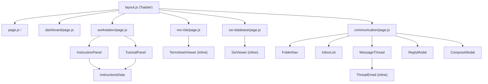

# 08 · Frontend Component Reference

[← 07 Navigation & Routing](07_Navigation_And_Routing.md) | [INDEX](INDEX.md) | Next: [09 API Reference →](09_API_Reference.md)

---

For each page/component: purpose, client/server, props, state, hooks, API calls, sockets, events, parent/children.

## 8.1 `app/layout.js` — Root Layout
- **Type:** server component. **Parent:** none (root). **Children:** every page + `<Toaster/>`.
- Loads Geist / Geist_Mono fonts as CSS vars; exports `metadata` (title "SGB Operations Simulator | Niramay Skillomentum").
- Mounts `react-hot-toast` `<Toaster position="top-center" />` once — services all `toast.*` calls app-wide. Imports `globals.css`.

## 8.2 `app/page.js` — Login / Register (`/`)
- **Type:** `'use client'`. **Parent:** layout. **Children:** none.
- **State:** `isLoginMode`, `email`, `password`, `fullName`, `errorMsg`, `isLoading`.
- **Hooks:** `useRouter()`. No `useEffect`.
- **Handlers:** `handleSubmit` (login → `POST /api/auth/login`; register → `POST /api/auth/register`); toggle button flips mode.
- **On success:** writes `sessionStorage` (`auth_token`, `justLoggedIn`) + `saveSession()` → `router.push('/dashboard')`.
- ⚠️ Empty-field path leaves `isLoading` stuck (see [18](18_Unused_And_Dead_Code.md)).

## 8.3 `app/dashboard/page.js` — Desk Selector (`/dashboard`)
- **Type:** `'use client'` (inner `DashboardComponent` in `<Suspense>`). **Children:** none.
- **State:** `userId`.
- **Hooks:** `useRouter`; `useEffect([router])` → `loadUserId()`, if `!hasSession()` toast + `push('/')`.
- **Handlers:** `goDesk(desk)` → `router.push('/workstation?desk=' + desk)`. Buttons: **MO, CONFIRMATION, SETTLEMENT, TLM, REPORTING**.
- **No API, no sockets.**

## 8.4 `app/workstation/page.js` — Trade Blotter (`/workstation`) — core screen (728 lines)
- **Type:** `'use client'` (inner `WorkstationComponent` in `<Suspense>`). **Children:** `InstructionPanel`, `TutorialPanel`.
- **Purpose:** the main desk screen — trade table, desk-specific action bar, modals, sim clock + session timer.

### State (useState)
`userId`, `desk`, `queue`, `selectedTrade`, `sessionExpiry`, `sessionStart`, `simTime`, `sessionTimerStr`, `popupState` ({type,action,trade}), `comment`, `emailText`, `auditData`, `isGeneratingQueue`, `isRefreshingQueue`, `isSubmittingAction`, `isSendingEmail`, `isEditingSSI`, `ssiFormData`.
### Refs
`alert1hrShown`, `alert10minShown` (one-shot toast flags), `socketRef`.

### Effects (useEffect)
1. **Init `[searchParams]`** — validate desk/token; `GET /api/queue/my?desk=`; connect socket `io(BACKEND_URL, {auth:{token}})`, `emit("join_desk")`, listen `trade_update`/`new_email` → `refreshQueueSilent`.
2. **Session timer `[sessionExpiry,sessionStart]`** — 1s interval; computes remaining + `simTime`; auto-logout at 0; `handleAlerts`.
3. **Sync selectedTrade `[queue,selectedTrade]`** — refresh selected trade when queue changes.
4. **Polling `[desk]`** — 15s `refreshQueueSilent`.

### Functions / API
`generateQueue` (`POST /api/queue/generate`), `refreshQueue`/`refreshQueueSilent` (`GET /api/queue/my`), `submitAction` (`POST /api/trade/action`), `handleSendToSystemAmendment` (`POST /api/settlement/amend`), `openAudit` (`GET /api/audit/:ref`), `sendEmail` (`POST /api/trade/action` or `/api/conversation/send`), `logout` (`POST /api/session/logout`), `downloadCSV` (client), `viewTruth` (client), `viewSSI` (client), plus window-open navigators (`openTermsheet`, `openMailboxGeneral`, `sendToFO`, `startCptyFlow`).

### Action gating
`allowed` map (action → statuses) mirrors backend `allowedActions`. `handleOpenAction` validates before opening the action modal. Special rule: `CONFIRM_RAISE_BREAK` only if `cptyContactCount===1 && foContactCount===0`.

### Modals (by `popupState.type`)
`"action"` (comment + submit), `"email"` (⚠ no button opens it now — dead path), `"audit"`/`"truth"` (XML + trail cards), `"ssi"` (view/edit SSI + "Send to System for Amendment").

### Known dead/broken wiring (see [18](18_Unused_And_Dead_Code.md))
- `SETTLEMENT_SEND_BACK_TO_MO` button — key absent from `allowed` → always "Invalid action".
- `startSettlementCptyFlow()` — guards on undefined `allowed['SETTLEMENT_FOLLOW_UP_CPTY']`; not bound to any button.
- `popupState.type==="email"` modal — no trigger.

## 8.5 `app/mo-risk/page.js` — Termsheet Viewer (`/mo-risk`)
- **Type:** `'use client'` (inner `MoRiskComponent` + child `TermsheetViewer`, `<Suspense>`).
- **State:** `userId`, `desk` (default "Risk"), `allTrades`, `searchQuery`, `selectedTrade`, `isLoading`.
- **Effect `[searchParams]`:** token guard; if `!uid` → `GET /api/session/info`; then `GET /api/trade/all` → `setAllTrades`.
- **Derived:** `filteredTrades` (client filter by tradeRef/currency/amount).
- **`TermsheetViewer({trade})`:** renders read-only table from `truths.mo || truth`.
- **No mutations, no sockets.**

## 8.6 `app/ssi-database/page.js` — SSI Lookup (`/ssi-database`)
- **Type:** `'use client'` (inner + child `SsiViewer`, `<Suspense>`).
- **State:** `userId`, `desk` (default "Settlement"), `alertCode`, `acronymCode`, `ssiResult`, `isLoading`, `hasSearched`.
- **Effect:** auth guard, `GET /api/session/info` if needed. No trades preloaded.
- **Handler:** `handleSearch()` → `GET /api/ssi/search-codes?alertCode=&acronymCode=` → `setSsiResult`. Inputs: Alert forced UPPERCASE maxLen 6; Acronym digits-only maxLen 6; Enter triggers search.
- **`SsiViewer({ssi})`:** shows alert/acronym codes + beneficiary/bank/BIC/account/method/correspondent.

## 8.7 `app/communication/page.js` — Mailbox (`/communication`) — 647 lines
- **Type:** `'use client'` (inner `CommunicationComponent`, `<Suspense>`). **Children:** `FolderNav`, `InboxList`, `MessageThread`, `ReplyModal`, `ComposeModal` (+ helpers in `utils.js`).
- **Purpose:** 3-pane email client with 3 modes (OpsMail / FO Chat / System) driven by `?channel=`.

### State
Identity: `userId`, `desk`, `channel`, `selectedTradeRef`, `currentFolder`. Data: `inboxData`, `currentTrade`, `currentMessages`, `todayDate`, `searchQuery`, `isLoading`. Reply modal: `replyModalOpen`, `replyBody`. Compose modal: `composeModalOpen`, `composeTo`, `composeToDisabled`, `composeTrade`, `composeSubject`, `composeBody`, `composeTrades`. Loading flags: `isSendingReply`, `isSendingCompose`, `isResolving`.
### Refs
`socketRef`; mirror refs `inboxDataRef`, `selectedTradeRefRef`, `currentFolderRef`; dedupe `lastRenderedInboxDataStr`.

### Data loaders (useCallback)
`mapConversations`, `loadPersonalInbox` (`/api/fo-channel/list` or `/api/conversations/personal`), `loadGroupInbox` (`/api/conversations/shared`), `loadSystemInbox` (`/api/system-mailbox/list`), `loadConversation` (`/api/fo-channel/:ref` or `/api/conversation/:ref`).

### Effects
1. **Init `[searchParams]`** — reads `desk/tradeRef/channel`; compose-mode preloads `GET /api/queue/my` for `composeTrades` + pre-drafts; connects socket, listens `new_email` / `new_system_mail`; 5s poll.
2. Three sync effects keep mirror refs current.

### Handlers / API
`switchFolder`, `closeMailbox` (`window.close`), `getResolveState`, `resolveConversation` (`POST /api/conversation/resolve`), `openReplyModal`, `sendReply` (`POST /api/fo-channel/send` or `/api/conversation/send`), `openNewCompose` (`GET /api/queue/my`), `handleComposeTradeChange/ToChange`, `sendCompose` (`POST /api/trade/action` if `composeAction` else send).

## 8.8 Mailbox sub-components (`app/communication/components/`)
All plain function components (inherit client boundary); parent = `CommunicationComponent`.

| Component | Key props | Purpose |
|---|---|---|
| `FolderNav.js` | `channel`, `currentFolder`, `switchFolder` | Folder list; SYSTEM → single "System Inbox"; else Inbox/Group + Sent/Drafts/Deleted (UI-only) |
| `InboxList.js` | `filteredInbox`, `loadConversation`, `getStatusBadge`, `formatDate`, `channel`, `userId` | Search + email row list; computes sender label, unread, 80-char preview; row click → `loadConversation` |
| `MessageThread.js` | `currentMessages`, `openReplyModal`, `resolveState`, `resolveConversation`, `readOnly` | Reading pane; per-message `ThreadEmail` (local `collapsed` state); body via `dangerouslySetInnerHTML`; Reply/Resolve bar |
| `ComposeModal.js` | compose* props, `sendCompose` | From/To/Trade/Subject/Body; To select (FO/COUNTERPARTY) |
| `ReplyModal.js` | reply* props, `sendReply` | To from last FO/CPTY msg; RE: subject; quoted history |
| `utils.js` | — (pure) | `formatDate/formatDateFull/formatAmount/buildSubject/getSenderInfo/getRecipientLabel/getStatusBadge` |

## 8.9 Shared components (`frontend/src/components/`)

### `InstructionPanel.js`
- **Props:** `desk`. **Parent:** Workstation. **State:** `isInlineOpen`.
- Renders `getDeskInstructions(desk)` SOP steps + pro tip; toggle expands inline panel. No API.

### `TutorialPanel.js`
- **Props:** `desk`, `selectedTrade` (Workstation passes only `desk` → `selectedTrade` undefined).
- **State:** `isFloatingOpen`, `inputText`, `isTyping`, `messages` (seeded from `getDeskInstructions`). **Ref:** `messagesEndRef` (auto-scroll).
- **Handler:** `handleSend()` → `POST {BACKEND_URL}/api/chat/tutor` (absolute URL, Bearer token), body `{message, desk, tradeContext:selectedTrade, history: messages.slice(-5)}`; appends `data.reply` via `ReactMarkdown`. Footer: "Powered by Nvidia Nemotron 3".

### `instructionsData.js`
- Pure module. `getDeskInstructions(desk)` → `{title, steps[{title,desc}], tips}` for MO/CONFIRMATION/SETTLEMENT (detailed), TLM/REPORTING (stub), fallback for unknown. Consumed by both panels.

## 8.10 `lib/auth.js` — session helpers
`getToken()`, `authHeaders()` (`Bearer <token>`), `saveSession(userId,fullName)`, `loadUserId()`, `loadFullName()`, `clearSession()`, `hasSession()`. All backed by `sessionStorage`. (`js-cookie` is installed but unused.)

## 8.11 Component tree (render hierarchy)

---
[← 07 Navigation & Routing](07_Navigation_And_Routing.md) | [INDEX](INDEX.md) | Next: [09 API Reference →](09_API_Reference.md)
