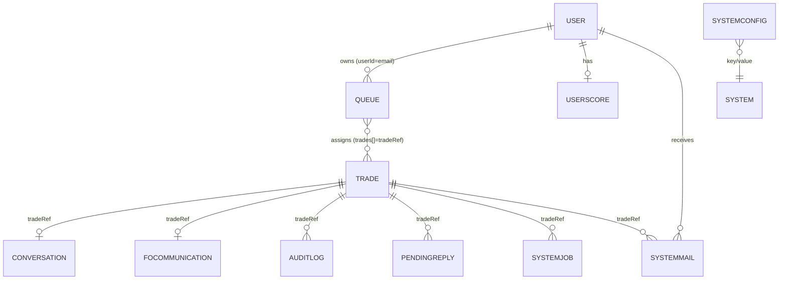

# 11 · Database Schema

[← 10 Backend Engines](10_Backend_Engines.md) | [INDEX](INDEX.md) | Next: [12 State Management →](12_State_Management.md)

---

**Database:** MongoDB (Atlas in prod, local container in docker-compose) via **Mongoose 9**. All models in [src/models/](../src/models/). All schemas use `{ timestamps: true }` unless noted (adds `createdAt`/`updatedAt`). "FK" relationships are **logical only** (no DB-level foreign keys) — mostly joined on `tradeRef` (string) and `userId` (email string).

## 11.1 Entity-relationship overview



Central key relationships:
- **`Trade.tradeRef`** (unique) is the join key for Conversation, FOCommunication, AuditLog, PendingReply, SystemJob, SystemMail.
- **`userId` (email)** joins User → Queue, UserScore, SystemMail; also `Trade.assignedTo`.

## 11.2 `Trade` — [Trade.js](../src/models/Trade.js) (central entity)

| Field | Type | Notes |
|---|---|---|
| `tradeRef` | String, **unique, indexed** | `TRD_<ts>_<rand>` |
| `originType` | String (default `AUTO_GENERATED`) | |
| `tradeDate` / `valueDate` | Date | valueDate = tradeDate + 2 (T+2) |
| `currentStatus` | String (default `MO_PENDING`) | lifecycle status |
| `nextDesk` | String, **indexed** | MO/CONFIRMATION/SETTLEMENT |
| `amount`/`currency`/`counterparty`/`direction` | mixed | booked economics (top-level) |
| `entity`/`foRegion`/`product`/`tradeType`/`settlementType` | String | trade attributes |
| `age` | Number (default 0) | desk-specific calendar age |
| `truths` | object | **desk-specific source of truth** (see below) |
| `booking` | `{amount, valueDate, currency, counterparty}` | what MO sees (may contain a break) |
| `settlementDetails` | object | SSI fields (beneficiary/bank/BIC/account/method/correspondent/paymentReference/settlementDate/settlementType) |
| `verificationErrors` | [String] | populated on `REJECTED_REVERIFY` by the bot |
| `pendingAmendments` | Array | staged amendments |
| `amendmentHistory` | [{amendmentNumber,desk,field,oldValue,newValue,source,status,appliedAt,appliedBy}] | applied amendments |
| `confirmationScenario` | {disputeType, expectedEconomics, evidence[]} | confirmation break metadata |
| `foEscalation` | {status, escalatedAt, resolvedAt, foResponse} | FO escalation state (`FO_SUPPORTS_US`/`FO_SUPPORTS_CPTY`/`FO_ADMITS_MISTAKE`/`PENDING`) |
| `foResponseReceived`/`cptyResponseReceived` | Boolean | reply flags (UI badges) |
| `cptyContactCount`/`foContactCount` | Number | drive round-based AI behavior |
| `conversation` | {status, resolvedAt} | persists resolve state across restarts |
| `assignedTo` | String (email), **indexed**, default null | current owner (null = in pool) |
| `isAutoGenerated` | Boolean (default true) | |
| `auditXml` | String | system audit XML story |

### `truths` sub-document (the grading basis)
```
truths.universal      { amount, valueDate, currency, counterparty }   ← absolute truth
truths.mo             { amount, valueDate, currency, counterparty }   ← MO/FO reference (booking compared vs this)
truths.confirmation   { amount, valueDate, currency }                 ← CPTY expectation (no counterparty)
truths.settlement     { amount, valueDate, currency, counterparty,
                        beneficiaryName, beneficiaryBank, beneficiaryBIC,
                        accountNumber, accountType, settlementMethod,
                        correspondentBank, paymentReference,
                        settlementDate, settlementType }               ← full SSI truth
```
A **break** = mismatch between the trainee-visible field (`booking`/top-level/`settlementDetails`) and the corresponding `truths.*`.

## 11.3 `User` — [User.js](../src/models/User.js)
| Field | Type | Notes |
|---|---|---|
| `email` | String, required, **unique**, lowercase, trim | login id; also used as `userId` everywhere |
| `fullName` | String, required | display name |
| `password` | String, required | **bcrypt hash** (cost 10) |
| `createdAt` | Date (default now) | (no `timestamps:true`) |

## 11.4 `Queue` — [Queue.js](../src/models/Queue.js)
| Field | Type | Notes |
|---|---|---|
| `userId` | String, required, **unique, indexed** | one active queue per user |
| `desk` | String, required | MO/CONFIRMATION/SETTLEMENT |
| `trades` | [String] | array of `tradeRef` |
| `sessionStart` | Date (default now) | sim-day anchor |
| `sessionExpiry` | Date | sessionStart + 3h |
| `isActive` | Boolean (default true, **indexed**) | |
| `lastActivity` | Date | heartbeat (`touchSession`) |

## 11.5 `Conversation` — [Conversation.js](../src/models/Conversation.js)
| Field | Type | Notes |
|---|---|---|
| `tradeRef` | String, required, **unique, indexed** | |
| `status` | String (default `OPEN`) | `OPEN`/`RESOLVED` |
| `desks` | [String] | desk tags (`$addToSet`) |
| `messages` | [MessageSchema] | thread |

`MessageSchema`: `{ sender ("USER"/"FO"/"COUNTERPARTY"), body, subject, timestamp }` (bodies are **sanitize-html scrubbed** on write).

## 11.6 `FOCommunication` — [FOCommunication.js](../src/models/FOCommunication.js)
| Field | Type | Notes |
|---|---|---|
| `tradeRef` | String, required, **unique** | |
| `desk` | String, required | context (MO/CONFIRMATION) |
| `openedBy` | String | userId |
| `status` | String (default `OPEN`) | `OPEN`/`CLOSED` |
| `messages` | [{sender, senderRole (USER/FO), message, timestamp}] | note field is `message` not `body` |

## 11.7 `PendingReply` — [PendingReply.js](../src/models/PendingReply.js)
Delayed AI reply queue (drained by background processors).
| Field | Type | Notes |
|---|---|---|
| `tradeRef` | String, required, **indexed** | |
| `replyType` | enum `CPTY_EMAIL/FO_EMAIL/FO_INTERNAL` | routes to processor |
| `sendAt` | Date, required, **indexed** | eligibility time |
| `subject`/`body`/`userMessage`/`escalationContext`/`desk` | String | context |
| `isFinalReply` | Boolean | second leg of holding-message reply |
| `payload` | Mixed | full AI response object |

## 11.8 `SystemJob` — [SystemJob.js](../src/models/SystemJob.js)
Settlement bot delayed jobs (drained by `processJobs`).
| Field | Type | Notes |
|---|---|---|
| `tradeRef` | String, required, **indexed** | |
| `jobType` | enum `AMENDMENT/VERIFICATION` | |
| `userId` | String, required, **indexed** | mailbox routing |
| `desk` | String (default SETTLEMENT) | |
| `settlementType` | String | BILATERAL/ELECTRONIC (context) |
| `sendAt` | Date, required, **indexed** | +8s default |
| `payload` | Mixed | |

## 11.9 `SystemMail` — [SystemMail.js](../src/models/SystemMail.js)
Isolated system-notification mailbox.
| Field | Type | Notes |
|---|---|---|
| `userId` | String, required, **indexed** | recipient |
| `tradeRef` | String, **indexed** | |
| `from` | String (default `System`) | |
| `subject`/`body` | String, required | |
| `action` | String | `AMENDED/APPROVED/VERIFICATION_FAILED` (also `SETTLED`) |
| `read` | Boolean (default false) | |
| `timestamp` | Date (default now) | |

## 11.10 `AuditLog` — [AuditLog.js](../src/models/AuditLog.js)
| Field | Type | Notes |
|---|---|---|
| `tradeRef` | String, **indexed** | |
| `action` | String, required | e.g. `EMAIL_SENT`, `BREAK_RESOLVED`, `SYSTEM_GENERATED`, `SETTLEMENT_*` |
| `userId` | String, **indexed** | actor (email or SYSTEM) |
| `desk` | String | |
| `details` | String (default "") | |
| `xmlContent` | String (default null) | XML for system events |
| `isAutomated` | Boolean (default false) | system vs manual |

## 11.11 `UserScore` — [UserScore.js](../src/models/UserScore.js)
| Field | Type | Notes |
|---|---|---|
| `userId` | String, required, **unique, indexed** | |
| `points` | Number (default 0) | |
| `penalties` | Number (default 0) | |
| `tradesResolved` | Number (default 0) | |
| `history` | [{tradeRef, action, pointsAwarded, timestamp}] | |

> ⚠️ Written only by `scoringEngine`, which is currently **not invoked by any live route** — so this collection stays empty in practice (see [18](18_Unused_And_Dead_Code.md)).

## 11.12 `SystemConfig` — [SystemConfig.js](../src/models/SystemConfig.js)
| Field | Type | Notes |
|---|---|---|
| `key` | String, required, **unique, indexed** | e.g. `SETTLEMENT_INITIAL_STATE` |
| `value` | Mixed, required | e.g. `"SETTLEMENT_PENDING"` |
| `description` | String | |

Seeded by [seedConfig.js](../seedConfig.js). Read by `queueComposer` for the settlement initial state.

## 11.13 `agendaJobs` (Agenda-managed)
Not a Mongoose model — Agenda auto-creates this collection (`db.collection = "agendaJobs"`) to persist scheduled jobs (`session-cleanup`, `daily-age-update`).

## 11.14 Indexes summary

| Collection | Indexed fields |
|---|---|
| trades | `tradeRef` (unique), `nextDesk`, `assignedTo` |
| users | `email` (unique) |
| queues | `userId` (unique), `isActive` |
| conversations | `tradeRef` (unique) |
| focommunications | `tradeRef` (unique) |
| pendingreplies | `tradeRef`, `sendAt` |
| systemjobs | `tradeRef`, `userId`, `sendAt` |
| systemmails | `userId`, `tradeRef` |
| auditlogs | `tradeRef`, `userId` |
| userscores | `userId` (unique) |
| systemconfigs | `key` (unique) |

## 11.15 Which controller initiates which DB operation

| Collection | Written by (route/engine) |
|---|---|
| trades | tradeGenerator (insert), queueComposer (assign/age), tradeRoutes/settlementRoutes/conversationRoutes (status), systemWorkflowEngine (amend/verify), dailyScheduler (age) |
| users | authRoutes (register) |
| queues | queueComposer (build/expire/touch), Agenda cleanup |
| conversations | conversationEngine.createMessage (from routes + comm processors + tradeGenerator) |
| focommunications | foInternalChannel |
| pendingreplies | communicationEngine + foInternalChannel (schedule), processors (delete) |
| systemjobs | systemWorkflowEngine (schedule/claim) |
| systemmails | systemWorkflowEngine (create), systemMailboxRoutes (read) |
| auditlogs | auditEngine (from many routes), tradeGenerator (SYSTEM_GENERATED) |
| userscores | scoringEngine (currently uninvoked) |
| systemconfigs | seedConfig.js (seed) |

---
[← 10 Backend Engines](10_Backend_Engines.md) | [INDEX](INDEX.md) | Next: [12 State Management →](12_State_Management.md)
