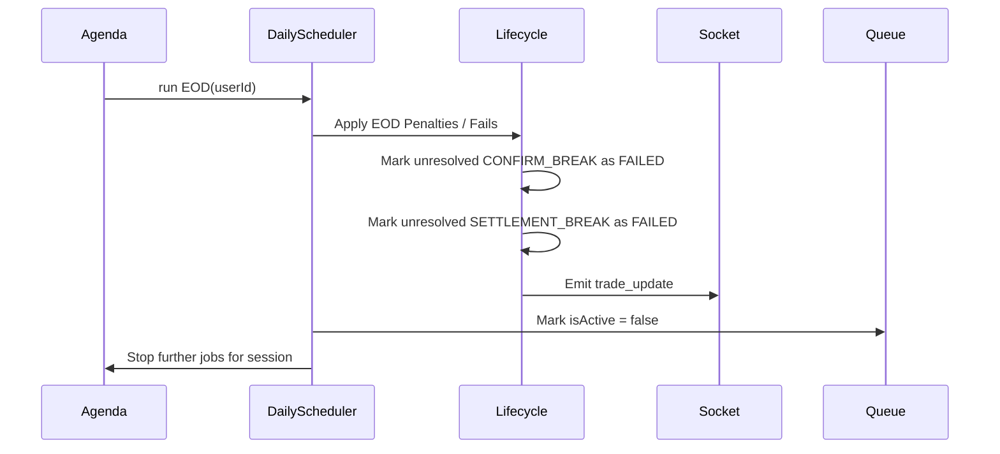

# 12. Execution & Call Graphs

This document visualizes the function call hierarchies and execution order of key backend subsystems.

## 1. Trade Generation Call Graph

When a user clicks "Generate Queue", synthetic trades are created with calculated discrepancies.

```mermaid
graph TD
    UI[Workstation Generate Button] --> API[POST /api/queue/generate]
    API --> QC[queueComposer.generateQueue(userId, desk)]
    QC --> TG[tradeGenerator.generateBatch(count, desk)]
    TG --> TGS[tradeGenerator.generateSingleTrade()]
    TGS --> TE[tradeGenerator (generate discrepancies/truths)]
    TGS --> XML[generate XML snippet]
    TG --> Models[Trade.insertMany]
    QC --> QDb[Queue.findOneAndUpdate]
    QC --> Agenda[Agenda: schedule End-of-Day jobs]
    API --> UI[Return new Queue data]
```

## 2. LLM Communication Flow (Agentic Counterparty)

When a user emails the simulated counterparty, the AI takes over asynchronously.

```mermaid
graph TD
    UI[Mailbox - Send] --> API[POST /api/conversation/send]
    API --> ConvDB[Conversation.updateOne]
    ConvDB --> API_RES[HTTP 200 OK]
    
    subgraph Background Loop (server.js)
        Srv[setInterval (3s)] --> CE[communicationEngine.processReplies]
        CE --> DB1[Find OPEN conversations w/ user msg]
        CE --> CPTY_AI[cptyAI.generateResponse(prompt)]
        CPTY_AI --> LLM[Groq / Gemini API]
        LLM --> CPTY_AI
        CPTY_AI --> CE_PARSE[Parse AI JSON]
        CE_PARSE --> DB2[Conversation.messages.push]
        CE_PARSE --> Socket[Socket.emit('new_email')]
    end
    
    API_RES --> UI_Wait
    Socket --> UI_Refresh[UI triggers GET /api/conversation]
```

## 3. Dependency Graph (Backend Engine)

How the core engine files depend on each other.

```text
server.js
│
├── src/db.js
├── src/routes/*.js
│
├── src/engine/communicationEngine.js
│   ├── src/engine/cptyAI.js
│   │   └── src/engine/llmService.js
│   ├── src/models/Conversation.js
│   └── src/engine/tradeGenerator.js
│
├── src/engine/queueComposer.js
│   ├── src/engine/tradeGenerator.js
│   └── src/engine/agendaJobs.js
│
└── src/engine/lifecycle.js
    ├── src/models/Trade.js
    └── src/engine/auditEngine.js
```

## 4. End-of-Day Lifecycle

Handled by Agenda jobs scheduled at `sessionExpiry`.


