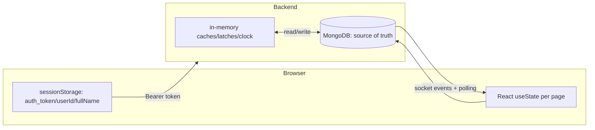

# 12 · State Management

[← 11 Database Schema](11_Database_Schema.md) | [INDEX](INDEX.md) | Next: [13 Event & Socket Flow →](13_Event_And_Socket_Flow.md)

---

There is **no Redux / MobX / Zustand / Context / signals** in this project. State lives in four places:

1. **React local component state** (`useState` / `useRef`) — per page.
2. **Browser `sessionStorage`** — the session/identity.
3. **Server (MongoDB)** — the source of truth for trades/queues/conversations.
4. **In-memory backend caches** — transient engine state.

## 12.1 Frontend: `sessionStorage` (the "auth store")

Managed by [frontend/src/lib/auth.js](../frontend/src/lib/auth.js). Keys:

| Key | Written by | Read by | Cleared by |
|---|---|---|---|
| `auth_token` | login `page.js` | `getToken()` / `authHeaders()` on every API + socket call | `clearSession()` (logout) |
| `userId` (email) | `saveSession()` | `loadUserId()` (page guards, request bodies) | `clearSession()` |
| `fullName` | `saveSession()` | `loadFullName()` | `clearSession()` |
| `justLoggedIn` | login `page.js` | Workstation init (one-shot "resuming session" toast) | consumed immediately |

- **Per-tab scope:** `sessionStorage` is tab-local, but new tabs opened via `window.open` inherit a copy — which is why the Termsheet/SSI/Mailbox tabs stay authenticated.
- **Not cookies:** `js-cookie` is installed but unused. The backend's HttpOnly `auth_token` cookie is a *separate* mechanism used only as a server-side fallback for API/socket auth.

## 12.2 Frontend: React state per page

State is entirely local; there is no cross-page store. Context flows via **URL query params** (`desk`, `channel`, `tradeRef`, `compose*`). See [08 Frontend Components](08_Frontend_Components.md) for the full per-page state inventory. Highlights:

### Workstation (`workstation/page.js`)
- **Server-derived:** `queue`, `selectedTrade`, `sessionExpiry`, `sessionStart` — set from `GET /api/queue/my`, refreshed on socket events + 15s poll.
- **UI/ephemeral:** `popupState`, `comment`, `emailText`, `auditData`, `ssiFormData`, loading flags.
- **Derived clock:** `simTime`, `sessionTimerStr` — recomputed each 1s tick.
- **Refs:** `socketRef` (client), `alert1hrShown`/`alert10minShown` (one-shot toast guards).

Who updates it / who reads it / when it changes:
- **Updated by:** `generateQueue`/`refreshQueue(Silent)`/`submitAction` (API responses), socket handlers (`trade_update`/`new_email` → `refreshQueueSilent`), timer interval (clock/timer), sync effect (keeps `selectedTrade` fresh when `queue` changes).
- **Read by:** the trade table render, action-gating (`allowed[action].includes(selectedTrade.currentStatus)`), modals.

### Communication (`communication/page.js`)
- `inboxData`, `currentMessages`, `currentTrade` from the various inbox/thread fetches; refreshed on socket `new_email`/`new_system_mail` + 5s poll.
- **Mirror refs** (`inboxDataRef`, `selectedTradeRefRef`, `currentFolderRef`) exist so socket/poll callbacks read the latest values without stale closures; `lastRenderedInboxDataStr` dedupes re-renders.

## 12.3 Frontend state-change triggers (event → state)

| Trigger | Handler | State changed |
|---|---|---|
| Login success | `handleSubmit` | sessionStorage + navigate |
| Generate Queue click | `generateQueue` | `queue`, `sessionExpiry/Start` |
| Select trade checkbox | inline | `selectedTrade` |
| Submit action | `submitAction` | `queue` (from response), `popupState=null` |
| Socket `trade_update` | listener | `queue` via `refreshQueueSilent` |
| Socket `new_email` | listener | `queue` / inbox / thread |
| Timer tick (1s) | interval | `simTime`, `sessionTimerStr` (+ auto-logout at 0) |
| Poll (15s/5s) | interval | `queue` / inbox |
| Open modal | `handleOpenAction`/`openAudit`/`viewSSI` | `popupState`, `auditData` |

## 12.4 Backend: MongoDB as source of truth

The authoritative state is in MongoDB (see [11](11_Database_Schema.md)). The frontend holds a *replica* that it keeps in sync via socket events + polling. The trade `currentStatus` is the single most important piece of state — mutated only through `LifecycleEngine.transition` + a Mongoose `save()`/`updateOne`.

## 12.5 Backend: in-memory (transient) state

Reset on every server restart. Documented so you know what is **not** persisted:

| Store | File | Purpose | Risk |
|---|---|---|---|
| `_cachedTrades` (tradeRef→trade) | communicationEngine (set in server.js) | Fast lookup for reply processors | Rebuilt every 2s; up to 2s stale |
| `cache` (conversations) | conversationEngine | Avoid DB reads on thread fetch | Repopulated on demand |
| `ledger[]/statements[]/matches[]` | reconciliation.js | Entire recon state | **Lost on restart** — recon has no persistence |
| `scenarioStore[]` | truthEngine (Layer A) | Legacy scenarios | Lost on restart |
| `userScores{}` | scoringEngine | Fallback when DB down | Lost on restart |
| `recentTemplates` (Map) | offlineResponseEngine | Anti-repeat template memory | Lost on restart |
| `simulatedTime` | clock.js | Sim clock | Reset on restart / queue generation |
| `isProcessing*` latches | comm/foInternal/systemWorkflow | Prevent overlapping interval runs | Reset on restart |

> **Design note:** Delayed work that *must* survive restarts (AI replies, bot jobs) is persisted to `PendingReply` / `SystemJob` in MongoDB (a deliberate improvement noted in code comments, e.g. "KI-007: Migrate LLM reply queues to MongoDB"). Recon state, however, is still purely in-memory.

## 12.6 State ownership summary

---
[← 11 Database Schema](11_Database_Schema.md) | [INDEX](INDEX.md) | Next: [13 Event & Socket Flow →](13_Event_And_Socket_Flow.md)
