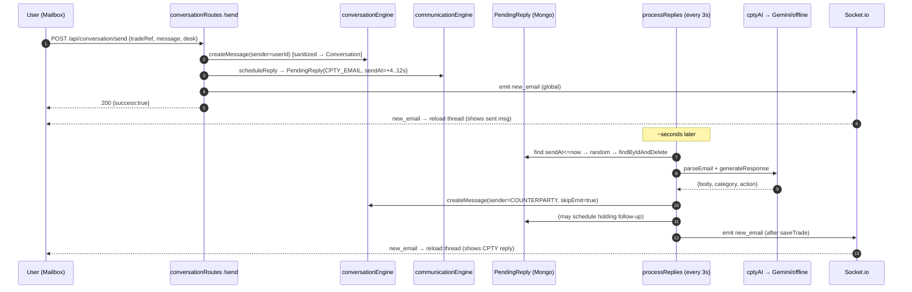

# 13 · Event & Socket Flow

[← 12 State Management](12_State_Management.md) | [INDEX](INDEX.md) | Next: [14 Execution / Call / Dependency Graphs →](14_Execution_Call_And_Dependency_Graphs.md)

---

Two kinds of "events" drive this system: **Socket.io events** (real-time server↔client) and **background interval processors** (server-internal, time-driven). This document covers both, plus a worked event trace.

## 13.1 Socket.io server ([socketEngine.js](../src/engine/socketEngine.js))

- Attached to the same `http.Server` as Express (`initSocket(server)` in `startServer`).
- **CORS:** `ALLOWED_ORIGINS` (comma-separated) or default `NEXT_PUBLIC_BACKEND_URL || http://localhost:3000`.
- **Auth (handshake):** JWT from `socket.handshake.auth.token` or `auth_token` cookie → `socket.user = { userId, fullName }`; rejects otherwise.
- **Rooms:** each socket auto-joins `user_<userId>`; can `join_desk`/`leave_desk` → `desk_<desk>` rooms.

### Socket event catalog

| Event | Direction | Payload | Emitter | Consumer |
|---|---|---|---|---|
| (handshake) | client→server | `auth.token` / cookie | client | `io.use` JWT middleware |
| `join_desk` | client→server | `desk` string | Workstation & Communication init | `socket.join(desk_<desk>)` |
| `leave_desk` | client→server | `desk` string | (available) | `socket.leave` |
| `disconnect` | client→server | — | client unmount | logs |
| `clock_tick` | server→**all** (`io.emit`) | `{ simTime, timeLeftMinutes }` | `clock.js` every 1s | (available to clients; UI computes its own timer too) |
| `trade_update` | server→`user_<userId>` | `{ tradeRef, currentStatus }` | tradeRoutes, settlementRoutes, systemWorkflowEngine | Workstation → `refreshQueueSilent` |
| `new_email` | server→**all** (`io.emit`) | `{ tradeRef, ... }` (shape varies) | conversationEngine, communicationEngine, foInternalChannel, conversation/fo-channel routes | Workstation & Communication → refresh |
| `new_system_mail` | server→`user_<userId>` | system mail | systemWorkflowEngine | Communication (SYSTEM channel) → `loadSystemInbox` |

> ⚠️ `new_email` is a **global broadcast** (`io.emit`), not scoped to a room — every connected client is notified regardless of ownership. The `user_<userId>` / `desk_<desk>` rooms exist but `new_email` doesn't use them. Clients then re-fetch their own (scoped) data.

### Client socket usage (differs by page)

| Page | Connect URL | Auth | Emits | Listens |
|---|---|---|---|---|
| Workstation | `NEXT_PUBLIC_BACKEND_URL \|\| http://localhost:3002` (**direct**, bypasses proxy) | `{auth:{token}}` | `join_desk` | `trade_update`, `new_email` → `refreshQueueSilent` |
| Communication | `NEXT_PUBLIC_BACKEND_URL \|\| window.location.origin` (origin routes via `/socket.io` rewrite) | `{auth:{token}}` | `join_desk` | `new_email`, `new_system_mail` → refresh |

Both disconnect on unmount and keep a **polling fallback** (Workstation 15s, Communication 5s) so the UI self-heals if the socket drops.

> ⚠️ **Deployment gotcha:** if `NEXT_PUBLIC_BACKEND_URL` is unset in production, Workstation sockets target `localhost:3002` while Communication targets the app origin — an inconsistency to set explicitly. See [20 Security](20_Security_Analysis.md) / [19 Performance](19_Performance_Analysis.md).

## 13.2 Background interval processors ([server.js](../server.js))

Registered at module load, fire on timers (independent of requests). These are the engine's "clock-driven events".

| Interval | Processor | Reads | Writes | Emits |
|---|---|---|---|---|
| 3000 ms | `communicationEngine.processReplies` | `PendingReply{CPTY_EMAIL}`, `_cachedTrades` | `Trade` (cptyResponseReceived, pendingAmendments), `Conversation` | `new_email` |
| 3000 ms | `communicationEngine.processFOReplies` | `PendingReply{FO_EMAIL}` | `Trade` (foResponseReceived, currentStatus, pendingAmendments), `Conversation` | `new_email` |
| 3000 ms | `foInternalChannel.processFOInternalReplies` | `PendingReply{FO_INTERNAL}`, `Trade` | `Trade` (foEscalation, currentStatus), `FOCommunication` | `new_email` |
| 3000 ms | `systemWorkflowEngine.processJobs` | `SystemJob` | `Trade`, `SystemMail`, `AuditLog` | `trade_update`, `new_system_mail` |
| 2000 ms | inline cache refresh | `Trade{assignedTo≠null}` | `_cachedTrades` (memory) | — |
| 1000 ms | `SimulationClock` tick | `simulatedTime` | `simulatedTime` (memory) | `clock_tick` |
| 60 s (Agenda) | `session-cleanup` | `Queue{expired}` | `Queue.isActive`, `Trade.assignedTo` | — |
| 60 s (Agenda) | `daily-age-update` | `Trade` | `Trade.age` | — |

Each processor uses an `isProcessing*` latch to avoid overlapping runs, and picks a **random** ready item to spread load (`PendingReply.find(...)` → random pick → `findByIdAndDelete`).

## 13.3 Worked event trace: "user emails counterparty → gets AI reply"



Files in execution order:
1. `communication/page.js` `sendReply/sendCompose`
2. `conversationRoutes.js` `/send`
3. `conversationEngine.js` `createMessage` (+ `sanitize-html`)
4. `communicationEngine.js` `scheduleReply` → `PendingReply` model
5. (timer) `server.js` interval → `communicationEngine.processReplies`
6. `aiParser.js` `parseEmail` → `cptyAI.js` `generateResponse` → `llmService.js` (Gemini) or `offlineResponseEngine.js`
7. `conversationEngine.js` `createMessage` (CPTY reply)
8. `socketEngine.js` `getIo().emit("new_email")`
9. `communication/page.js` socket listener → `loadConversation`

## 13.4 Worked event trace: "trade action → real-time queue update"

```
workstation/page.js submitAction
  → POST /api/trade/action
    → tradeRoutes.js: LifecycleEngine.transition + Trade.save
    → res.json {trades}
    → getIo().to(user_<userId>).emit("trade_update", {tradeRef, currentStatus})
    → auditEngine.recordEvent (fire-and-forget)
  → setQueue(response.trades)                 (immediate, from response)
  ← socket "trade_update" → refreshQueueSilent (also refreshes, belt-and-suspenders)
```

## 13.5 Event-flow guarantees & caveats

- **At-most-once job processing:** `findByIdAndDelete` claims a `PendingReply`/`SystemJob` before processing (no duplicate replies across ticks).
- **Retry on AI failure:** if the AI returns null, the reply is re-queued with `sendAt = now + 5000`.
- **Ordering:** replies are picked **randomly** among ready items — not FIFO — modeling real-world non-determinism.
- **Socket delivery is best-effort:** all emits are wrapped in try/catch and swallowed; the polling fallback is the safety net.

---
[← 12 State Management](12_State_Management.md) | [INDEX](INDEX.md) | Next: [14 Execution / Call / Dependency Graphs →](14_Execution_Call_And_Dependency_Graphs.md)
