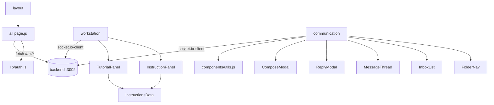

# 14 · Execution, Call & Dependency Graphs

[← 13 Event & Socket Flow](13_Event_And_Socket_Flow.md) | [INDEX](INDEX.md) | Next: [15 Complete File Reference →](15_Complete_File_Reference.md)

---

## 14.1 Execution reference — exact file order per user action

### A. Application startup
```
1. node server.js
2. dotenv.config()
3. require(src/db, models, engines, agendaJobs, socketEngine)  [schemas registered, singletons built]
4. register setInterval processors (comm x3, systemWorkflow, cache refresh)
5. assert JWT_SECRET (exit 1 if missing)
6. app.use(cors, express.json, ...12 routers)
7. startServer(): connectDB → startAgenda → http.createServer(app) → initSocket → listen(3002)
```

### B. Login
```
1. frontend/src/app/page.js        handleSubmit
2. next.config.mjs rewrite         /api/auth/login → :3002
3. src/routes/authRoutes.js        authLimiter → login handler
4. src/models/User.js              User.findOne
5. bcryptjs                        compare
6. jsonwebtoken                    sign (JWT_SECRET from src/middleware/auth.js)
7. src/routes/authRoutes.js        Set-Cookie + res.json
8. frontend/src/lib/auth.js        saveSession / sessionStorage
9. frontend/src/app/dashboard/page.js  useEffect guard → render
```

### C. Generate queue
```
1. workstation/page.js             generateQueue
2. queueRoutes.js                  POST /generate (validate desk)
3. clock.js                        reset() + start()
4. queueComposer.js                buildQueue
5. Trade/Queue/SystemConfig models countDocuments / find
6. tradeGenerator.js               generateTrades → saveGeneratedTrades (Trade+AuditLog insertMany)
7. ageCalculator.js                calculateAge
8. queueComposer.js                Trade.updateOne(assignedTo) x20 + Queue upsert
9. queueRoutes.js                  res.json
10. workstation/page.js            setQueue + session timer starts
```

### D. Trade action (e.g. MO_RAISE_BREAK)
```
1. workstation/page.js             handleOpenAction → submitAction
2. tradeRoutes.js                  POST /action (fetch by assignedTo, guard allowedActions)
3. lifecycle.js                    LifecycleEngine.transition
4. transitions.js                  TRANSITIONS lookup
5. src/models/Trade.js             sessionTrade.save()
6. queueComposer.js                getActiveQueue
7. tradeRoutes.js                  res.json
8. socketEngine.js                 getIo().emit(trade_update)
9. auditEngine.js                  recordEvent (fire-and-forget → AuditLog)
10. workstation/page.js            setQueue
```

### E. Email → AI reply (see [13 §13.3](13_Event_And_Socket_Flow.md) for full trace)
```
send: page → conversationRoutes /send → conversationEngine.createMessage → communicationEngine.scheduleReply (PendingReply) → emit new_email
reply (timer): server.js interval → communicationEngine.processReplies → aiParser → cptyAI → llmService(Gemini)/offlineResponseEngine → conversationEngine.createMessage → emit new_email
```

### F. Settlement amend/verify (see [06 §6.4.3](06_User_Flows.md))
```
amend:  settlementRoutes /amend → systemWorkflowEngine.scheduleAmendment (SystemJob) → [timer] processJobs → processAmendment → Trade→AMENDED + SystemMail
verify: SETTLEMENT_APPROVE (tradeRoutes) → scheduleVerification (SystemJob) → [timer] processVerification → validateTrade → SETTLED | SETTLEMENT_PENDING
settle: settlementRoutes /settle → LifecycleEngine.transition(SETTLED) → auditEngine
```

## 14.2 Call graph — login (canonical)

```
page.js LoginPage.handleSubmit
  └─ fetch POST /api/auth/login
      └─ authRoutes.js authLimiter
          └─ login handler
              ├─ User.findOne()                 [users]
              ├─ bcrypt.compare()
              ├─ jwt.sign()  ← JWT_SECRET (middleware/auth.js)
              └─ res.setHeader Set-Cookie + res.json
  └─ sessionStorage + auth.js saveSession()
  └─ router.push('/dashboard')
      └─ dashboard/page.js useEffect → hasSession() → goDesk()
          └─ router.push('/workstation?desk=DESK')
```

## 14.3 Call graph — trade action

```
tradeRoutes POST /action
  ├─ Trade.findOne({tradeRef, assignedTo:userId})
  ├─ queueComposer.touchSession()
  ├─ allowedActions guard
  ├─ switch(action)
  │    ├─ amendmentEngine.applyAllAccepted / createAmendment
  │    ├─ conversationEngine.createMessage
  │    ├─ communicationEngine.scheduleReply
  │    ├─ foInternalChannel.openChannel/sendMessage/scheduleFOInternalReply
  │    ├─ truthEngine.getMismatchFields
  │    └─ systemWorkflowEngine.scheduleVerification (SETTLEMENT_APPROVE)
  ├─ LifecycleEngine.transition → transitions.js
  ├─ sessionTrade.save()
  ├─ queueComposer.getActiveQueue
  ├─ res.json
  ├─ socketEngine.getIo().emit(trade_update)
  └─ auditEngine.recordEvent → AuditLog
```

## 14.4 Module dependency graph (backend)

```mermaid
flowchart TD
  server[server.js] --> db[src/db.js]
  server --> routes[routes/*]
  server --> agenda[agendaJobs]
  server --> socket[socketEngine]
  server --> comm[communicationEngine]
  server --> convo[conversationEngine]
  server --> foI[foInternalChannel]
  server --> sysw[systemWorkflowEngine]

  routes --> mw[middleware/auth]
  routes --> models[models/*]
  routes --> engines[engine/*]

  comm --> aiParser
  comm --> cptyAI
  comm --> cptySettlementAI
  comm --> foAI
  comm --> amend[amendmentEngine]
  comm --> truth[truthEngine]
  comm --> foProfiles[foResponseProfiles]
  comm --> lifecycle
  comm --> PendingReply

  cptyAI --> llm[llmService]
  cptyAI --> offline[offlineResponseEngine]
  cptyAI --> truth
  foAI --> llm
  foAI --> offline
  offline --> foOff[foOfflineResponses]
  offline --> cptyOff[cptyOfflineResponses]
  offline --> foProfiles
  offline --> truth

  convo --> Conversation
  convo --> socket
  foI --> foAI
  foI --> FOCommunication
  foI --> amend
  foI --> lifecycle

  sysw --> lifecycle
  sysw --> SystemJob
  sysw --> SystemMail
  sysw --> auditEngine
  sysw --> socket

  queueComposer --> tradeGenerator
  queueComposer --> ageCalculator
  queueComposer --> truth
  queueComposer --> Queue
  queueComposer --> Trade
  tradeGenerator --> ageCalculator
  tradeGenerator --> convo

  lifecycle --> transitions
  lifecycle --> errors
  clock --> socket
  cutoff --> clock
  dailyScheduler --> ageCalculator
  agenda --> queueComposer
  agenda --> dailyScheduler
```



## 14.5 Frontend dependency graph



## 14.6 Circular dependencies & lazy requires

To avoid require cycles, several modules use **lazy `require()` inside functions** rather than at top-of-file:

| Module | Lazily requires | Reason |
|---|---|---|
| communicationEngine | `cptySettlementAI`, `socketEngine` | break cycle / defer socket init |
| conversationRoutes | `truthEngine`, `socketEngine.getIo`, `Conversation` | avoid cycles |
| tradeRoutes | `truthEngine` | avoid cycle |
| foChannelRoutes | `FOCommunication`, `socketEngine.getIo` | defer |
| cptySettlementAI | `tradeGenerator` (SSI dicts), `Trade` | avoid heavy cycle |
| foInternalChannel | `socketEngine`, `amendmentEngine`, `lifecycle` | avoid cycles |
| settlementRoutes / tradeRoutes | `socketEngine.getIo` | socket not ready at require time |

No **problematic** runtime cycles exist; the lazy-require pattern is used deliberately. The one duplicated implementation is `llmService.js` (root vs engine copy) — see [18](18_Unused_And_Dead_Code.md).

## 14.7 "Who imports whom" quick reference

- **Everything backend** ultimately flows through `server.js` (mounts routers, registers processors).
- **`lifecycle.js` + `transitions.js`** are imported by nearly every status-changing route/engine.
- **`truthEngine.js`** is the shared grading dependency for AI personas, confirmation/settlement break engines, and queueComposer.
- **`socketEngine.getIo()`** is imported (lazily) wherever a real-time emit is needed.
- **`auditEngine`** is imported by trade/settlement/conversation routes + systemWorkflowEngine.

---
[← 13 Event & Socket Flow](13_Event_And_Socket_Flow.md) | [INDEX](INDEX.md) | Next: [15 Complete File Reference →](15_Complete_File_Reference.md)
