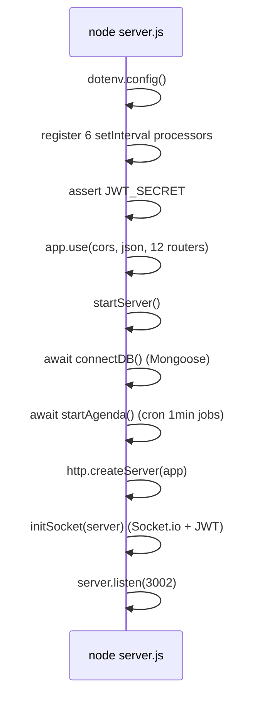
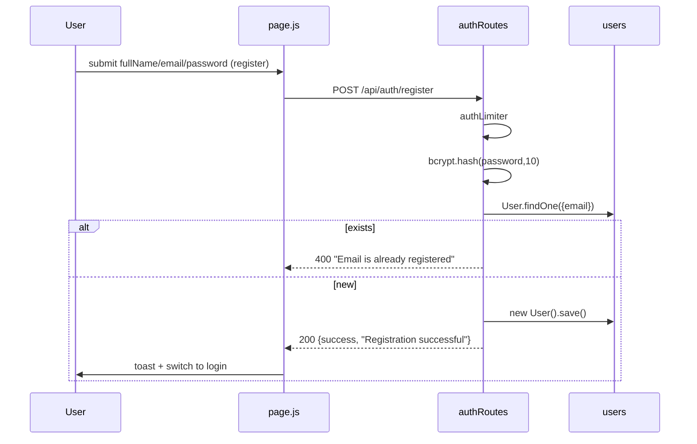
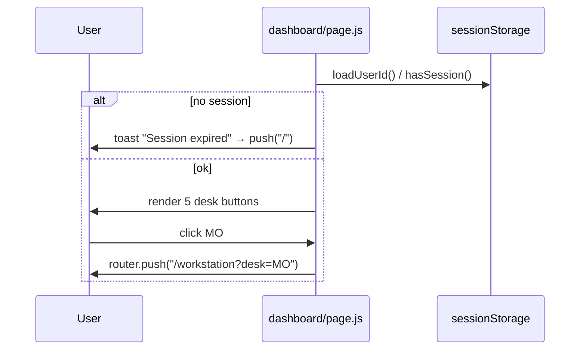
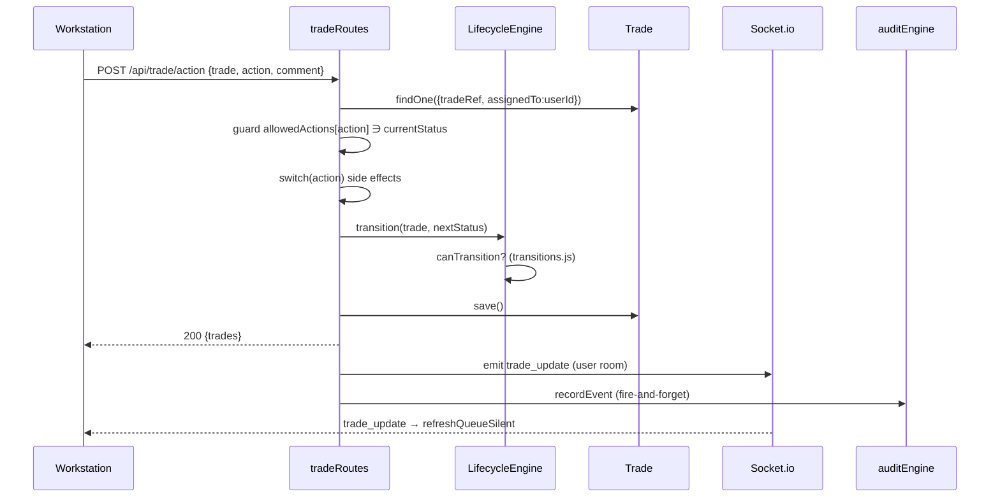
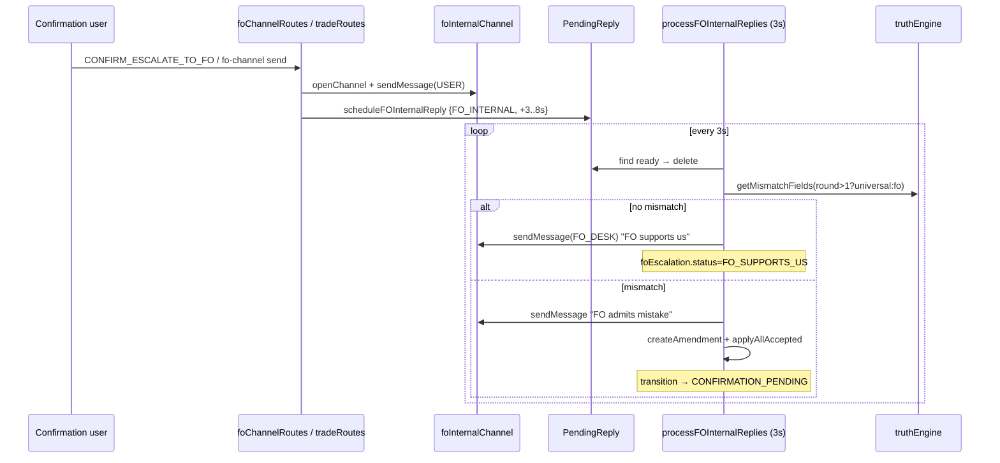
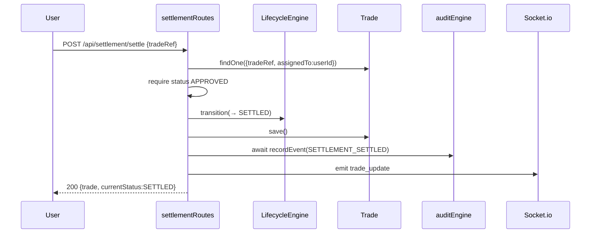
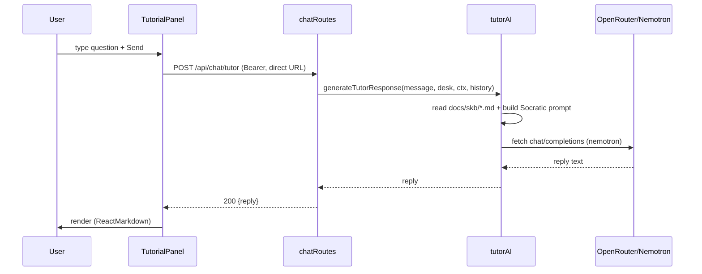
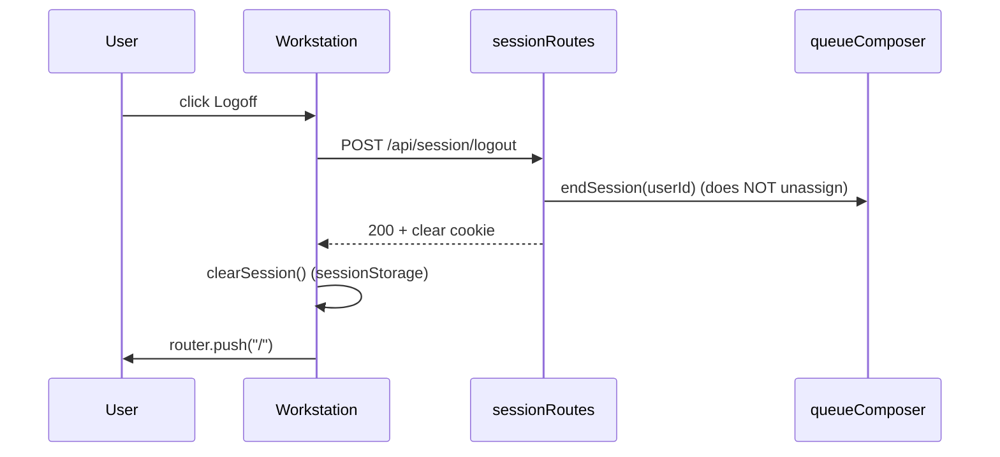
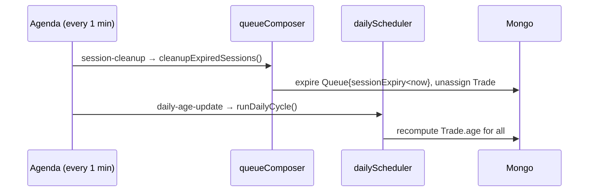

# 16 · Sequence Diagrams

[← 15 File Reference](15_Complete_File_Reference.md) | [INDEX](INDEX.md) | Next: [17 Flowcharts →](17_Flowcharts.md)

---

Mermaid sequence diagrams for all major workflows. (Startup, login, email→reply, and settlement bot also appear inline in [04](04_Entry_Point_And_Startup.md)/[05](05_Authentication_And_Login_Flow.md)/[06](06_User_Flows.md)/[13](13_Event_And_Socket_Flow.md); collected and extended here.)

## 16.1 Application startup

## 16.2 Registration

## 16.3 Login
See [05 §5.4.2](05_Authentication_And_Login_Flow.md).

## 16.4 Dashboard loading & desk selection

## 16.5 Queue generation
See [06 §6.1](06_User_Flows.md).

## 16.6 Trade action (state transition)

## 16.7 Email send → AI counterparty reply
See [13 §13.3](13_Event_And_Socket_Flow.md).

## 16.8 FO internal escalation

## 16.9 Settlement amend + verify (System Bot)
See [06 §6.4.3](06_User_Flows.md).

## 16.10 Settle (final)

## 16.11 AI Tutor

## 16.12 Logout

## 16.13 Admin/automated operations (Agenda)

---
[← 15 File Reference](15_Complete_File_Reference.md) | [INDEX](INDEX.md) | Next: [17 Flowcharts →](17_Flowcharts.md)
