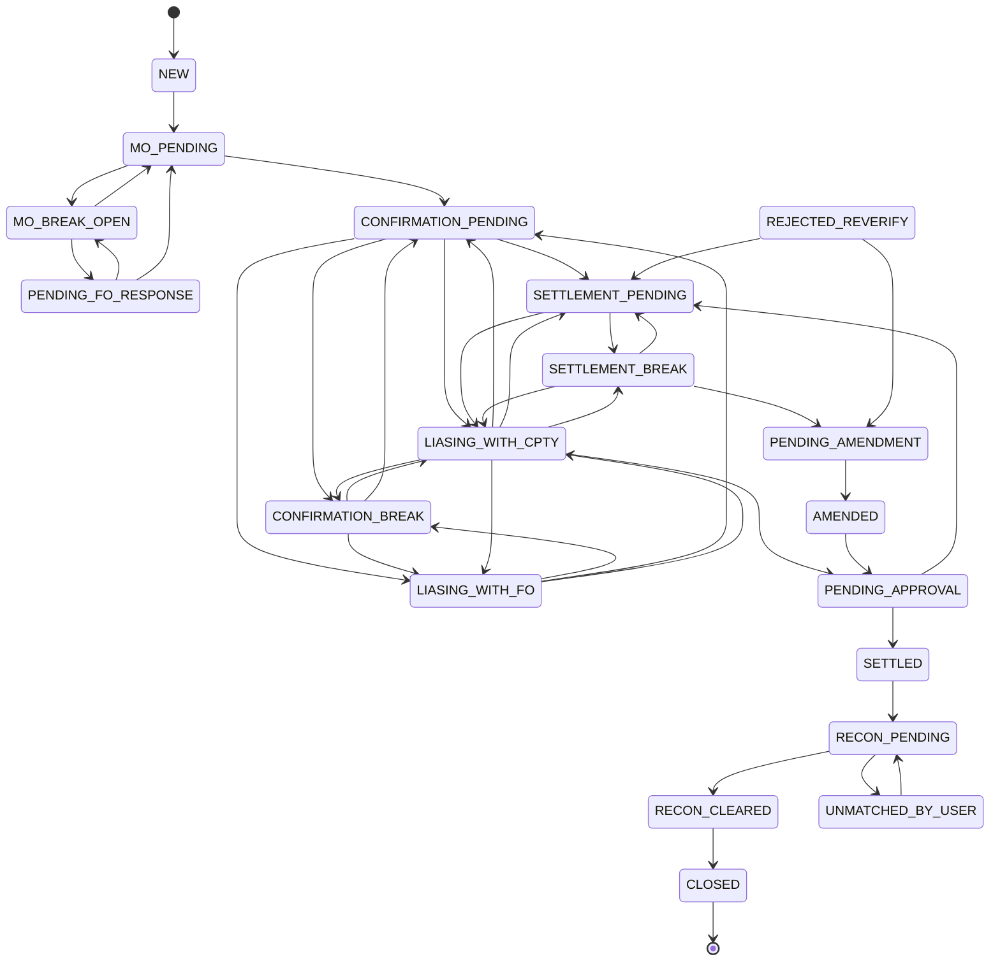
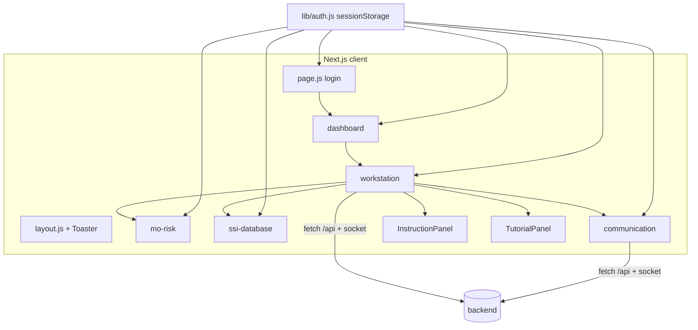
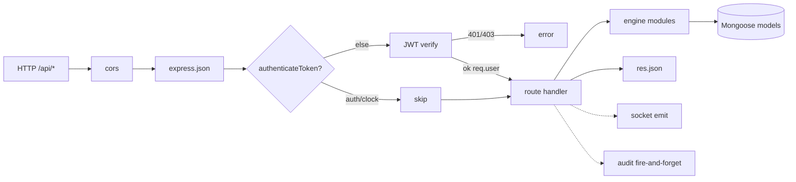
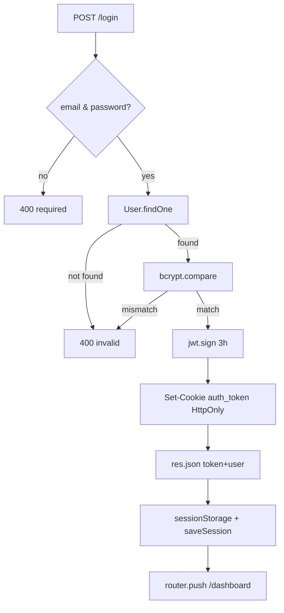
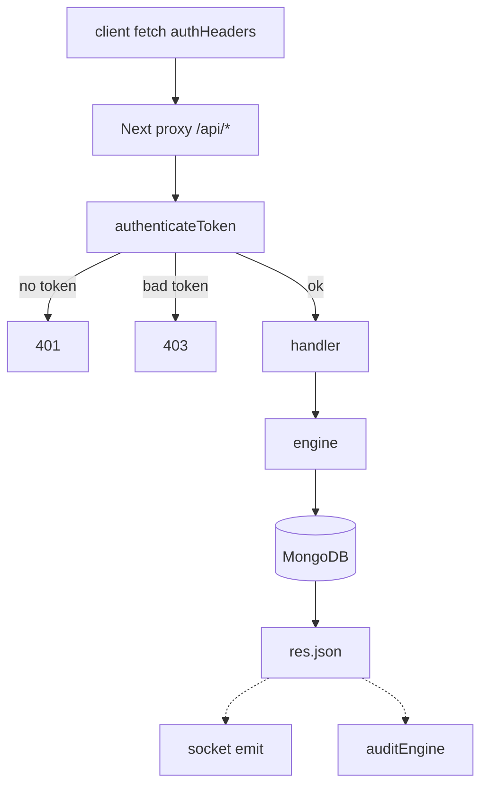
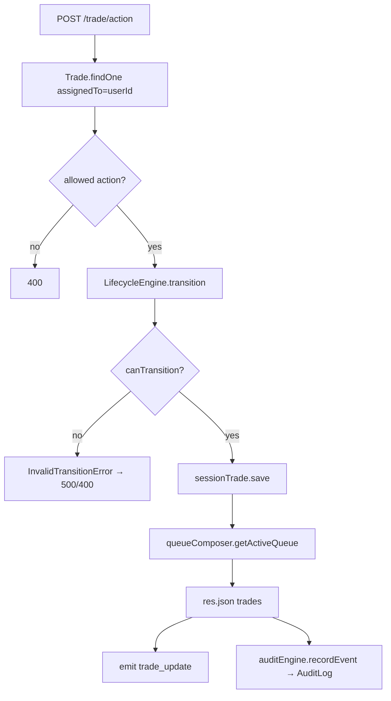
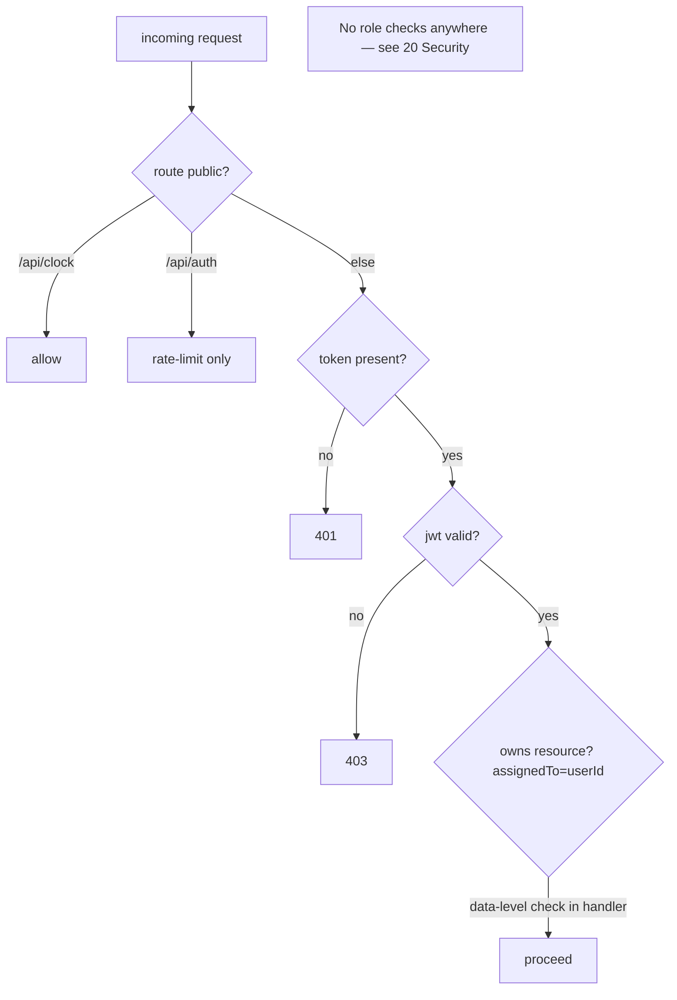
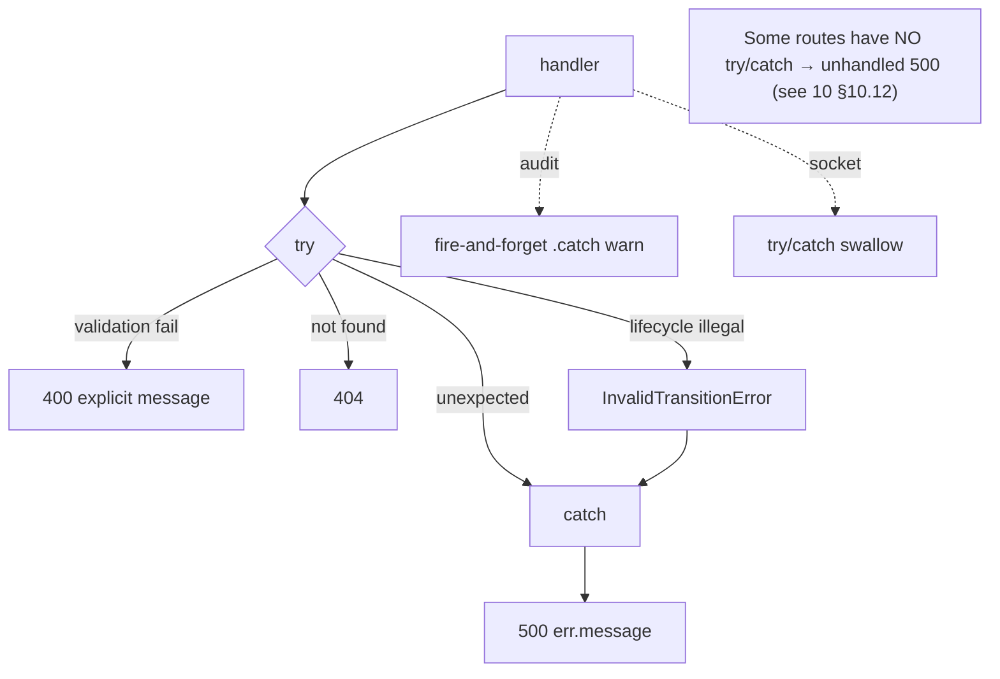
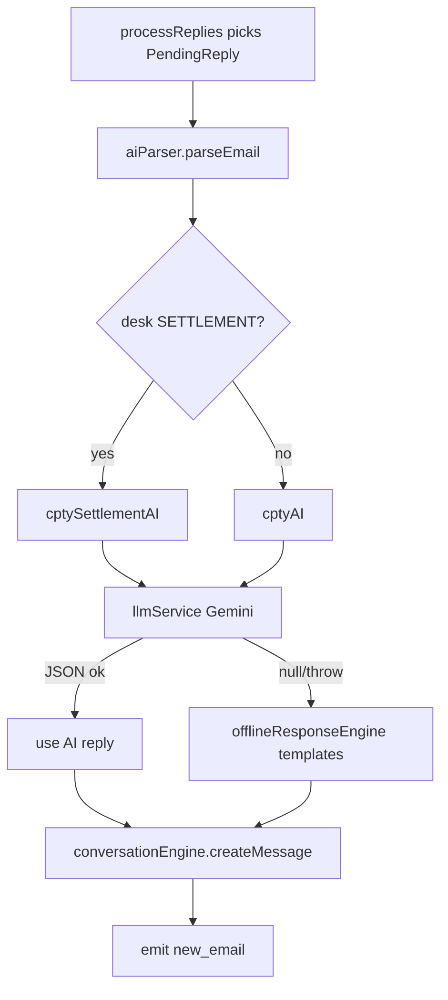

# 17 · Flowcharts

[← 16 Sequence Diagrams](16_Sequence_Diagrams.md) | [INDEX](INDEX.md) | Next: [18 Unused & Dead Code →](18_Unused_And_Dead_Code.md)

---

## 17.1 Overall system architecture
See [02 §2.1](02_Architecture.md).

## 17.2 The trade lifecycle state machine (complete)

## 17.3 Frontend architecture

## 17.4 Backend architecture (request pipeline)

## 17.5 Authentication flow

## 17.6 API request lifecycle (protected route)

## 17.7 Navigation flow
See [07 §7.2](07_Navigation_And_Routing.md).

## 17.8 Database interaction flow (trade action write)

## 17.9 Authentication + authorization decision

## 17.10 Error-handling flow

## 17.11 AI reply generation (Gemini → offline fallback)

---
[← 16 Sequence Diagrams](16_Sequence_Diagrams.md) | [INDEX](INDEX.md) | Next: [18 Unused & Dead Code →](18_Unused_And_Dead_Code.md)
