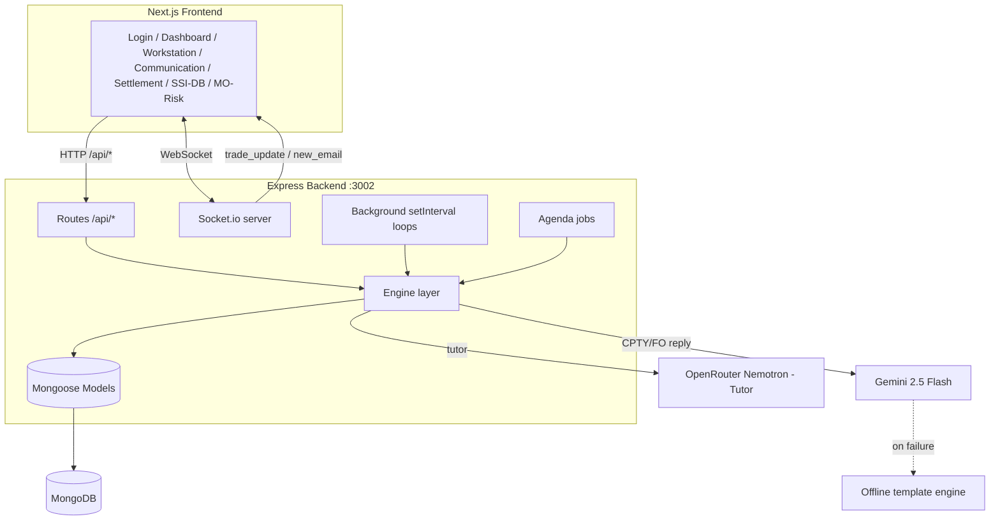
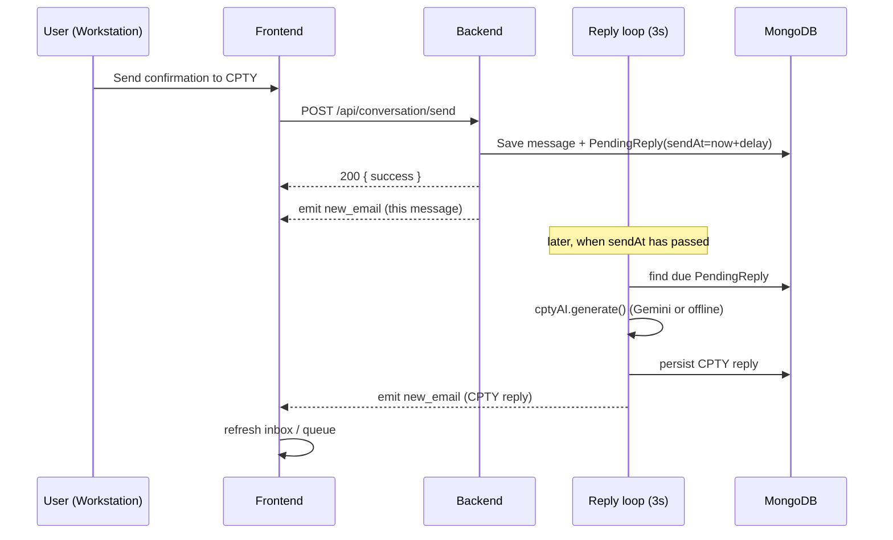

# Architecture

> **Purpose:** Describe the runtime architecture of the iLabs — SGB Operations Simulator: processes, layers, the async simulation loop, real-time channel, and AI integration.
> **Audience:** Backend and full-stack engineers.
> **Last verified:** 2026-07-01 against the implementation.
> **Related:** [API Reference](API.md) · [Database](DATABASE.md) · [Business Rules](BUSINESS_RULES.md) · [Deployment](DEPLOYMENT.md)

---

## System overview

The system is two processes: an **Express 5 backend** (`server.js`, default port **3002**) and a **Next.js 16 frontend** (`frontend/`, dev port 3000, Docker port 3001). The frontend talks to the backend over HTTP and Socket.io; in dev/prod the Next.js config **proxies** `/api/*` and `/socket.io/*` to the backend, so page code uses relative paths.

## Backend layering

Strict one-way dependency: **routes → engine → models**. Routes are thin (validate input, call an engine, return JSON); all business logic lives in `src/engine/`.

### Entry point — `server.js`

On boot (`server.js`):
1. Load `.env`; **fail fast** if `JWT_SECRET` is missing (server.js:95-99).
2. `connectDB()` — MongoDB via `src/db.js` (serverSelectionTimeout 10s; continues in memory-only mode if `MONGO_URI` unset).
3. `startAgenda()` — schedules periodic jobs.
4. Wrap Express `app` in an `http.Server`; `initSocket(server)` mounts Socket.io.
5. Mount 11 routers under `/api/*` (server.js:107-118); apply global `cors()` and `express.json()`.
6. Listen on `PORT` (default 3002).
7. Start 4 background loops (below).

### The four background loops

The simulation advances on timers in `server.js`, decoupled from request/response:

| Loop | Interval | Purpose |
|------|----------|---------|
| CPTY reply processor | 3s | Deliver due counterparty replies into conversations |
| FO reply processor | 3s | Deliver due front-office replies into conversations |
| FO internal channel processor | 3s | Deliver due FO internal-channel replies; update `foEscalation` |
| Trade cache refresh | 2s | Rebuild an in-memory cache of assigned trades for fast lookup |

**Scheduled replies are persisted, not in-memory.** When you message the CPTY/FO, the engine writes a **`PendingReply`** document (`replyType` = `CPTY_EMAIL` / `FO_EMAIL` / `FO_INTERNAL`, with a future `sendAt`). The 3-second loops pick up any `PendingReply` whose `sendAt` has passed, generate the reply, persist it to the conversation, and emit a socket event. Because scheduling lives in MongoDB, a restart does not lose in-flight replies.

### Agenda jobs — `src/engine/agendaJobs.js`

Agenda (backed by the `agendaJobs` Mongo collection) runs **two** repeating jobs every **1 minute** — nothing more:
- `session-cleanup` → `queueComposer.cleanupExpiredSessions()`
- `daily-age-update` → `dailyScheduler.runDailyCycle()` (recomputes desk-specific trade age)

Agenda does **not** drive trade state transitions; those happen from user actions and from the reply loops.

### Simulated clock — `src/engine/clock.js`

A simulated trading day runs **09:00 → 18:00**. Real time is compressed (≈1 real second → 3 simulated seconds) so the ~3-hour session spans a full day. `clock_tick` events carry the formatted time and minutes remaining to the 18:00 cutoff. `/api/clock` exposes the current sim time.

### Engine layer highlights (`src/engine/`)

| Engine | Responsibility |
|--------|---------------|
| `tradeGenerator.js` | Build trades with layered truths, booking, settlement details, XML audit; SSI tables |
| `queueComposer.js` | Compose 20-trade queues (graduated DB/generated split); session lifecycle |
| `queue.js` | In-memory `DeskQueue` helper (main/break FIFO) |
| `lifecycle.js` / `transitions.js` | Validate & apply status transitions against the allowed-transition map |
| `truthEngine.js` | Detect MO / confirmation / settlement mismatches vs truths |
| `scenarioEngine.js`, `ageCalculator.js`, `cutoff.js`, `dailyScheduler.js` | Scenario mix, desk age, currency cut-offs, daily recompute |
| `settlement.js`, `settlementInteraction.js`, `settlementBreakEngine.js` | Settlement approval, CPTY interaction, break handling |
| `confirmationBreakEngine.js`, `reconciliation.js`, `reconBreakEngine.js` | Confirmation & reconciliation break logic |
| `amendmentEngine.js` | Extract, attach, apply amendments |
| `communicationEngine.js` / `conversationEngine.js` | Persist conversation messages (+ sanitize), in-memory cache, emit `new_email` |
| `foInternalChannel.js` | FO internal escalation channel (`FOCommunication`) + scheduled FO replies |
| `cptyAI.js`, `cptySettlementAI.js`, `foAI.js`, `aiParser.js` | AI actors + deterministic email intent parsing |
| `offlineResponseEngine.js`, `cptyOfflineResponses.js`, `foOfflineResponses.js`, `foResponseProfiles.js` | Deterministic template fallback with per-counterparty personalities |
| `llmService.js`, `tutorAI.js` | Gemini provider wrapper; OpenRouter Nemotron tutor |
| `scoringEngine.js`, `auditEngine.js`, `socketEngine.js`, `errors.js` | Scoring, audit log, Socket.io init, error types |

### Model layer — `src/models/` (9 schemas)

`Trade`, `User`, `Queue`, `Conversation`, `FOCommunication`, `AuditLog`, `UserScore`, `SystemConfig`, `PendingReply`. All cross-references are by **string key** (`tradeRef`, `userId`) — there are no ObjectId `populate` refs. Full field tables in [DATABASE.md](DATABASE.md).

### Route layer — `src/routes/` (11 routers)

`/api/auth`, `/api/session`, `/api/clock`, `/api/queue`, `/api/trade`, `/api/conversation` (+ `/api/conversations`), `/api/fo-channel`, `/api/audit`, `/api/settlement`, `/api/ssi`, `/api/chat`. Full endpoint spec in [API.md](API.md).

### Auth middleware — `src/middleware/auth.js`

Reads a JWT from `Authorization: Bearer <token>` then falls back to the `auth_token` cookie; verifies with `JWT_SECRET`; attaches `{ userId, fullName }` to `req.user`; returns 401 (no token) or 403 (invalid/expired). No role checks — see [Security](SECURITY.md).

## Frontend architecture

- **Next.js 16 App Router**, **React 19**, all interactive pages are `"use client"` and wrapped in `<Suspense>` (App Router requires this around `useSearchParams()`).
- **Tailwind v4** (`globals.css`) plus a page-scoped `communication/page.css`; **react-hot-toast** for notifications.
- Session helpers in `frontend/src/lib/auth.js`: token in `sessionStorage` (`auth_token`), `authHeaders()`, `saveSession`/`clearSession`. Backend base URL from `NEXT_PUBLIC_BACKEND_URL`.
- `next.config.mjs` rewrites `/api/:path*` and `/socket.io/:path*` to the backend.

Pages: `/` (login), `/dashboard` (desk selector), `/workstation`, `/mo-risk`, `/communication`, `/settlement/electronic`, `/settlement/bilateral`, `/ssi-database`. See [Component Guidelines](COMPONENT_GUIDELINES.md).

## Real-time channel

Socket auth uses the same JWT (handshake `auth.token` or cookie). Clients auto-join `user_<userId>` and join/leave `desk_<desk>`. Server emits `trade_update` `{tradeRef,currentStatus}` (user room) and `new_email` `{tradeRef,sender,subject,timestamp}` (broadcast). Frontend also polls (15s workstation / 5s communication) as a fallback.

## AI integration

- **CPTY & FO replies:** `cptyAI` / `cptySettlementAI` / `foAI` build a prompt from the trade's truths and mismatches and call `llmService` (**Gemini 2.5 Flash**, rate-limited to ~1 request / 4s with retries). On any failure they fall back to the **deterministic offline template engine** (`offlineResponseEngine` + per-counterparty personalities). Cerebras and Groq keys exist in config but are **not** wired into the active chain.
- **Tutor:** `tutorAI` calls **OpenRouter (Nemotron 3 Ultra)**, injecting the three `docs/skb/*` knowledge-base files into the system prompt. Served by `POST /api/chat/tutor`.

## Deployment shape

`docker-compose.yml` defines three services: `mongodb` (27017), `backend` (3002), `frontend` (3001, `BACKEND_URL=http://backend:3002`). See [Deployment](DEPLOYMENT.md).
