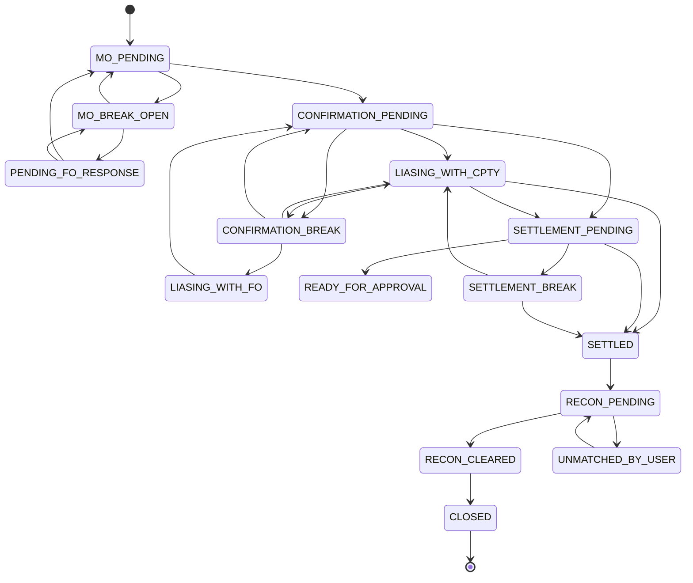

# Business Rules

> **Purpose:** The authoritative rulebook for how the simulation behaves — sessions, trade generation, per-desk actions, breaks, communication, and scoring.
> **Audience:** Engineers and content/scenario designers.
> **Last verified:** 2026-07-01 against `src/routes/*` and `src/engine/*`.
> **Related:** [API Reference](API.md) · [Architecture](ARCHITECTURE.md) · [Database](DATABASE.md)

---

## Lifecycle state machine

The allowed-transition map lives in `src/engine/transitions.js`; `lifecycle.js` enforces it and throws on illegal transitions.

## Session & queue rules

| # | Rule |
|---|------|
| SR-01 | One active session per user. `buildQueue()` refuses with "Complete your current queue first" while an unexpired active queue exists |
| SR-02 | Session duration = **3 real hours** (`SESSION_DURATION_MS`); `sessionExpiry = sessionStart + 3h` |
| SR-03 | The simulated clock maps the session onto a **09:00–18:00** trading day |
| SR-04 | Every queue contains **20 trades** — target **12 clean + 8 break** (60/40) |
| SR-05 | ~30% of MO-clean trades carry a **hidden confirmation-level break** invisible at MO |
| SR-06 | Graduated allocation: `dbCount = floor(20 * (1 - e^(-0.003 * availablePool)))`; below ~50 unassigned trades, generate all 20 fresh |
| SR-07 | Only trades with `assignedTo: null` are eligible for pool allocation |
| SR-08 | `Queue.lastActivity` is touched on every `GET /api/queue/my` and every trade action |

## Trade generation truth model

Generated in `tradeGenerator.js` with a **40/30/30** scenario split:

| Scenario | Probability | MO truth vs universal | Confirmation truth vs universal |
|----------|------------|-----------------------|--------------------------------|
| Clean | 40% | equal | equal |
| FO error | 30% | differs (+ counterparty) | equal |
| CPTY error | 30% | equal | differs |

- **MO break** is injected by making `booking` differ from `truths.mo`. Types: **AMOUNT, VALUE_DATE, CURRENCY, COUNTERPARTY**.
- **Confirmation break** types: **AMOUNT, VALUE_DATE, CURRENCY** only — **no counterparty** by design.
- **Settlement break** corrupts one of the 9 SSI fields in `settlementDetails` vs `truths.settlement`.

## MO desk rules

| Rule | Description |
|------|-------------|
| MO-01 | `MO_VALIDATE_PASS`: `MO_PENDING → CONFIRMATION_PENDING` (applies accepted amendments first) |
| MO-02 | `MO_VALIDATE_PASS` from `PENDING_FO_RESPONSE` requires `foResponseReceived === true` |
| MO-03 | `MO_VALIDATE_PASS` with non-empty `pendingAmendments` requires the conversation to be `RESOLVED` |
| MO-04 | `MO_RAISE_BREAK`: `MO_PENDING → MO_BREAK_OPEN` |
| MO-05 | `MO_SEND_TO_FO`: `MO_BREAK_OPEN → PENDING_FO_RESPONSE` |
| MO-06 | Sending an email from `MO_BREAK_OPEN` auto-transitions to `PENDING_FO_RESPONSE` and schedules an FO reply |
| MO-07 | `/api/conversation/resolve` requires `foResponseReceived === true`; applies amendments; sets conversation `RESOLVED`; returns to `MO_PENDING` |

## Confirmation desk rules

| Rule | Description |
|------|-------------|
| CONF-01 | `CONFIRM_SEND_TO_CPTY` increments `cptyContactCount`, schedules a CPTY reply, moves to `LIASING_WITH_CPTY` |
| CONF-02 | `CONFIRM_TRADE`: `LIASING_WITH_CPTY → SETTLEMENT_PENDING` |
| CONF-03 | `CONFIRM_RAISE_BREAK` is gated: `cptyContactCount === 1 && foContactCount === 0` |
| CONF-04 | `CONFIRM_ESCALATE_TO_FO` opens the FO internal channel and moves to `LIASING_WITH_FO`; if the FO admits a booking error, amendments auto-apply and the trade returns to `CONFIRMATION_PENDING` |
| CONF-05 | `CONFIRM_REJECT_CLAIM`: `CONFIRMATION_BREAK → CONFIRMATION_PENDING` (applies the truth when the FO supports the desk and the booking matches the universal truth) |
| CONF-06 | `CONFIRM_APPROVE_AMENDMENT`: applies accepted amendments → `CONFIRMATION_PENDING` |
| CONF-07 | `CONFIRM_REQUEST_EVIDENCE` / `CONFIRM_RAISE_AMENDMENT` stay in `CONFIRMATION_BREAK` |
| CONF-08 | `CONFIRM_RESEND`: `CONFIRMATION_PENDING → LIASING_WITH_CPTY` |

## Settlement desk rules

| Rule | Description |
|------|-------------|
| SETT-01 | Analyst must **select the settlement type** (electronic vs bilateral). A wrong choice applies a **10-point penalty** (`/api/settlement/select-type`) |
| SETT-02 | `SETTLEMENT_APPROVE` validates all **9 SSI fields** (`settlementDetails` vs `truths.settlement`). Match → `SETTLED`; mismatch → **10-point penalty** and rejection. Allowed from `SETTLEMENT_PENDING`, `LIASING_WITH_CPTY`, `SETTLEMENT_BREAK` |
| SETT-03 | `SETTLEMENT_RAISE_BREAK`: from `SETTLEMENT_PENDING` / `READY_FOR_APPROVAL` / `LIASING_WITH_CPTY` → `SETTLEMENT_BREAK` |
| SETT-04 | `SETTLEMENT_FOLLOW_UP_CPTY` / **Mail CPTY** (bilateral only): → `LIASING_WITH_CPTY` |
| SETT-05 | **Bilateral**: system SSI editable until settled; supports Mail CPTY. **Electronic**: system SSI editable only while in `SETTLEMENT_BREAK`; no Mail CPTY — correct by editing to the truth |
| SETT-06 | The settlement counterparty only ever returns an **SSI ID**; the analyst self-matches via the SSI Database (`/api/ssi/search`) |
| SETT-07 | If the currency cut-off has passed on the value date at approval, the value date shifts +1 business day (`cutoff.js` / `settlement.js`) |

## General action rules

| Rule | Description |
|------|-------------|
| GEN-01 | Every action requires a **non-empty comment** (400 otherwise) |
| GEN-02 | Actions are validated server-side against the action→status matrix in `tradeRoutes.js` |
| GEN-03 | The client trade object is never trusted — the backend re-fetches by `tradeRef` |
| GEN-04 | Each action writes an `AuditLog` entry (fire-and-forget) |
| GEN-05 | Each action emits `trade_update` `{ tradeRef, currentStatus }` |

(Full action→status matrix in [API.md](API.md).)

## Communication routing

| Rule | Description |
|------|-------------|
| COMM-01 | Trades in an `MO_*` status or `PENDING_FO_RESPONSE` route email to **FO** |
| COMM-02 | Otherwise email routes to the **Counterparty** |
| COMM-03 | Emailing from `MO_BREAK_OPEN` auto-transitions to `PENDING_FO_RESPONSE` |

## AI response rules

| Rule | Description |
|------|-------------|
| AI-01 | CPTY/FO replies are **asynchronous**, scheduled as `PendingReply` docs and delivered by the 3-second server loops |
| AI-02 | CPTY/FO generation uses **Gemini 2.5 Flash**; on any failure it falls back to the **deterministic offline template engine**. (Cerebras/Groq keys exist but are not wired into the active chain) |
| AI-03 | The settlement CPTY (`cptySettlementAI`) only ever returns its SSI ID — it never confirms a match |
| AI-04 | The Tutor uses OpenRouter Nemotron 3 Ultra grounded in the `docs/skb/*` knowledge base and answers Socratically |

## Break detection

- **MO** (`queueComposer.isBreakTrade` / `truthEngine.getMismatchFields`): `truths.mo` vs `booking` over amount, valueDate, currency, counterparty.
- **Confirmation** (`truthEngine.getConfirmationMismatches`): `truths.confirmation` vs current economics over amount, valueDate, currency.
- **Settlement** (`truthEngine.getSettlementMismatches`): `settlementDetails` vs `truths.settlement` over the 9 SSI fields.
- **Reconciliation** (`reconciliation.js`): ledger vs statement; auto-match on amount+currency+reference; weighted scenarios (PERFECT_MATCH 40%, REFERENCE_MISMATCH 20%, AMOUNT_MISMATCH 15%, MISSING_STATEMENT 10%, DUPLICATE_LEDGER 10%, TIMING_DIFFERENCE 5%).

## Scoring

- `VALIDATE` **+5**, `RAISE_BREAK` **+3**, `issueType` present **+2** (`scoringEngine.js`).
- **Penalties (−10):** wrong settlement type; approving settlement with mismatched SSI.
- Scores persist in `UserScore` (points, penalties, history). No user-facing score UI yet.

## Session termination

| Trigger | Handler |
|---------|---------|
| User logout | `POST /api/session/logout` → `endSession(userId)` |
| 3-hour timer / 18:00 sim close | Frontend calls logout |
| Expired session on next `buildQueue()` | `expireSession(userId)` |
| Agenda sweep | `session-cleanup` job every 1 min |

In all cases the queue is deactivated (`isActive = false`) and its trades return to the pool (`assignedTo = null`).
