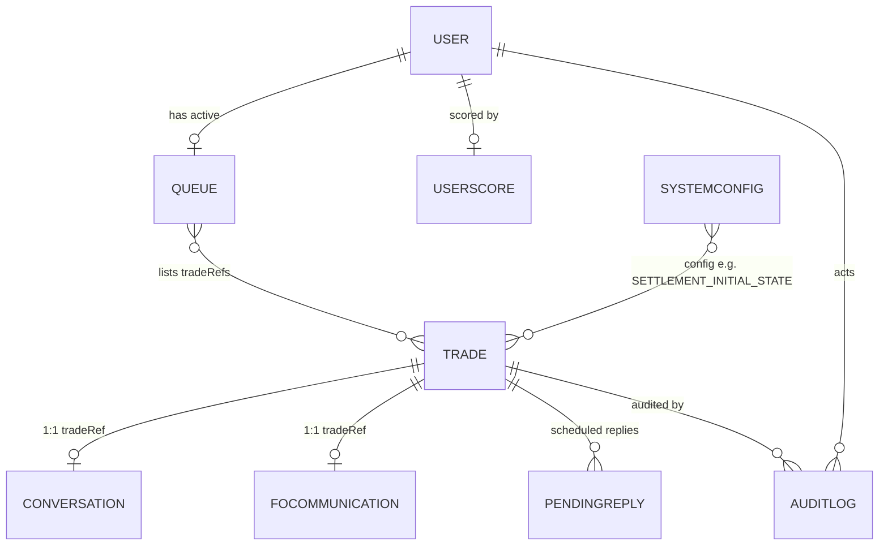

# Database

> **Purpose:** Full reference for the MongoDB/Mongoose data model.
> **Audience:** Backend engineers.
> **Last verified:** 2026-07-01 against `src/models/*`.
> **Related:** [Architecture](ARCHITECTURE.md) · [API Reference](API.md) · [Business Rules](BUSINESS_RULES.md)

---

## Engine & connection

**MongoDB** via **Mongoose 9** (`src/db.js`). Connection string from `MONGO_URI` (Atlas SRV with SSL). If `MONGO_URI` is missing/unreachable the server continues in **memory-only mode** (operations degrade; data not persisted). Collections are created on first write; there is no migration framework (only ad-hoc scripts).

All models cross-reference each other by **string key** (`tradeRef`, `userId`) — there is no ObjectId `populate`.



## Collections

### `trades` — `Trade.js` (timestamps: true)

The primary entity. Top-level fields:

| Field | Type | Index | Notes |
|-------|------|-------|-------|
| `tradeRef` | String | unique | Primary key, e.g. `TRD_...` |
| `originType` | String | — | default `"AUTO_GENERATED"` |
| `isAutoGenerated` | Boolean | — | default `true` |
| `tradeDate` / `valueDate` | Date | — | value date = T+2 |
| `currentStatus` | String | — | default `MO_PENDING` (see status enum) |
| `nextDesk` | String | yes | routing desk |
| `amount` | Number | — | booked notional (may differ from truth) |
| `currency` | String | — | e.g. USD/EUR/GBP/JPY/CHF/AUD |
| `counterparty` | String | — | e.g. CITI/HSBC/JPM/BNP/DB |
| `direction` | String | — | BUY / SELL |
| `entity` | String | — | booking entity |
| `foRegion` | String | — | AMER / EMEA / APAC |
| `product` / `tradeType` / `settlementType` | String | — | derived at generation |
| `age` | Number | — | default 0; recomputed per desk by `ageCalculator` |
| `assignedTo` | String | yes | userId (null = in pool) |
| `auditXml` | String | — | XML audit generated at creation |
| `foResponseReceived` / `cptyResponseReceived` | Boolean | — | default false |
| `cptyContactCount` / `foContactCount` | Number | — | default 0; drive break/escalation gating |
| `pendingAmendments` | Array | — | default `[]` |

**Sub-documents:**

- `truths.universal` `{ amount, valueDate, currency, counterparty }` — absolute correct economics.
- `truths.mo` `{ amount, valueDate, currency, counterparty }` — front-office truth. MO break = `truths.mo ≠ booking`.
- `truths.confirmation` `{ amount, valueDate, currency }` — counterparty-expected (no counterparty field, by design).
- `truths.settlement` — full settlement truth: `{ amount, valueDate, currency, counterparty, beneficiaryName, beneficiaryBank, beneficiaryBIC, accountNumber, accountType, settlementMethod, correspondentBank, paymentReference, settlementDate, settlementType }`.
- `booking` `{ amount, valueDate, currency, counterparty }` — what the ops system shows (break = diverges from `truths.mo`).
- `settlementDetails` — the **system SSI** shown to the analyst; the 9 comparison fields `{ beneficiaryName, beneficiaryBank, beneficiaryBIC, accountNumber, accountType, currency, settlementMethod, correspondentBank, paymentReference }` plus `settlementDate, settlementType`.
- `amendmentHistory[]` `{ amendmentNumber, desk, field, oldValue, newValue, source, status, appliedAt, appliedBy }`.
- `confirmationScenario` `{ disputeType (default null), expectedEconomics:{amount,valueDate,currency}, evidence:[{type, provided(false), requestedAt, receivedAt}] }`.
- `foEscalation` `{ status (default null), escalatedAt, resolvedAt, foResponse }`.
- `conversation` `{ status (default null), resolvedAt }`.

**Status enum (currentStatus):** `MO_PENDING`, `MO_BREAK_OPEN`, `PENDING_FO_RESPONSE`, `CONFIRMATION_PENDING`, `CONFIRMATION_BREAK`, `LIASING_WITH_CPTY`, `LIASING_WITH_FO`, `SETTLEMENT_PENDING`, `READY_FOR_APPROVAL`, `SETTLEMENT_BREAK`, `SETTLED`, `RECON_PENDING`, `RECON_CLEARED`, `UNMATCHED_BY_USER`, `CLOSED`. See the full state machine in [Business Rules](BUSINESS_RULES.md).

### `users` — `User.js`
| Field | Type | Notes |
|-------|------|-------|
| `email` | String | required, unique, lowercased (used as `userId` everywhere) |
| `fullName` | String | required |
| `password` | String | bcrypt hash |
| `createdAt` | Date | default `Date.now` (no `timestamps` option) |

### `queues` — `Queue.js` (timestamps: true)
| Field | Type | Notes |
|-------|------|-------|
| `userId` | String | required, unique, indexed |
| `desk` | String | required |
| `trades` | [String] | array of `tradeRef` (≤20) |
| `sessionStart` / `sessionExpiry` | Date | expiry ≈ start + 3h |
| `isActive` | Boolean | default true, indexed |
| `lastActivity` | Date | touched on queue fetch / action |

### `conversations` — `Conversation.js` (timestamps: true)
`tradeRef` (required, unique), `status` (default `OPEN`), `desks: [String]`, `messages: [MessageSchema]`.
**MessageSchema:** `sender` (enum `USER`|`FO`|`COUNTERPARTY`, required), `body` (required, sanitized HTML allowed), `subject` (default ""), `timestamp` (default now), auto `_id`.

### `focommunications` — `FOCommunication.js` (timestamps: true)
`tradeRef` (required, unique), `desk` (required), `openedBy`, `openedAt`, `status` (default `OPEN`), `messages: [{ sender, senderRole (enum USER|FO), message, timestamp }]`.

### `auditlogs` — `AuditLog.js` (timestamps: true)
`tradeRef` (indexed), `action` (required), `userId` (indexed), `desk`, `details` (default ""), `timestamp`, `xmlContent` (default null), `isAutomated` (default false).

### `userscores` — `UserScore.js` (timestamps: true)
`userId` (required, unique, indexed), `points` (default 0), `penalties` (default 0), `tradesResolved` (default 0), `history: [{ tradeRef, action, pointsAwarded, timestamp }]`.

### `systemconfigs` — `SystemConfig.js` (timestamps: true)
`key` (required, unique, indexed), `value` (Mixed, required), `description`. Seeded by `seedConfig.js` with `SETTLEMENT_INITIAL_STATE = SETTLEMENT_PENDING`.

### `pendingreplies` — `PendingReply.js` (timestamps: true)
Backs the asynchronous AI reply mechanism (processed by the 3s server loops).
`tradeRef` (required, indexed), `replyType` (required, enum `CPTY_EMAIL`|`FO_EMAIL`|`FO_INTERNAL`), `sendAt` (required, indexed — scheduled fire time), `subject`, `body`, `userMessage`, `escalationContext`, `desk`, `isFinalReply` (default false), `payload` (Mixed).

## Index summary

| Collection | Field(s) | Type |
|-----------|----------|------|
| trades | tradeRef | unique |
| trades | nextDesk, assignedTo | regular |
| queues | userId | unique |
| queues | isActive | regular |
| conversations | tradeRef | unique |
| focommunications | tradeRef | unique |
| auditlogs | tradeRef, userId | regular |
| userscores | userId | unique |
| systemconfigs | key | unique |
| pendingreplies | tradeRef, sendAt | regular |

**Recommended additions:** `trades.currentStatus`; a compound `trades.isAutoGenerated + trades.assignedTo` for pool queries; `queues.desk + queues.isActive`. See [Performance](PERFORMANCE.md).

## Query patterns

```js
// Queue building (queueComposer.js) — count pool, fetch, assign
Trade.countDocuments({ nextDesk: desk, assignedTo: null, currentStatus: { $in: statusList } })
Trade.find({ nextDesk: desk, assignedTo: null, currentStatus: { $in: statuses } }).lean().limit(N)
Trade.updateMany({ tradeRef: { $in: refs } }, { $set: { assignedTo: userId } })

// Active queue
Queue.findOne({ userId, isActive: true })
Trade.find({ tradeRef: { $in: queueDoc.trades } }).lean()

// Trade action — re-fetch server-side, never trust the client
Trade.findOne({ tradeRef })
Trade.updateOne({ tradeRef }, { $set: { currentStatus, foResponseReceived /* … */ } })

// Async replies — the 3s loops
PendingReply.find({ sendAt: { $lte: now } })
```

## Utility scripts

| Script | Command | Purpose |
|--------|---------|---------|
| `checkDB.js` | `node checkDB.js` | Connect and dump `Conversation` docs |
| `cleanDB.js` | `node cleanDB.js` | Wipe Conversation/Trade/Queue/User/UserScore/AuditLog |
| `migrateDB.js` | `node migrateDB.js` | Backfill `Conversation.desks = ["MO"]` where missing |
| `seedConfig.js` | `node seedConfig.js` | Seed `SystemConfig.SETTLEMENT_INITIAL_STATE` |

See [Deployment](DEPLOYMENT.md) for the full script inventory.
