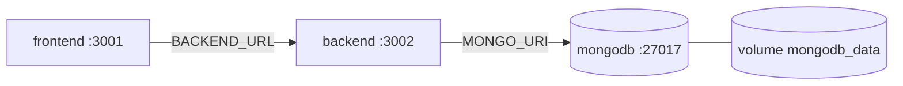

# Deployment

> **Purpose:** How to run, containerize, and configure the system in development and production.
> **Audience:** Engineers and operators.
> **Last verified:** 2026-07-01 against `Dockerfile`, `frontend/Dockerfile`, `docker-compose.yml`, `.github/workflows/ci.yml`, `.env.example`.
> **Related:** [Architecture](ARCHITECTURE.md) · [Security](SECURITY.md) · [Testing](TESTING.md)

---

## Prerequisites
- Node.js **22** (Dockerfiles use `node:22-alpine`; CI runs on Node 20).
- A MongoDB instance (Atlas or local). Without `MONGO_URI` the backend runs **memory-only** (no persistence).
- Root `.env` (copy from `.env.example`) and, for local frontend dev, `frontend/.env.local`.

## Local development

**Backend** (repo root):
```bash
npm install
npm run dev          # nodemon server.js  (or: npm start)
npm run test:backend # jest tests/backend
```
Runs on `http://localhost:3002`. Boot sequence: validate `JWT_SECRET` → `connectDB()` → `startAgenda()` → `initSocket()` → mount routers → start the 4 background loops.

**Frontend** (`frontend/`):
```bash
cd frontend
npm install
npm run dev          # next dev --webpack (port 3000)
npm run build && npm start
npm test             # jest (jsdom)
```
> `next dev --webpack` is intentional (Turbopack disabled). The rewrites in `next.config.mjs` proxy `/api/*` and `/socket.io/*` to the backend, so page code uses relative paths.

## Environment variables

**Backend `.env`:**
```env
MONGO_URI=mongodb+srv://<user>:<password>@<cluster>.mongodb.net/?ssl=true&replicaSet=...
JWT_SECRET=replace_with_a_strong_random_string
GEMINI_API_KEY=your_gemini_api_key          # CPTY/FO replies
OPENROUTER_API_KEY=your_openrouter_api_key  # Tutor (Nemotron 3 Ultra)
CEREBRAS_API_KEY=your_cerebras_api_key       # secondary (not wired in)
# GROQ_API_KEY=...                            # configured but unused
ALLOWED_ORIGINS=http://localhost:3000        # Socket.io CORS (comma-separated)
PORT=3002
```

**Frontend `frontend/.env.local`:**
```env
NEXT_PUBLIC_BACKEND_URL=http://localhost:3002   # exposed to browser (socket)
BACKEND_URL=http://localhost:3002               # server-side (next rewrites)
```

`MONGO_URI` and `JWT_SECRET` are the only hard requirements; the server refuses to start without `JWT_SECRET`. Full sensitivity table in [Security](SECURITY.md).

## Docker & docker-compose

```bash
docker-compose up --build       # build + start all services
docker-compose up --build -d    # detached
docker-compose logs -f
docker-compose down
```



Services in `docker-compose.yml`:

| Service | Build | Port | Key env | Depends on |
|---------|-------|------|---------|-----------|
| `mongodb` | `mongo:latest` | 27017 | — (volume `mongodb_data`) | — |
| `backend` | root `Dockerfile` (node:22-alpine, `npm install --omit=dev`) | 3002 | `PORT=3002`, `MONGO_URI=mongodb://mongodb:27017/ilabs`, `JWT_SECRET=…`, `NODE_ENV=production` | mongodb |
| `frontend` | `frontend/Dockerfile` (multi-stage standalone) | 3001 | `NODE_ENV=production`, `PORT=3001`, `BACKEND_URL=http://backend:3002` | backend |

All services use `restart: unless-stopped`. Replace the placeholder `JWT_SECRET` in compose before any real deployment, and prefer `env_file`/secrets over inline values.

## CI (`.github/workflows/ci.yml`)
Triggered on push/PR to `main`. Jobs: **test-backend** (Node 20, `npm install`, `npm run test:backend`), **test-frontend** (Node 20, `cd frontend`, `npm install`, `npm test`), then **build-docker** (`docker-compose build`) which depends on both test jobs.

## Utility & maintenance scripts (`node <script>.js` from root)
| Script | Purpose |
|--------|---------|
| `checkDB.js` | Connect and dump `Conversation` docs |
| `cleanDB.js` | Wipe Conversation/Trade/Queue/User/UserScore/AuditLog |
| `migrateDB.js` | Backfill `Conversation.desks = ["MO"]` where missing |
| `seedConfig.js` | Seed `SystemConfig.SETTLEMENT_INITIAL_STATE = SETTLEMENT_PENDING` |
| `cleanup-test.js` | Remove data for users matching `^testuser` (batches of 500) |
| `load-test.js` | 100 JWTs, concurrent `POST /api/queue/generate`, latency stats |
| `test-route.js` | POST a large context to `/api/chat/tutor` (needs a running backend) |
| `test-tutor.js` | Call `generateTutorResponse()` directly |

## Production checklist
- [ ] `JWT_SECRET` strong/random; `NODE_ENV=production`; `ALLOWED_ORIGINS` = real frontend origin.
- [ ] HTTPS/TLS in front of both services; tighten REST CORS.
- [ ] `.env` not committed and not baked into Docker layers.
- [ ] MongoDB backups on; least-privilege DB user; network restricted.
- [ ] Frontend built with `npm run build` and served via `next start` (or the standalone image).

## Scaling notes
The backend is effectively single-instance today. Before running multiple replicas:
- Socket.io needs a shared adapter (e.g. Redis) for cross-instance events.
- The 2-second in-memory trade cache and the reply loops assume one process (the reply **schedule** is durable via `PendingReply`, but the loops would double-process across instances without coordination).

See [Performance](PERFORMANCE.md) and [Known Issues](KNOWN_ISSUES.md).
