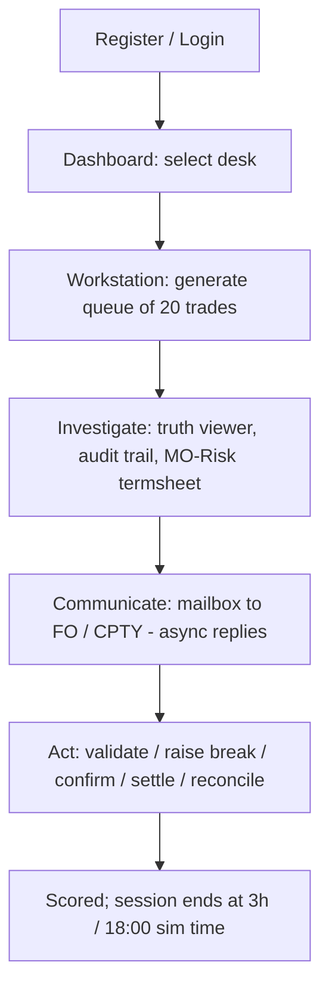

# iLabs — SGB Operations Simulator: Project Overview

> **Purpose:** Define what the product is, who it is for, and the shape of the system.
> **Audience:** New engineers, trainers, and stakeholders.
> **Product:** SGB Operations Simulator · **Company:** Niramay Skillomentum
> **Last verified:** 2026-07-01 against the implementation.

---

## What it is

**iLabs** is a full-stack **financial operations training simulator** that reproduces the post-trade lifecycle of a global investment bank. Trainees log in as operations analysts, work realistic trade queues, exchange messages with simulated **Front Office (FO)** and **Counterparty (CPTY)** actors, and are scored on the quality of their decisions.

The simulator spans the back-office desks a trade passes through after execution:

| Desk | Role |
|------|------|
| **Middle Office (MO)** | Validate the booking against front-office records; find and resolve discrepancies |
| **Confirmation** | Agree trade economics with the counterparty; manage disputes and FO escalations |
| **Settlement** | Verify settlement instructions (SSI) and approve payment; handle settlement breaks |
| **Reconciliation (TLM)** | Match ledger entries to bank statements; clear or flag exceptions |
| **Reporting** | (Selectable desk; minimal workflow implemented) |

## Target users

- Finance graduates and trainees learning bank operations workflows.
- Operations staff being onboarded to trade-lifecycle processes.
- Trainers/assessors measuring trainee decision quality.

## The analyst journey



## Technology stack

| Layer | Technology |
|-------|-----------|
| Backend runtime | Node.js (CommonJS) |
| Backend framework | Express 5 |
| Database | MongoDB (Mongoose 9 ODM) |
| Real-time | Socket.io 4 |
| Job scheduling | Agenda 5 |
| AI — CPTY & FO replies | Google **Gemini 2.5 Flash** (`@google/genai`) with deterministic offline fallback |
| AI — Tutor chatbot | **OpenRouter** — Nvidia **Nemotron 3 Ultra** |
| AI — secondary / unused | Cerebras (secondary fallback), Groq (configured, not wired in) |
| Auth | JWT (HS256) + bcryptjs |
| Rate limiting | express-rate-limit |
| Frontend | Next.js 16 (App Router) + React 19 |
| Styling | Tailwind CSS v4 (+ typography), react-hot-toast |
| Client utils | socket.io-client, react-markdown, js-cookie |
| Containerization | Docker + docker-compose |

See [Architecture](ARCHITECTURE.md) for how these fit together and [Deployment](DEPLOYMENT.md) for versions and env.

## Repository layout

```
ilabs1/
├── server.js                # Backend entry (Express + Socket.io + background loops)
├── llmService.js            # Shared Gemini helper (root)
├── src/
│   ├── db.js                # MongoDB connection
│   ├── middleware/auth.js   # JWT middleware
│   ├── models/              # 9 Mongoose schemas
│   ├── routes/              # 11 route groups (mounted under /api/*)
│   └── engine/              # simulation engines (lifecycle, breaks, AI, comms, queue…)
├── frontend/                # Next.js App Router application
│   └── src/app/             # login, dashboard, workstation, mo-risk,
│                            # communication, settlement/*, ssi-database
├── docs/                    # Narrative developer docs (numbered) + INDEX
│   ├── ai/                  # Deep reference docs (this directory)
│   └── skb/                 # Simulator Knowledge Base (loaded into the AI tutor)
├── tests/backend/           # Jest + Supertest suite
├── Dockerfile, frontend/Dockerfile, docker-compose.yml
└── .env.example
```

## Key features

**Simulation engine** — Each session composes exactly **20 trades** (≈12 clean + 8 with breaks) via a graduated DB-allocation formula. Every trade carries layered **truths** (`universal`, `mo`, `confirmation`, `settlement`); MO compares `truths.mo` vs `booking`, Confirmation compares `truths.confirmation` vs current economics, Settlement compares `settlementDetails` vs `truths.settlement`. ~30% of MO-clean trades hide a confirmation-level break that only surfaces at the Confirmation desk. Trade age is desk-specific. See [Business Rules](BUSINESS_RULES.md).

**Communication system** — A threaded, folder-based mailbox. CPTY and FO replies are generated by Gemini (with a deterministic template fallback) and delivered **asynchronously** through background loops. A separate **FO internal channel** handles Confirmation-desk escalations. All threads persist in MongoDB. See [Architecture](ARCHITECTURE.md).

**Assessment & audit** — Every action requires a mandatory comment (enforced server-side). Each trade has an auto-generated **XML audit trail** (capture, compliance, risk, booking, routing) plus a structured `AuditLog`. A backend **scoring engine** awards points and penalties.

**Infrastructure** — Socket.io pushes `trade_update` and `new_email` events; clients join `user_<id>` and `desk_<desk>` rooms. A simulated clock runs 09:00→18:00 over the 3-hour session. Background `setInterval` loops deliver AI replies and refresh a trade cache; Agenda runs session cleanup and daily age recalculation.

## Related documents

- [Architecture](ARCHITECTURE.md) · [API Reference](API.md) · [Database](DATABASE.md) · [Business Rules](BUSINESS_RULES.md)
- [Security](SECURITY.md) · [Deployment](DEPLOYMENT.md) · [Testing](TESTING.md) · [Performance](PERFORMANCE.md)
- Narrative onboarding: [../01_Project_Overview.md](../01_Project_Overview.md) · Knowledge base for the tutor: [../skb/simulator_workflow_guide.md](../skb/simulator_workflow_guide.md)
