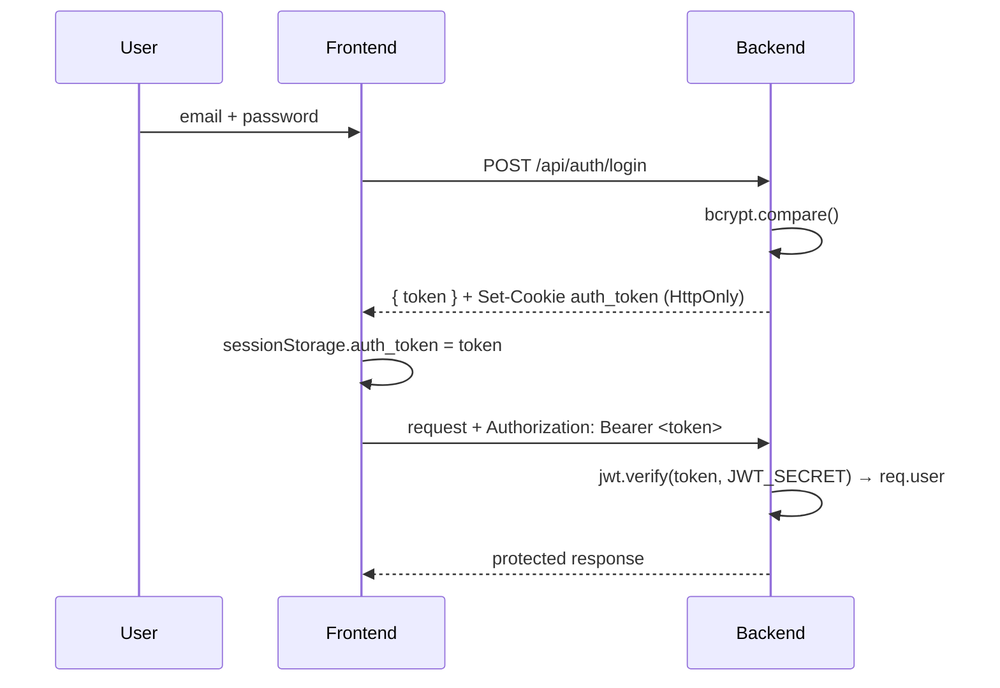

# Security

> **Purpose:** Document the authentication, authorization, and hardening posture, and the honest list of open gaps.
> **Audience:** Backend engineers, reviewers, operators.
> **Last verified:** 2026-07-01 against `src/middleware/auth.js`, `src/routes/authRoutes.js`, `server.js`, `src/engine/socketEngine.js`, `src/engine/communicationEngine.js`.
> **Related:** [API Reference](API.md) · [Deployment](DEPLOYMENT.md) · [Known Issues](KNOWN_ISSUES.md)

---

## Authentication flow

### JWT
- Algorithm HS256; secret from **`JWT_SECRET`** with **no fallback** — the server exits at boot if it is unset.
- Lifetime **3 hours**; payload `{ userId, fullName }`.
- Delivered both in the login response body and as an `auth_token` cookie.

### Cookie
`auth_token=<JWT>; Path=/; Max-Age=10800; SameSite=Lax; HttpOnly` and **`Secure` in production** (`NODE_ENV === "production"`). The frontend stores the token in `sessionStorage` for its `Authorization` headers; the cookie is the fallback for the socket handshake.

### Middleware — `src/middleware/auth.js`
Token resolution: `Authorization: Bearer <token>` header, then `auth_token` cookie. Returns `401` when no token is present, `403` when the token is invalid/expired. Attaches `{ userId, fullName }` to `req.user`.

## Authorization
- Protected routes use the auth middleware.
- Trade actions **re-fetch the trade from the DB** by `tradeRef` — the client-supplied trade object is not trusted.
- **No RBAC.** Every authenticated user has identical capabilities; isolation is by session/`assignedTo`, not roles.

## Passwords
- bcryptjs, 10 salt rounds; never stored in plaintext; login uses `bcrypt.compare()`. No complexity policy enforced.

## Rate limiting
`express-rate-limit` on `/api/auth/register` and `/api/auth/login`: **15 requests / 15 minutes / IP**, returning a "Too many requests" error. No rate limiting on other routes.

## CORS
- **REST:** a global permissive `cors()` is applied in `server.js` (acceptable in the proxied same-origin dev setup, but should be tightened for a directly-exposed API).
- **Socket.io:** restricted to `ALLOWED_ORIGINS` (comma-separated) or `http://localhost:3000`, with `credentials: true`.

## Input handling
| Input | Handling |
|-------|----------|
| Register/login fields | Presence-checked (400 if missing) |
| Email | Lowercased/normalized |
| Trade action `comment` | Required, non-empty (400 otherwise) |
| Trade ownership | Trade re-fetched server-side by `tradeRef` |
| Message bodies | **Sanitized with `sanitize-html`** (a constrained allow-list of tags/attributes) before persistence in `communicationEngine` |

## Environment variable sensitivity
| Variable | Sensitivity | Notes |
|----------|-------------|-------|
| `MONGO_URI` | Critical | DB credentials — never commit |
| `JWT_SECRET` | Critical | Required at boot; use a long random value |
| `GEMINI_API_KEY` | High | CPTY/FO LLM |
| `OPENROUTER_API_KEY` | High | Tutor LLM |
| `CEREBRAS_API_KEY` | High | Secondary (not in active chain) |
| `GROQ_API_KEY` | Medium | Configured, unused |
| `ALLOWED_ORIGINS`, `PORT`, `NEXT_PUBLIC_BACKEND_URL` | Low | Non-secret config |

Keep `.env` in `.gitignore`; `.env.example` is the safe template.

## Data privacy
All trade data is synthetic (no real PII). `user.email` doubles as `userId` and appears in audit logs stored in the private DB; it is not exposed in URLs.

## Open gaps (honest list)
| Area | Status |
|------|--------|
| REST CORS is globally permissive | Open — tighten before exposing the API directly |
| No RBAC | Open — all users are equal |
| Token in `sessionStorage` | Open — XSS-reachable; the HttpOnly cookie mitigates the primary vector |
| No password complexity policy | Open |
| Rate limiting only on auth routes | Open |

See [Known Issues](KNOWN_ISSUES.md) for the tracked register.

## Production hardening checklist
- [ ] `NODE_ENV=production` (enables the `Secure` cookie flag)
- [ ] HTTPS/TLS termination in front of both services
- [ ] `ALLOWED_ORIGINS` set to the real frontend origin; tighten REST CORS
- [ ] Strong random `JWT_SECRET` (64+ chars), rotated
- [ ] MongoDB network access restricted; least-privilege DB user
- [ ] Verify `.env` is not baked into any Docker layer
- [ ] Review audit logs for accidental secret logging
