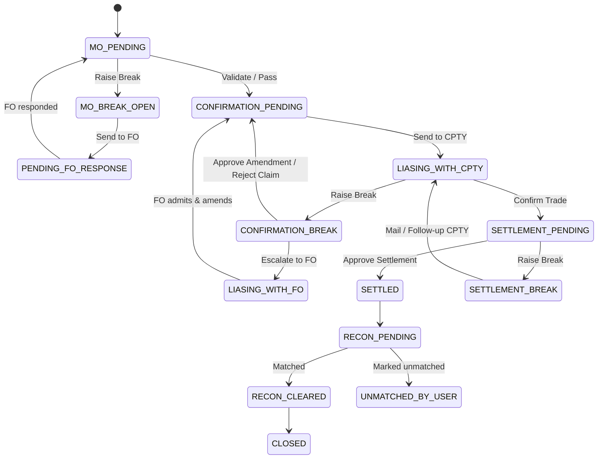

# Simulator Workflow Guide

> **Purpose:** Explain, end to end, how a trade moves through the iLabs — SGB Operations Simulator and exactly which actions the analyst takes at each desk.
> **Audience:** Trainees on the simulator, and the AI Tutor (this file is loaded into the tutor's knowledge base at runtime).
> **Last verified:** 2026-07-01 against the implementation.
> **Related:** [Screen & Feature Guide](screen_and_feature_guide.md) · [Troubleshooting & FAQs](troubleshooting_and_faqs.md)

---

## 1. What the simulator is

iLabs — SGB Operations Simulator trains **securities/FX back-office operations analysts**. You work a queue of trades and move each one safely through its post-execution lifecycle across four desks:

**Middle Office (MO) → Confirmation → Settlement → Reconciliation (TLM)**

Every trade has a hidden **truth** (the economically correct values). Your job is to detect when the booked trade disagrees with the truth (a **break**), investigate it by talking to the **Counterparty (CPTY)** and the **Front Office (FO)**, correct it through amendments, and only then advance it. The simulator scores your accuracy.

> The tutor never gives you the answer directly. It asks questions that lead you to inspect the trade, its truth, and the messages yourself.

## 2. The session

- A session gives you a queue of **20 trades** for one desk (roughly **12 clean and 8 with breaks**).
- A session lasts **3 hours** of real time and is paced by a **simulated clock running 09:00 → 18:00**.
- You may only have **one active desk queue at a time** — finish (or let expire) your current queue before generating a new one.
- Every action requires a **comment** — it is mandatory and recorded in the audit trail.

## 3. Trade lifecycle — the real states

Trades move only along allowed transitions (a strict state machine). These are the **actual** statuses. There is **no** "Validated" status and **no** "Confirmed" status — those were never real.

| Phase | Statuses |
|---|---|
| Middle Office | `MO_PENDING`, `MO_BREAK_OPEN`, `PENDING_FO_RESPONSE` |
| Confirmation | `CONFIRMATION_PENDING`, `CONFIRMATION_BREAK`, `LIASING_WITH_CPTY`, `LIASING_WITH_FO` |
| Settlement | `SETTLEMENT_PENDING`, `READY_FOR_APPROVAL`, `SETTLEMENT_BREAK`, `SETTLED` |
| Reconciliation (TLM) | `RECON_PENDING`, `RECON_CLEARED`, `UNMATCHED_BY_USER`, `CLOSED` |

## 4. A key mechanic: replies are asynchronous

When you message a counterparty or the front office, **they do not answer instantly**. The AI actor replies a few seconds later, and the reply appears in your **Communication** mailbox (with a notification). The normal rhythm is therefore: *send a message → keep working other trades → come back when the reply arrives.*

## 5. Middle Office (MO) desk

The MO desk checks that what was **booked** matches the **MO truth** (the front-office ticket). Fields that can break here: **amount, value date, currency, counterparty**.

Actions (these are the real action names):

- **`MO_VALIDATE_PASS`** — the booking is correct → moves `MO_PENDING → CONFIRMATION_PENDING`. If the trade is in `PENDING_FO_RESPONSE`, you can only pass once the FO has responded; if amendments are pending, the related conversation must be resolved first.
- **`MO_RAISE_BREAK`** — you found a discrepancy → `MO_PENDING → MO_BREAK_OPEN`.
- **`MO_SEND_TO_FO`** — escalate the break to the front office → `MO_BREAK_OPEN → PENDING_FO_RESPONSE`. The FO replies asynchronously.

Resolving an MO break:
1. Compare the booking against the MO truth (use the **Truth viewer** and the **MO-Risk termsheet**).
2. If the **booking** is wrong, email the FO. The FO reply may **admit the error** — the simulator auto-extracts the corrected values into **pending amendments**, which you approve; approving applies them. Then `MO_VALIDATE_PASS`.
3. If the **ticket/records** were right all along (the FO says "our booking is correct"), do **not** amend — just `MO_VALIDATE_PASS`.

## 6. Confirmation desk

The Confirmation desk agrees the trade economics with the counterparty. Breakable fields here: **amount, value date, currency** (counterparty is **not** disputed at confirmation).

Actions:

- **`CONFIRM_SEND_TO_CPTY`** — send a confirmation to the counterparty → moves the trade into `LIASING_WITH_CPTY`. The CPTY replies asynchronously in the mailbox.
- **`CONFIRM_TRADE`** — the trade is agreed → `LIASING_WITH_CPTY → SETTLEMENT_PENDING`.
- **`CONFIRM_RAISE_BREAK`** — you found a genuine discrepancy → `CONFIRMATION_BREAK`. Allowed **once**, only after the first CPTY contact.
- **`CONFIRM_REQUEST_EVIDENCE`** — ask the CPTY for supporting evidence (stays in `CONFIRMATION_BREAK`; the CPTY sends it asynchronously).
- **`CONFIRM_ESCALATE_TO_FO`** — open the **internal FO channel** → `LIASING_WITH_FO`. If the FO admits a booking error, amendments are auto-applied and the trade returns to `CONFIRMATION_PENDING`.
- **`CONFIRM_RAISE_AMENDMENT`** / **`CONFIRM_APPROVE_AMENDMENT`** — raise / approve an economic correction. Approving applies accepted amendments and returns to `CONFIRMATION_PENDING`.
- **`CONFIRM_REJECT_CLAIM`** — reject the counterparty's claim (used when the FO supports your booking and it matches the universal truth) → `CONFIRMATION_PENDING`.
- **`CONFIRM_RESEND`** — re-send the confirmation after a correction → back to `LIASING_WITH_CPTY`.

Typical confirmation-break loop: raise break → request evidence and/or escalate to FO → wait for the async reply → approve the correct amendment (or reject the claim) → resend / confirm.

## 7. Settlement desk

Once confirmed, the trade must settle to the correct **Standard Settlement Instructions (SSI)**.

1. **Select the settlement type** — electronic or bilateral. Choosing the wrong type costs points. The correct choice opens the matching screen: `/settlement/electronic` or `/settlement/bilateral`.
2. On the settlement screen you compare the **system SSI** against the **truth SSI** across **9 fields**: beneficiaryName, beneficiaryBank, beneficiaryBIC, accountNumber, accountType, currency, settlementMethod, correspondentBank, paymentReference.
3. Actions:
   - **`SETTLEMENT_APPROVE`** — approve payment. The simulator validates all 9 SSI fields against the truth; a mismatch is a **10-point penalty** and the approval is rejected. A correct match → `SETTLED`.
   - **`SETTLEMENT_RAISE_BREAK`** — flag a settlement discrepancy → `SETTLEMENT_BREAK`.
   - **`SETTLEMENT_FOLLOW_UP_CPTY`** / **Mail CPTY** (bilateral only) — chase the counterparty → `LIASING_WITH_CPTY`.
   - **Edit SSI** — correct the system SSI fields (electronic: editable only while in `SETTLEMENT_BREAK`; bilateral: editable until settled).

**How the settlement counterparty behaves:** when you email the CPTY at the settlement desk, it only ever replies with its **SSI ID** — it never says whether your details match or where the break is. You must look that ID up yourself in the **SSI Database** (`/ssi-database`) and compare field by field.

**Cutoff:** if the currency's cut-off time has already passed on the value date when you approve, settlement rolls to the next business day (the value date shifts +1).

## 8. Reconciliation (TLM) desk

After settlement, trades reconcile ledger entries against bank statements:

- `SETTLED → RECON_PENDING`. Entries auto-match on amount + currency + reference.
- Unmatched items must be matched manually, or explicitly **marked unmatched** (`UNMATCHED_BY_USER`) for genuine exceptions (timing differences, missing statements).
- When everything is matched, the break closes: `RECON_PENDING → RECON_CLEARED → CLOSED`.

## 9. Scoring (how you are graded)

- Correctly validating a clean trade: **+5**.
- Correctly raising a break: **+3**.
- Selecting an issue type when raising a break: **+2**.
- **Penalties:** approving settlement with mismatched SSI, or choosing the wrong settlement type, each apply a **10-point penalty**.

The lesson the score enforces: **investigate before you act.** Read the truth, gather the CPTY/FO evidence, apply the right amendment, and only then advance the trade.

## 10. Golden rules

1. No manual state jumping — you can only take the actions the current status allows.
2. There is one truth per trade; validate against it, don't guess.
3. Replies are asynchronous — send, move on, return when the mailbox updates.
4. Amend only when the **booking** is wrong; if the **records/ticket** were right, just pass.
5. At settlement, self-match the SSI using the SSI Database — the counterparty won't do it for you.
